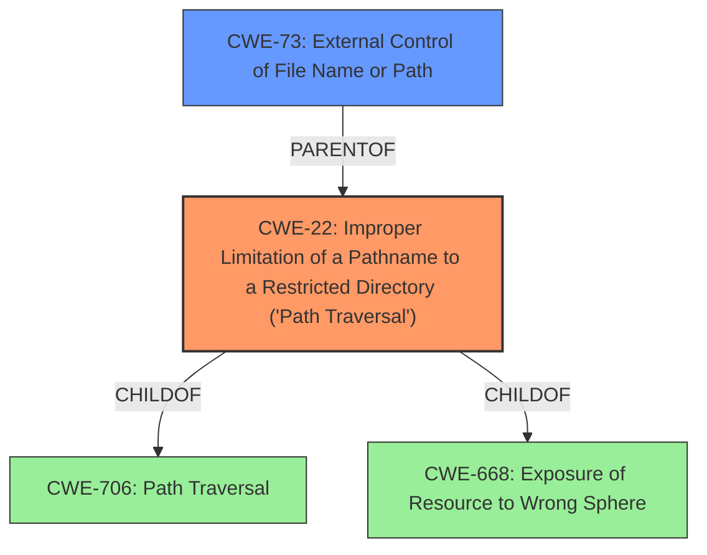

# Analysis for CVE-2021-27328

# Summary
| CWE ID | CWE Name | Confidence | CWE Abstraction Level | CWE Vulnerability Mapping Label | CWE-Vulnerability Mapping Notes |
|---|---|---|---|---|---|
| CWE-22 | Improper Limitation of a Pathname to a Restricted Directory ('Path Traversal') | 1.0 | Base | Allowed | Primary CWE. The vulnerability is a **path traversal** issue. |
| CWE-73 | External Control of File Name or Path | 0.7 | Base | Allowed | Secondary CWE. The product allows user input to control or influence paths or file names that are used in filesystem operations. |

## Evidence and Confidence

*   **Confidence Score:** 1.0
*   **Evidence Strength:** HIGH

## Relationship Analysis
The primary CWE is CWE-22, which represents the **improper limitation of a pathname to a restricted directory ('Path Traversal')**. This is a **base** level CWE and accurately describes the **root cause** of the vulnerability.
CWE-73 (External Control of File Name or Path) is a parent of CWE-22, but CWE-22 is a more specific description of the vulnerability. The graph helps to visualize the relationships and confirm that CWE-22 is the more appropriate choice.

## Vulnerability Chain
The vulnerability chain starts with **improper handling of user-supplied input**, leading to a **path traversal** (**CWE-22**). This then leads to **information disclosure** (decrypt firmware and read sensitive information).

## Summary of Analysis
The initial analysis identified CWE-22 as the primary weakness, which aligns with the vulnerability description of a **path traversal** issue. The evidence provided in the "CVE Reference Links Content Summary" confirms that the `WebCGI` parameter `1404` is vulnerable to **path traversal**, allowing access to sensitive files.

The Retriever Results also listed CWE-22 as the top candidate with a score of 1.0. Other CWEs like CWE-23 (Relative Path Traversal), CWE-36 (Absolute Path Traversal), and CWE-59 (Improper Link Resolution Before File Access ('Link Following')) were considered but were not as precise as CWE-22, which encompasses both relative and absolute path traversal issues.

CWE-73 (External Control of File Name or Path) was also considered as it is a broader category that includes path traversal. However, CWE-22 is more specific and accurately represents the vulnerability.

The final decision is based on direct evidence from the vulnerability description and the "CVE Reference Links Content Summary," which clearly indicates a **path traversal** issue, making CWE-22 the most appropriate choice.

Relevant CWE Information:
- **Vulnerability Description Key Phrases**:
  - **rootcause:** **directory traversal**
- **CVE Reference Links Content Summary**:
  - The vulnerability is a **path traversal** issue.