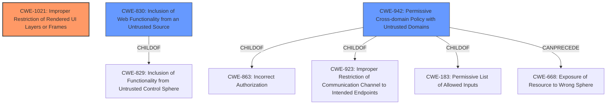

# Analysis for CVE-2021-27375

# Summary
| CWE ID    | CWE Name                                                                 | Confidence | CWE Abstraction Level | CWE Vulnerability Mapping Label | CWE-Vulnerability Mapping Notes |
| :-------- | :----------------------------------------------------------------------- | :--------- | :---------------------- | :------------------------------ | :------------------------------ |
| CWE-1021 | Improper Restriction of Rendered UI Layers or Frames | 0.9        | Base                   | Allowed                       | Primary CWE                     |
| CWE-830 | Inclusion of Web Functionality from an Untrusted Source | 0.7        | Variant                   | Allowed                       | Secondary Candidate                |
| CWE-942 | Permissive Cross-domain Policy with Untrusted Domains | 0.6        | Variant                   | Allowed                       | Secondary Candidate               |

## Evidence and Confidence

*   **Confidence Score:** 0.8
*   **Evidence Strength:** HIGH

## Relationship Analysis
The primary CWE is CWE-1021, which focuses on the **improper restriction of UI layers or frames**. The vulnerability directly relates to this as it allows the loading of IFRAME elements from untrusted domains. CWE-1021 is a base level CWE, providing a specific description of the weakness.

CWE-830 (Inclusion of Web Functionality from an Untrusted Source) is a variant that focuses on the inclusion of web functionality from untrusted sources, leading to potential control of the product by the untrusted source. CWE-830 is a child of CWE-829 (Inclusion of Functionality from Untrusted Control Sphere).

CWE-942 (Permissive Cross-domain Policy with Untrusted Domains) is another variant that addresses the use of cross-domain policy files that include domains that should not be trusted. This is less directly relevant as it focuses on policy files rather than the general inclusion of iframes.

## Vulnerability Chain
The vulnerability chain starts with the **lack of restrictions** on the source of iframes being loaded. This leads to the inclusion of content from **untrusted sources**, which ultimately allows for potential **Cross-Site Scripting (XSS)** attacks via malicious iframes.

## Summary of Analysis
The initial analysis identified several potential CWEs, focusing on issues related to untrusted input and control spheres. The primary selection of CWE-1021 is based on the direct match with the vulnerability description, which highlights the **improper restriction** of rendered UI layers or frames. The evidence supporting this includes the vulnerability description stating that Traefik allows loading of IFRAME elements from other domains, and the fix implemented restricting iframe loading to the application's own domain.

The choice of CWE-1021 is further justified by its Base level of abstraction, aligning with the preferred level for root cause mapping. Other considered CWEs, such as CWE-830 and CWE-942, are relevant but less specific. CWE-830 addresses the inclusion of web functionality from untrusted sources, while CWE-942 relates to permissive cross-domain policies. While both are applicable to the scenario, CWE-1021 directly describes the **lack of restriction** on iframe sources, making it a more precise fit.

The final selection reflects the need for a specific classification that captures the essence of the vulnerability, which is the failure to restrict the loading of iframes from untrusted domains, potentially leading to malicious content injection and XSS attacks.

Relevant CWE Information:

# Enhanced Context (25 CWEs)
The following CWEs were identified as potentially relevant to this vulnerability:

## CWE-807: Reliance on Untrusted Inputs in a Security Decision
**Abstraction Level**: Base
**Similarity Score**: 0.79

## CWE-784: Reliance on Cookies without Validation and Integrity Checking in a Security Decision
**Abstraction Level**: Variant
**Similarity Score**: 0.78

## CWE-565: Reliance on Cookies without Validation and Integrity Checking
**Abstraction Level**: Base
**Similarity Score**: 0.77

## CWE-41: Improper Resolution of Path Equivalence
**Abstraction Level**: Base
**Similarity Score**: 0.77

## CWE-668: Exposure of Resource to Wrong Sphere
**Abstraction Level**: Class
**Similarity Score**: 0.76

## CWE-451: User Interface (UI) Misrepresentation of Critical Information
**Abstraction Level**: Class
**Similarity Score**: 0.76

## CWE-1289: Improper Validation of Unsafe Equivalence in Input
**Abstraction Level**: Base
**Similarity Score**: 0.76

## CWE-472: External Control of Assumed-Immutable Web Parameter
**Abstraction Level**: Base
**Similarity Score**: 0.76

## CWE-184: Incomplete List of Disallowed Inputs
**Abstraction Level**: Base
**Similarity Score**: 0.76

## CWE-74: Improper Neutralization of Special Elements in Output Used by a Downstream Component ('Injection')
**Abstraction Level**: Class
**Similarity Score**: 0.76

## CWE-427: Uncontrolled Search Path Element
**Abstraction Level**: Base
**Similarity Score**: 7098.29

## CWE-942: Permissive Cross-domain Policy with Untrusted Domains
**Abstraction Level**: Variant
**Similarity Score**: 6211.73

## CWE-79: Improper Neutralization of Input During Web Page Generation ('Cross-site Scripting')
**Abstraction Level**: Base
**Similarity Score**: 6093.42

## CWE-22: Improper Limitation of a Pathname to a Restricted Directory ('Path Traversal')
**Abstraction Level**: Base
**Similarity Score**: 6081.05

## CWE-923: Improper Restriction of Communication Channel to Intended Endpoints
**Abstraction Level**: Class
**Similarity Score**: 6024.55

## CWE-73: External Control of File Name or Path
**Abstraction Level**: base
**Similarity Score**: 5.03

## CWE-22: Improper Limitation of a Pathname to a Restricted Directory ('Path Traversal')
**Abstraction Level**: base
**Similarity Score**: 4.33

## CWE-835: Loop with Unreachable Exit Condition ('Infinite Loop')
**Abstraction Level**: base
**Similarity Score**: 4.33

## CWE-1322: Use of Blocking Code in Single-threaded, Non-blocking Context
**Abstraction Level**: base
**Similarity Score**: 4.33

## CWE-942: Permissive Cross-domain Policy with Untrusted Domains
**Abstraction Level**: variant
**Similarity Score**: 3.88

## CWE-183: Permissive List of Allowed Inputs
**Abstraction Level**: base
**Similarity Score**: 3.80

## CWE-193: Off-by-one Error
**Abstraction Level**: base
**Similarity Score**: 3.65

## CWE-426: Untrusted Search Path
**Abstraction Level**: base
**Similarity Score**: 3.64

## CWE-427: Uncontrolled Search Path Element
**Abstraction Level**: base
**Similarity Score**: 3.64

## CWE-79: Improper Neutralization of Input During Web Page Generation ('Cross-site Scripting')
**Abstraction Level**: base
**Similarity Score**: 3.49

# Enhanced Query for CVE-2021-27375

## Vulnerability Description
Traefik before 2.4.5 allows the loading of IFRAME elements from other domains.

### Vulnerability Description Key Phrases
- **impact:** load IFRAME elements from other domains
- **product:** Traefik
- **version:** before 2.4.5

## CVE Reference Links Content Summary
Based on the provided content, here's an analysis related to CVE-2021-27375:

**Summary:**
The provided content details a fix for an issue where iframes could be loaded from any domain within the Traefik web UI. This fix was implemented by restricting iframe loading to only the application's own domain. This directly addresses a potential security vulnerability, even if the specific CVE isn't stated.

**Root Cause of Vulnerability:**
The root cause was the lack of restrictions on the source of iframes being loaded into the Traefik web UI. This could allow an attacker to inject malicious content via iframes.

**Weaknesses/Vulnerabilities Present:**
- **Cross-Site Scripting (XSS) via iframes**: The vulnerability is a form of XSS that could potentially be exploited via malicious iframes.

**Impact of Exploitation:**
- An attacker could inject malicious content into the Traefik dashboard by using iframes from a different domain.
- This could lead to a variety of attacks, including:
  - Defacement of the dashboard
  - Phishing attacks by overlaying a fake login form
  - Session hijacking
  - Other malicious activities depending on the context.

**Attack Vectors:**
- The primary attack vector is through the injection of iframes into the Traefik web UI that are loaded from an attacker-controlled domain.

**Required Attacker Capabilities/Position:**
- The attacker needs to be able to control content that the web UI would process.
- The attacker could trick a user into loading a malicious page in the context of the web UI.
- An attacker would need the ability to somehow influence the iframes that are loaded in the web UI.

**Additional Notes:**

- This is a fix for an XSS vulnerability where a malicious actor could load iframes from a domain that they control.
- The fix was implemented by restricting the allowed domain for iframes.
- The fix was included in Traefik version v2.4.5

## Retriever Results

### Top Combined Results

| Rank | CWE ID | Name | Abstraction | Usage  | Retrievers | Individual Scores |
|------|--------|------|-------------|-------|------------|-------------------|
| 1 | 1021 | Improper Restriction of Rendered UI Layers or Frames | Base | Allowed | sparse | 0.034 |
| 2 | 427 | Uncontrolled Search Path Element | Base | Allowed | sparse | 0.024 |
| 3 | 610 | Externally Controlled Reference to a Resource in Another Sphere | Class | Discouraged | sparse | 0.024 |
| 4 | 835 | Loop with Unreachable Exit Condition ('Infinite Loop') | Base | Allowed | sparse | 0.021 |
| 5 | 942 | Permissive Cross-domain Policy with Untrusted Domains | Variant | Allowed | sparse | 0.020 |
| 6 | 830 | Inclusion of Web Functionality from an Untrusted Source | Variant | Allowed | dense | 0.364 |
| 7 | 1322 | Use of Blocking Code in Single-threaded, Non-blocking Context | Base | Allowed | graph | 0.002 |
| 8 | 755 | Improper Handling of Exceptional Conditions | Class | Discouraged | sparse | 0.019 |
| 9 | 162 | Improper Neutralization of Trailing Special Elements | Variant | Allowed | sparse | 0.019 |
| 10 | 784 | Reliance on Cookies without Validation and Integrity Checking in a Security Decision | Variant | Allowed | sparse | 0.019 |

# Complete CWE Specifications

## CWE-1021: Improper Restriction of Rendered UI Layers or Frames
**Abstraction:** Base
**Status:** Incomplete

### Description
The web application does not restrict or incorrectly restricts frame objects or UI layers that belong to another application or domain, which can lead to user confusion about which interface the user is interacting with.

### Extended Description
A web application is expected to place restrictions on whether it is allowed to be rendered within frames, iframes, objects, embed or applet elements. Without the restrictions, users can be tricked into interacting with the application when they were not intending to.

### Alternative Terms
Clickjacking
UI Redress Attack
Tapjacking: "Tapjacking" is similar to clickjacking, except it is used for mobile applications in which the user "taps" the application instead of performing a mouse click.

### Relationships
ChildOf -> CWE-441
ChildOf -> CWE-610
ChildOf -> CWE-451

### Mapping Guidance
**Usage:** Allowed
**Rationale:** This CWE entry is at the Base level of abstraction, which is a preferred level of abstraction for mapping to the root causes of vulnerabilities.
**Comments:** Carefully read both the name and description to ensure that this mapping is an appropriate fit. Do not try to 'force' a mapping to a lower-level Base/Variant simply to comply with this preferred level of abstraction.
**Reasons:**
- Acceptable-Use

### Observed Examples
- **CVE-2017-7440:** E-mail preview feature in a desktop application allows clickjacking attacks via a crafted e-mail message
- **CVE-2017-5697:** Hardware/firmware product has insufficient clickjacking protection in its web user interface
- **CVE-2017-4015:** Clickjacking in data-loss prevention product via HTTP response header.

## CWE-427: Uncontrolled Search Path Element
**Abstraction:** Base
**Status:** Draft

### Description
The product uses a fixed or controlled search path to find resources, but one or more locations in that path can be under the control of unintended actors.

### Extended Description

Although this weakness can occur with any type of resource, it is frequently introduced when a product uses a directory search path to find executables or code libraries, but the path contains a directory that can be modified by an attacker, such as "/tmp" or the current working directory.

In Windows-based systems, when the LoadLibrary or LoadLibraryEx function is called with a DLL name that does not contain a fully qualified path, the function follows a search order that includes two path elements that might be uncontrolled:

  - the directory from which the program has been loaded

  - the current working directory

In some cases, the attack can be conducted remotely, such as when SMB or WebDAV network shares are used.

One or more locations in that path could include the Windows drive root or its subdirectories. This often exists in Linux-based code assuming the controlled nature of the root directory (/) or its subdirectories (/etc, etc), or a code that recursively accesses the parent directory. In Windows, the drive root and some of its subdirectories have weak permissions by default, which makes them uncontrolled.

In some Unix-based systems, a PATH might be created that contains an empty element, e.g. by splicing an empty variable into the PATH. This empty element can be interpreted as equivalent to the current working directory, which might be an untrusted search element.

In software package management frameworks (e.g., npm, RubyGems, or PyPi), the framework may identify dependencies on third-party libraries or other packages, then consult a repository that contains the desired package. The framework may search a public repository before a private repository. This could be exploited by attackers by placing a malicious package in the public repository that has the same name as a package from the private repository. The search path might not be directly under control of the developer relying on the framework, but this search order effectively contains an untrusted element.

### Alternative Terms
DLL preloading: This term is one of several that are used to describe exploitation of untrusted search path elements in Windows systems, which received wide attention in August 2010. From a weakness perspective, the term is imprecise because it can apply to both CWE-426 and CWE-427.
Binary planting: This term is one of several that are used to describe exploitation of untrusted search path elements in Windows systems, which received wide attention in August 2010. From a weakness perspective, the term is imprecise because it can apply to both CWE-426 and CWE-427.
Insecure library loading: This term is one of several that are used to describe exploitation of untrusted search path elements in Windows systems, which received wide attention in August 2010. From a weakness perspective, the term is imprecise because it can apply to both CWE-426 and CWE-427.
Dependency confusion: As of February 2021, this term is used to describe CWE-427 in the context of managing installation of software package dependencies, in which attackers release packages on public sites where the names are the same as package names used by private repositories, and the search for the dependent package tries the public site first, downloading untrusted code. It may also be referred to as a "substitution attack."

### Relationships
ChildOf -> CWE-668
ChildOf -> CWE-668

### Mapping Guidance
**Usage:** Allowed
**Rationale:** This CWE entry is at the Base level of abstraction, which is a preferred level of abstraction for mapping to the root causes of vulnerabilities.
**Comments:** Carefully read both the name and description to ensure that this mapping is an appropriate fit. Do not try to 'force' a mapping to a lower-level Base/Variant simply to comply with this preferred level of abstraction.
**Reasons:**
- Acceptable-Use

### Additional Notes
**[Relationship]** Unlike untrusted search path (CWE-426), which inherently involves control over the definition of a control sphere (i.e., modification of a search path), this entry concerns a fixed control sphere in which some part of the sphere may be under attacker control (i.e., the search path cannot be modified by an attacker, but one element of the path can be under attacker control).

**[Theoretical]** This weakness is not a clean fit under CWE-668 or CWE-610, which suggests that the control sphere model might need enhancement or clarification.

### Observed Examples
- **CVE-2023-25815:** chain: a change in an underlying package causes the gettext function to use implicit initialization with a hard-coded path (CWE-1419) under the user-writable C:\ drive, introducing an untrusted search path element (CWE-427) that enables spoofing of messages.
- **CVE-2022-4826:** Go-based git extension on Windows can search for and execute a malicious "..exe" in a repository because Go searches the current working directory if git.exe is not found in the PATH
- **CVE-2020-26284:** A Static Site Generator built in Go, when running on Windows, searches the current working directory for a command, possibly allowing code execution using a malicious .exe or .bat file with the name being searched

## CWE-610: Externally Controlled Reference to a Resource in Another Sphere
**Abstraction:** Class
**Status:** Draft

### Description
The product uses an externally controlled name or reference that resolves to a resource that is outside of the intended control sphere.

### Extended Description
Not provided

### Alternative Terms
None

### Relationships
ChildOf -> CWE-664

### Mapping Guidance
**Usage:** Discouraged
**Rationale:** This CWE entry is a level-1 Class (i.e., a child of a Pillar). It might have lower-level children that would be more appropriate
**Comments:** Examine children of this entry to see if there is a better fit
**Reasons:**
- Abstraction

### Additional Notes
**[Relationship]** This is a general class of weakness, but most research is focused on more specialized cases, such as path traversal (CWE-22) and symlink following (CWE-61). A symbolic link has a name; in general, it appears like any other file in the file system. However, the link includes a reference to another file, often in another directory - perhaps in another sphere of control. Many common library functions that accept filenames will "follow" a symbolic link and use the link's target instead.

**[Maintenance]** The relationship between CWE-99 and CWE-610 needs further investigation and clarification. They might be duplicates. CWE-99 "Resource Injection," as originally defined in Seven Pernicious Kingdoms taxonomy, emphasizes the "identifier used to access a system resource" such as a file name or port number, yet it explicitly states that the "resource injection" term does not apply to "path manipulation," which effectively identifies the path at which a resource can be found and could be considered to be one aspect of a resource identifier. Also, CWE-610 effectively covers any type of resource, whether that resource is at the system layer, the application layer, or the code layer.

### Observed Examples
- **CVE-2022-3032:** An email client does not block loading of remote objects in a nested document.
- **CVE-2022-45918:** Chain: a learning management tool debugger uses external input to locate previous session logs (CWE-73) and does not properly validate the given path (CWE-20), allowing for filesystem path traversal using "../" sequences (CWE-24)
- **CVE-2018-1000613:** Cryptography API uses unsafe reflection when deserializing a private key

## CWE-835: Loop with Unreachable Exit Condition ('Infinite Loop')
**Abstraction:** Base
**Status:** Incomplete

### Description
The product contains an iteration or loop with an exit condition that cannot be reached, i.e., an infinite loop.

### Extended Description
Not provided

### Alternative Terms
None

### Relationships
ChildOf -> CWE-834
ChildOf -> CWE-834

### Mapping Guidance
**Usage:** Allowed
**Rationale:** This CWE entry is at the Base level of abstraction, which is a preferred level of abstraction for mapping to the root causes of vulnerabilities.
**Comments:** Carefully read both the name and description to ensure that this mapping is an appropriate fit. Do not try to 'force' a mapping to a lower-level Base/Variant simply to comply with this preferred level of abstraction.
**Reasons:**
- Acceptable-Use

### Observed Examples
- **CVE-2022-22224:** Chain: an operating system does not properly process malformed Open Shortest Path First (OSPF) Type/Length/Value Identifiers (TLV) (CWE-703), which can cause the process to enter an infinite loop (CWE-835)
- **CVE-2022-25304:** A Python machine communication platform did not account for receiving a malformed packet with a null size, causing the receiving function to never update the message buffer and be caught in an infinite loop.
- **CVE-2011-1027:** Chain: off-by-one error (CWE-193) leads to infinite loop (CWE-835) using invalid hex-encoded characters.

## CWE-942: Permissive Cross-domain Policy with Untrusted Domains
**Abstraction:** Variant
**Status:** Incomplete

### Description
The product uses a cross-domain policy file that includes domains that should not be trusted.

### Extended Description

A cross-domain policy file ("crossdomain.xml" in Flash and "clientaccesspolicy.xml" in Silverlight) defines a list of domains from which a server is allowed to make cross-domain requests. When making a cross-domain request, the Flash or Silverlight client will first look for the policy file on the target server. If it is found, and the domain hosting the application is explicitly allowed to make requests, the request is made.

Therefore, if a cross-domain policy file includes domains that should not be trusted, such as when using wildcards, then the application could be attacked by these untrusted domains.

An overly permissive policy file allows many of the same attacks seen in Cross-Site Scripting (CWE-79). Once the user has executed a malicious Flash or Silverlight application, they are vulnerable to a variety of attacks. The attacker could transfer private information, such as cookies that may include session information, from the victim's machine to the attacker. The attacker could send malicious requests to a web site on behalf of the victim, which could be especially dangerous to the site if the victim has administrator privileges to manage that site.

In many cases, the attack can be launched without the victim even being aware of it.

### Alternative Terms
None

### Relationships
ChildOf -> CWE-863
ChildOf -> CWE-923
ChildOf -> CWE-183
CanPrecede -> CWE-668

### Mapping Guidance
**Usage:** Allowed
**Rationale:** This CWE entry is at the Variant level of abstraction, which is a preferred level of abstraction for mapping to the root causes of vulnerabilities.
**Comments:** Carefully read both the name and description to ensure that this mapping is an appropriate fit. Do not try to 'force' a mapping to a lower-level Base/Variant simply to comply with this preferred level of abstraction.
**Reasons:**
- Acceptable-Use

### Observed Examples
- **CVE-2012-2292:** Product has a Silverlight cross-domain policy that does not restrict access to another application, which allows remote attackers to bypass the Same Origin Policy.
- **CVE-2014-2049:** The default Flash Cross Domain policies in a product allows remote attackers to access user files.
- **CVE-2007-6243:** Chain: Adobe Flash Player does not sufficiently restrict the interpretation and usage of cross-domain policy files, which makes it easier for remote attackers to conduct cross-domain and cross-site scripting (XSS) attacks.

## CWE-830: Inclusion of Web Functionality from an Untrusted Source
**Abstraction:** Variant
**Status:** Incomplete

### Description
The product includes web functionality (such as a web widget) from another domain, which causes it to operate within the domain of the product, potentially granting total access and control of the product to the untrusted source.

### Extended Description

Including third party functionality in a web-based environment is risky, especially if the source of the functionality is untrusted.

Even if the third party is a trusted source, the product may still be exposed to attacks and malicious behavior if that trusted source is compromised, or if the code is modified in transmission from the third party to the product.

This weakness is common in "mashup" development on the web, which may include source functionality from other domains. For example, Javascript-based web widgets may be inserted by using '<SCRIPT SRC="http://other.domain.here">' tags, which causes the code to run in the domain of the product, not the remote site from which the widget was loaded. As a result, the included code has access to the local DOM, including cookies and other data that the developer might not want the remote site to be able to access.

Such dependencies may be desirable, or even required, but sometimes programmers are not aware that a dependency exists.

### Alternative Terms
None

### Relationships
ChildOf -> CWE-829

### Mapping Guidance
**Usage:** Allowed
**Rationale:** This CWE entry is at the Variant level of abstraction, which is a preferred level of abstraction for mapping to the root causes of vulnerabilities.
**Comments:** Carefully read both the name and description to ensure that this mapping is an appropriate fit. Do not try to 'force' a mapping to a lower-level Base/Variant simply to comply with this preferred level of abstraction.
**Reasons:**
- Acceptable-Use

## CWE-1322: Use of Blocking Code in Single-threaded, Non-blocking Context
**Abstraction:** Base
**Status:** Incomplete

### Description
The product uses a non-blocking model that relies on a single threaded process
			for features such as scalability, but it contains code that can block when it is invoked.

### Extended Description

When an attacker can directly invoke the blocking code, or the blocking code can be affected by environmental conditions that can be influenced by an attacker, then this can lead to a denial of service by causing unexpected hang or freeze of the code. Examples of blocking code might be an expensive computation or calling blocking library calls, such as those that perform exclusive file operations or require a successful network operation.

Due to limitations in multi-thread models, single-threaded models are used to overcome the resource constraints that are caused by using many threads. In such a model, all code should generally be non-blocking. If blocking code is called, then the event loop will effectively be stopped, which can be undesirable or dangerous. Such models are used in Python asyncio, Vert.x, and Node.js, or other custom event loop code.

### Alternative Terms
None

### Relationships
ChildOf -> CWE-834
CanPrecede -> CWE-835

### Mapping Guidance
**Usage:** Allowed
**Rationale:** This CWE entry is at the Base level of abstraction, which is a preferred level of abstraction for mapping to the root causes of vulnerabilities.
**Comments:** Carefully read both the name and description to ensure that this mapping is an appropriate fit. Do not try to 'force' a mapping to a lower-level Base/Variant simply to comply with this preferred level of abstraction.
**Reasons:**
- Acceptable-Use

## CWE-755: Improper Handling of Exceptional Conditions
**Abstraction:** Class
**Status:** Incomplete

### Description
The product does not handle or incorrectly handles an exceptional condition.

### Extended Description
Not provided

### Alternative Terms
None

### Relationships
ChildOf -> CWE-703

### Mapping Guidance
**Usage:** Discouraged
**Rationale:** This CWE entry is a level-1 Class (i.e., a child of a Pillar). It might have lower-level children that would be more appropriate
**Comments:** Examine children of this entry to see if there is a better fit
**Reasons:**
- Abstraction

### Observed Examples
- **CVE-2023-41151:** SDK for OPC Unified Architecture (OPC UA) server has uncaught exception when a socket is blocked for writing but the server tries to send an error
- **[REF-1374]:** Chain: JavaScript-based cryptocurrency library can fall back to the insecure Math.random() function instead of reporting a failure (CWE-392), thus reducing the entropy (CWE-332) and leading to generation of non-unique cryptographic keys for Bitcoin wallets (CWE-1391)
- **CVE-2021-3011:** virtual interrupt controller in a virtualization product allows crash of host by writing a certain invalid value to a register, which triggers a fatal error instead of returning an error code

## CWE-162: Improper Neutralization of Trailing Special Elements
**Abstraction:** Variant
**Status:** Incomplete

### Description
The product receives input from an upstream component, but it does not neutralize or incorrectly neutralizes trailing special elements that could be interpreted in unexpected ways when they are sent to a downstream component.

### Extended Description
As data is parsed, improperly handled trailing special elements may cause the process to take unexpected actions that result in an attack.

### Alternative Terms
None

### Relationships
ChildOf -> CWE-138

### Mapping Guidance
**Usage:** Allowed
**Rationale:** This CWE entry is at the Variant level of abstraction, which is a preferred level of abstraction for mapping to the root causes of vulnerabilities.
**Comments:** Carefully read both the name and description to ensure that this mapping is an appropriate fit. Do not try to 'force' a mapping to a lower-level Base/Variant simply to comply with this preferred level of abstraction.
**Reasons:**
- Acceptable-Use

### Observed Examples
- **CVE-2004-0847:** web framework for .NET allows remote attackers to bypass authentication for .aspx files in restricted directories via a request containing a (1) "\" (backslash) or (2) "%5C" (encoded backslash)
- **CVE-2002-1451:** Trailing space ("+" in query string) leads to source code disclosure.
- **CVE-2001-0446:** Application server allows remote attackers to read source code for .jsp files by appending a / to the requested URL.

## CWE-784: Reliance on Cookies without Validation and Integrity Checking in a Security Decision
**Abstraction:** Variant
**Status:** Draft

### Description
The product uses a protection mechanism that relies on the existence or values of a cookie, but it does not properly ensure that the cookie is valid for the associated user.

### Extended Description
Attackers can easily modify cookies, within the browser or by implementing the client-side code outside of the browser. Attackers can bypass protection mechanisms such as authorization and authentication by modifying the cookie to contain an expected value.

### Alternative Terms
None

### Relationships
ChildOf -> CWE-807
ChildOf -> CWE-565

### Mapping Guidance
**Usage:** Allowed
**Rationale:** This CWE entry is at the Variant level of abstraction, which is a preferred level of abstraction for mapping to the root causes of vulnerabilities.
**Comments:** Carefully read both the name and description to ensure that this mapping is an appropriate fit. Do not try to 'force' a mapping to a lower-level Base/Variant simply to comply with this preferred level of abstraction.
**Reasons:**
- Acceptable-Use

### Additional Notes
**[Maintenance]** A new parent might need to be defined for this entry. This entry is specific to cookies, which reflects the significant number of vulnerabilities being reported for cookie-based authentication in CVE during 2008 and 2009. However, other types of inputs - such as parameters or headers - could also be used for similar authentication or authorization. Similar issues (under the Research view) include CWE-247 and CWE-472.

### Observed Examples
- **CVE-2009-1549:** Attacker can bypass authentication by setting a cookie to a specific value.
- **CVE-2009-1619:** Attacker can bypass authentication and gain admin privileges by setting an "admin" cookie to 1.
- **CVE-2009-0864:** Content management system allows admin privileges by setting a "login" cookie to "OK."

