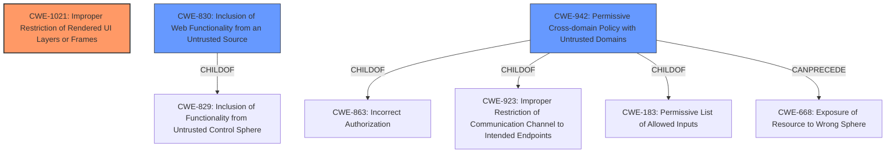

# Analysis Report for CVE-2021-27375

# Vulnerability Analysis Report: CVE-2021-27375

## Description


## Analysis (with Relationship Data)

# Summary
| CWE ID    | CWE Name                                                                 | Confidence | CWE Abstraction Level | CWE Vulnerability Mapping Label | CWE-Vulnerability Mapping Notes |
| :-------- | :----------------------------------------------------------------------- | :--------- | :---------------------- | :------------------------------ | :------------------------------ |
| CWE-1021 | Improper Restriction of Rendered UI Layers or Frames | 0.9        | Base                   | Allowed                       | Primary CWE                     |
| CWE-830 | Inclusion of Web Functionality from an Untrusted Source | 0.7        | Variant                   | Allowed                       | Secondary Candidate                |
| CWE-942 | Permissive Cross-domain Policy with Untrusted Domains | 0.6        | Variant                   | Allowed                       | Secondary Candidate               |

## Evidence and Confidence

*   **Confidence Score:** 0.8
*   **Evidence Strength:** HIGH

## Relationship Analysis
The primary CWE is CWE-1021, which focuses on the **improper restriction of UI layers or frames**. The vulnerability directly relates to this as it allows the loading of IFRAME elements from untrusted domains. CWE-1021 is a base level CWE, providing a specific description of the weakness.

CWE-830 (Inclusion of Web Functionality from an Untrusted Source) is a variant that focuses on the inclusion of web functionality from untrusted sources, leading to potential control of the product by the untrusted source. CWE-830 is a child of CWE-829 (Inclusion of Functionality from Untrusted Control Sphere).

CWE-942 (Permissive Cross-domain Policy with Untrusted Domains) is another variant that addresses the use of cross-domain policy files that include domains that should not be trusted. This is less directly relevant as it focuses on policy files rather than the general inclusion of iframes.



## Vulnerability Chain
The vulnerability chain starts with the **lack of restrictions** on the source of iframes being loaded. This leads to the inclusion of content from **untrusted sources**, which ultimately allows for potential **Cross-Site Scripting (XSS)** attacks via malicious iframes.

## Summary of Analysis
The initial analysis identified several potential CWEs, focusing on issues related to untrusted input and control spheres. The primary selection of CWE-1021 is based on the direct match with the vulnerability description, which highlights the **improper restriction** of rendered UI layers or frames. The evidence supporting this includes the vulnerability description stating that Traefik allows loading of IFRAME elements from other domains, and the fix implemented restricting iframe loading to the application's own domain.

The choice of CWE-1021 is further justified by its Base level of abstraction, aligning with the preferred level for root cause mapping. Other considered CWEs, such as CWE-830 and CWE-942, are relevant but less specific. CWE-830 addresses the inclusion of web functionality from untrusted sources, while CWE-942 relates to permissive cross-domain policies. While both are applicable to the scenario, CWE-1021 directly describes the **lack of restriction** on iframe sources, making it a more precise fit.

The final selection reflects the need for a specific classification that captures the essence of the vulnerability, which is the failure to restrict the loading of iframes from untrusted domains, potentially leading to malicious content injection and XSS attacks.

Relevant CWE Information:

# Enhanced Context (25 CWEs)
The following CWEs were identified as potentially relevant to this vulnerability:

## CWE-807: Reliance on Untrusted Inputs in a Security Decision
**Abstraction Level**: Base
**Similarity Score**: 0.79

## CWE-784: Reliance on Cookies without Validation and Integrity Checking in a Security Decision
**Abstraction Level**: Variant
**Similarity Score**: 0.78

## CWE-565: Reliance on Cookies without Validation and Integrity Checking
**Abstraction Level**: Base
**Similarity Score**: 0.77

## CWE-41: Improper Resolution of Path Equivalence
**Abstraction Level**: Base
**Similarity Score**: 0.77

## CWE-668: Exposure of Resource to Wrong Sphere
**Abstraction Level**: Class
**Similarity Score**: 0.76

## CWE-451: User Interface (UI) Misrepresentation of Critical Information
**Abstraction Level**: Class
**Similarity Score**: 0.76

## CWE-1289: Improper Validation of Unsafe Equivalence in Input
**Abstraction Level**: Base
**Similarity Score**: 0.76

## CWE-472: External Control of Assumed-Immutable Web Parameter
**Abstraction Level**: Base
**Similarity Score**: 0.76

## CWE-184: Incomplete List of Disallowed Inputs
**Abstraction Level**: Base
**Similarity Score**: 0.76

## CWE-74: Improper Neutralization of Special Elements in Output Used by a Downstream Component ('Injection')
**Abstraction Level**: Class
**Similarity Score**: 0.76

## CWE-427: Uncontrolled Search Path Element
**Abstraction Level**: Base
**Similarity Score**: 7098.29

## CWE-942: Permissive Cross-domain Policy with Untrusted Domains
**Abstraction Level**: Variant
**Similarity Score**: 6211.73

## CWE-79: Improper Neutralization of Input During Web Page Generation ('Cross-site Scripting')
**Abstraction Level**: Base
**Similarity Score**: 6093.42

## CWE-22: Improper Limitation of a Pathname to a Restricted Directory ('Path Traversal')
**Abstraction Level**: Base
**Similarity Score**: 6081.05

## CWE-923: Improper Restriction of Communication Channel to Intended Endpoints
**Abstraction Level**: Class
**Similarity Score**: 6024.55

## CWE-73: External Control of File Name or Path
**Abstraction Level**: base
**Similarity Score**: 5.03

## CWE-22: Improper Limitation of a Pathname to a Restricted Directory ('Path Traversal')
**Abstraction Level**: base
**Similarity Score**: 4.33

## CWE-835: Loop with Unreachable Exit Condition ('Infinite Loop')
**Abstraction Level**: base
**Similarity Score**: 4.33

## CWE-1322: Use of Blocking Code in Single-threaded, Non-blocking Context
**Abstraction Level**: base
**Similarity Score**: 4.33

## CWE-942: Permissive Cross-domain Policy with Untrusted Domains
**Abstraction Level**: variant
**Similarity Score**: 3.88

## CWE-183: Permissive List of Allowed Inputs
**Abstraction Level**: base
**Similarity Score**: 3.80

## CWE-193: Off-by-one Error
**Abstraction Level**: base
**Similarity Score**: 3.65

## CWE-426: Untrusted Search Path
**Abstraction Level**: base
**Similarity Score**: 3.64

## CWE-427: Uncontrolled Search Path Element
**Abstraction Level**: base
**Similarity Score**: 3.64

## CWE-79: Improper Neutralization of Input During Web Page Generation ('Cross-site Scripting')
**Abstraction Level**: base
**Similarity Score**: 3.49


## CWE Relationship Analysis

Current CWEs represent these abstraction levels: .


### Vulnerability Chain Analysis

**Chain starting from CWE-784:**
- 784 (Reliance on Cookies without Validation and Integrity Checking in a Security Decision) - ROOT


**Chain starting from CWE-183:**
- 183 (Permissive List of Allowed Inputs) - ROOT


### CWE Relationship Diagram

```mermaid
graph TD
    classDef primary fill:#f96,stroke:#333,stroke-width:2px
    classDef secondary fill:#69f,stroke:#333
    classDef tertiary fill:#9e9,stroke:#333
```


*Report generated on 2025-04-01 23:11:47*
