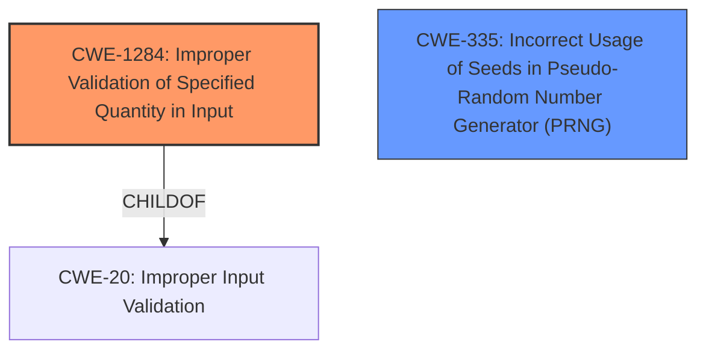

# Analysis for CVE-2021-27378

# Summary
| CWE ID  | CWE Name                                                     | Confidence | CWE Abstraction Level | CWE Vulnerability Mapping Label | CWE-Vulnerability Mapping Notes |
| :-------- | :----------------------------------------------------------- | :---------- | :---------------------- | :------------------------------ | :------------------------------ |
| CWE-1284 | Improper Validation of Specified Quantity in Input           | 0.9         | Base                    | Primary                       | Allowed                       |
| CWE-335 | Incorrect Usage of Seeds in Pseudo-Random Number Generator (PRNG) | 0.7         | Base                    | Secondary                       | Allowed                       |

## Evidence and Confidence

*   **Confidence Score:** 0.8
*   **Evidence Strength:** HIGH

## Relationship Analysis
The primary CWE, CWE-1284, is a child of CWE-20 (Improper Input Validation), reflecting that the root cause involves insufficient input validation. CWE-335, a secondary CWE, relates to the specific context of PRNG seeding. There are no direct parent-child or chain relationships between CWE-1284 and CWE-335 in the provided data, but they both relate to security vulnerabilities arising from improper handling of input or resources within a PRNG context. Choosing CWE-1284 as the primary and CWE-335 as a secondary CWE provides a more complete understanding of the vulnerability.

## Vulnerability Chain
The vulnerability chain begins with the **mishandling of buffer-length checks** (CWE-1284), leading to the **seeding of the RNG with too little data** (CWE-335). This insufficient seeding can result in predictable or weak random number generation, potentially compromising cryptographic security.

## Summary of Analysis
The initial assessment focused on identifying the root cause of the vulnerability. The description clearly indicates a **mishandling of buffer-length checks** in the `read_u32_into` and `read_u64_into` functions, which directly relates to improper input validation. The vulnerability description key phrases emphasize this root cause. The CVE Reference Links Content Summary further supports this by stating that the functions "fail to properly validate the length of the source buffer during the seeding process." This evidence strongly supports the selection of CWE-1284 (Improper Validation of Specified Quantity in Input) as the primary CWE.

The impact of this improper validation is that the random number generator may be seeded with too little data, leading to potential predictability. This aspect is captured by CWE-335 (Incorrect Usage of Seeds in Pseudo-Random Number Generator (PRNG)), which serves as a secondary CWE to further clarify the specific context of the vulnerability.

The graph relationships reinforce the selection of CWE-1284, which is a child of CWE-20 (Improper Input Validation), indicating a clear hierarchical relationship. While CWE-335 does not have a direct relationship with CWE-1284 in the provided data, it is logically connected as the consequence of the improper input validation in the context of random number generation.

The selected CWEs are at the optimal level of specificity. CWE-1284 accurately describes the **root cause** of the vulnerability, while CWE-335 provides additional context regarding the impact on the random number generator. Using higher-level CWEs like CWE-20 alone would not provide sufficient detail.

Relevant CWE Information:

# Enhanced Context (25 CWEs)

## CWE-191: Integer Underflow (Wrap or Wraparound)
**Abstraction Level**: Base
**Similarity Score**: 0.78
**Source**: dense

**Description**:
The product subtracts one value from another, such that the result is less than the minimum allowable integer value, which produces a value that is not equal to the correct result.

**Mapping Guidance**:
- Usage: Allowed
- Rationale: This CWE entry is at the Base level of abstraction, which is a preferred level of abstraction for mapping to the root causes of vulnerabilities.

## CWE-131: Incorrect Calculation of Buffer Size
**Abstraction Level**: Base
**Similarity Score**: 0.78
**Source**: dense

**Description**:
The product does not correctly calculate the size to be used when allocating a buffer, which could lead to a buffer overflow.

**Mapping Guidance**:
- Usage: Allowed
- Rationale: This CWE entry is at the Base level of abstraction, which is a preferred level of abstraction for mapping to the root causes of vulnerabilities.

## CWE-226: Sensitive Information in Resource Not Removed Before Reuse
**Abstraction Level**: Base
**Similarity Score**: 0.78
**Source**: dense

**Description**:
The product releases a resource such as memory or a file so that it can be made available for reuse, but it does not clear or "zeroize" the information contained in the resource before the product performs a critical state transition or makes the resource available for reuse by other entities.

**Mapping Guidance**:
- Usage: Allowed
- Rationale: This CWE entry is at the Base level of abstraction, which is a preferred level of abstraction for mapping to the root causes of vulnerabilities.

## CWE-404: Improper Resource Shutdown or Release
**Abstraction Level**: Class
**Similarity Score**: 0.77
**Source**: dense

**Description**:
The product does not release or incorrectly releases a resource before it is made available for re-use.

**Mapping Guidance**:
- Usage: Allowed-with-Review
- Rationale: This CWE entry is a Class and might have Base-level children that would be more appropriate

## CWE-908: Use of Uninitialized Resource
**Abstraction Level**: Base
**Similarity Score**: 0.76
**Source**: dense

**Description**:
The product uses or accesses a resource that has not been initialized.

**Mapping Guidance**:
- Usage: Allowed
- Rationale: This CWE entry is at the Base level of abstraction, which is a preferred level of abstraction for mapping to the root causes of vulnerabilities.

## CWE-667: Improper Locking
**Abstraction Level**: Class
**Similarity Score**: 0.76
**Source**: dense

**Description**:
The product does not properly acquire or release a lock on a resource, leading to unexpected resource state changes and behaviors.

**Mapping Guidance**:
- Usage: Allowed-with-Review
- Rationale: This CWE entry is a Class and might have Base-level children that would be more appropriate

## CWE-909: Missing Initialization of Resource
**Abstraction Level**: Class
**Similarity Score**: 0.76
**Source**: dense

**Description**:
The product does not initialize a critical resource.

**Mapping Guidance**:
- Usage: Allowed-with-Review
- Rationale: This CWE entry is a Class and might have Base-level children that would be more appropriate

## CWE-824: Access of Uninitialized Pointer
**Abstraction Level**: Base
**Similarity Score**: 0.76
**Source**: dense

**Description**:
The product accesses or uses a pointer that has not been initialized.

**Mapping Guidance**:
- Usage: Allowed
- Rationale: This CWE entry is at the Base level of abstraction, which is a preferred level of abstraction for mapping to the root causes of vulnerabilities.

## CWE-125: Out-of-bounds Read
**Abstraction Level**: Base
**Similarity Score**: 0.76
**Source**: dense

**Description**:
The product reads data past the end, or before the beginning, of the intended buffer.

**Mapping Guidance**:
- Usage: Allowed
- Rationale: This CWE entry is at the Base level of abstraction, which is a preferred level of abstraction for mapping to the root causes of vulnerabilities.

## CWE-665: Improper Initialization
**Abstraction Level**: Class
**Similarity Score**: 0.76
**Source**: dense

**Description**:
The product does not initialize or incorrectly initializes a resource, which might leave the resource in an unexpected state when it is accessed or used.

**Mapping Guidance**:
- Usage: Discouraged
- Rationale: This CWE entry is a level-1 Class (i.e., a child of a Pillar). It might have lower-level children that would be more appropriate

## CWE-190: Integer Overflow or Wraparound
**Abstraction Level**: Base
**Similarity Score**: 6555.65
**Source**: sparse

**Description**:
The product performs a calculation that can
         produce an integer overflow or wraparound when the logic
         assumes that the resulting value will always be larger than
         the original value. This occurs when an integer value is
         incremented to a value that is too large to store in the
         associated representation. When this occurs,