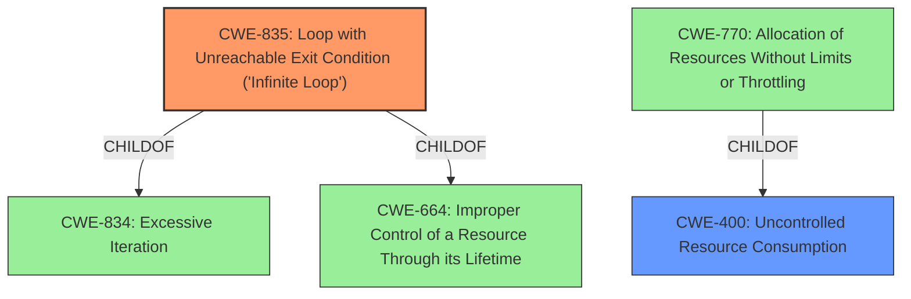

# Analysis Report for CVE-2021-27385

# Vulnerability Analysis Report: CVE-2021-27385

## Description


## Analysis (with Relationship Data)

# Summary
| CWE ID | CWE Name | Confidence | CWE Abstraction Level | CWE Vulnerability Mapping Label | CWE-Vulnerability Mapping Notes |
|---|---|---|---|---|---|
| CWE-835 | Loop with Unreachable Exit Condition ('Infinite Loop') | 1.0 | Base | Primary | Allowed |
| CWE-400 | Uncontrolled Resource Consumption | 0.8 | Class | Secondary | Discouraged |

## Evidence and Confidence

*   **Confidence Score:** 0.9
*   **Evidence Strength:** HIGH

## Relationship Analysis
The primary CWE is CWE-835, which is a Base level CWE. It is a child of CWE-834 (Improper Control of Recursion) and CWE-664 (Improper Control of a Resource Through its Lifetime).
CWE-400 is a Class level CWE and parent of CWE-770 (Allocation of Resources Without Limits or Throttling). There is a potential chain from uncontrolled resource allocation leading to an infinite loop.



## Vulnerability Chain
The vulnerability chain starts with the receipt of specially crafted packets leading to **uncontrolled resource consumption (CWE-400)**, ultimately resulting in an **infinite loop (CWE-835)** and a denial-of-service condition.

## Summary of Analysis
The vulnerability description clearly states that a remote attacker can send specially crafted packets to the SmartVNC device layout handler, which influences the amount of resources consumed and results in a denial-of-service condition due to an **infinite loop**.

The **Vulnerability Description Key Phrases** highlights the impact as "infinite loop". The **CVE Reference Links Content Summary** states "The vulnerability is due to an **uncontrolled resource consumption** issue within the SmartVNC device layout handler on the client side... specially crafted packets can be sent by a remote attacker to influence the amount of resources consumed, which leads to an **infinite loop**."

Based on this evidence, the primary CWE is CWE-835 "Loop with Unreachable Exit Condition ('Infinite Loop')", with a confidence of 1.0. CWE-835 is a Base level CWE, which is the preferred level of abstraction.

The secondary CWE is CWE-400 "Uncontrolled Resource Consumption" with a confidence of 0.8. CWE-400 is a Class level CWE and is mapped because the **uncontrolled resource consumption** leads to the infinite loop, it is a valid contributing factor.

The Retriever Results list CWE-835 and CWE-400 as potential CWEs.

Other CWEs Considered and Not Used:

*   CWE-755 (Improper Handling of Exceptional Conditions): While the infinite loop can be considered an exceptional condition, CWE-835 is a more specific and accurate representation of the vulnerability.
*   CWE-119 (Improper Restriction of Operations within the Bounds of a Memory Buffer): Not directly related to the described vulnerability, which focuses on resource consumption leading to an infinite loop, not a memory buffer issue.
*   CWE-770 (Allocation of Resources Without Limits or Throttling): Although related to resource consumption, the primary issue described is the resulting infinite loop. CWE-400 is already used, and it is a parent of CWE-770.
*   CWE-789 (Memory Allocation with Excessive Size Value): Not explicitly mentioned in the vulnerability description.
*   CWE-20 (Improper Input Validation): While the crafted packets might not be properly validated, the core issue is the resource consumption and the resulting infinite loop.

Relevant CWE Information:

# Enhanced Context (25 CWEs)
The following CWEs were identified as potentially relevant to this vulnerability:

## CWE-1269: Product Released in Non-Release Configuration
**Abstraction Level**: Base
**Similarity Score**: 0.78
**Source**: dense

**Description**:
The product released to market is released in pre-production or manufacturing configuration.

**Mapping Guidance**:
- Usage: Allowed
- Rationale: This CWE entry is at the Base level of abstraction, which is a preferred level of abstraction for mapping to the root causes of vulnerabilities.

## CWE-119: Improper Restriction of Operations within the Bounds of a Memory Buffer
**Abstraction Level**: Class
**Similarity Score**: 0.77
**Source**: dense

**Description**:
The product performs operations on a memory buffer, but it reads from or writes to a memory location outside the buffer's intended boundary. This may result in read or write operations on unexpected memory locations that could be linked to other variables, data structures, or internal program data.

**Mapping Guidance**:
- Usage: Discouraged
- Rationale: CWE-119 is commonly misused in low-information vulnerability reports when lower-level CWEs could be used instead, or when more details about the vulnerability are available.

## CWE-345: Insufficient Verification of Data Authenticity
**Abstraction Level**: Class
**Similarity Score**: 0.77
**Source**: dense

**Description**:
The product does not sufficiently verify the origin or authenticity of data, in a way that causes it to accept invalid data.

**Mapping Guidance**:
- Usage: Discouraged
- Rationale: This CWE entry is a level-1 Class (i.e., a child of a Pillar). It might have lower-level children that would be more appropriate

## CWE-755: Improper Handling of Exceptional Conditions
**Abstraction Level**: Class
**Similarity Score**: 0.77
**Source**: dense

**Description**:
The product does not handle or incorrectly handles an exceptional condition.

**Mapping Guidance**:
- Usage: Discouraged
- Rationale: This CWE entry is a level-1 Class (i.e., a child of a Pillar). It might have lower-level children that would be more appropriate

## CWE-200: Exposure of Sensitive Information to an Unauthorized Actor
**Abstraction Level**: Class
**Similarity Score**: 0.77
**Source**: dense

**Description**:
The product exposes sensitive information to an actor that is not explicitly authorized to have access to that information.

**Mapping Guidance**:
- Usage: Discouraged
- Rationale: CWE-200 is commonly misused to represent the loss of confidentiality in a vulnerability, but confidentiality loss is a technical impact - not a root cause error. As of CWE 4.9, over 400 CWE entries can lead to a loss of confidentiality. Other options are often available. [REF-1287].

## CWE-668: Exposure of Resource to Wrong Sphere
**Abstraction Level**: Class
**Similarity Score**: 0.77
**Source**: dense

**Description**:
The product exposes a resource to the wrong control sphere, providing unintended actors with inappropriate access to the resource.

**Mapping Guidance**:
- Usage: Discouraged
- Rationale: CWE-668 is high-level and is often misused as a catch-all when lower-level CWE IDs might be applicable. It is sometimes used for low-information vulnerability reports [REF-1287]. It is a level-1 Class (i.e., a child of a Pillar). It is not useful for trend analysis.

## CWE-226: Sensitive Information in Resource Not Removed Before Reuse
**Abstraction Level**: Base
**Similarity Score**: 0.76
**Source**: dense

**Description**:
The product releases a resource such as memory or a file so that it can be made available for reuse, but it does not clear or "zeroize" the information contained in the resource before the product performs a critical state transition or makes the resource available for reuse by other entities.

**Mapping Guidance**:
- Usage: Allowed
- Rationale: This CWE entry is at the Base level of abstraction, which is a preferred level of abstraction for mapping to the root causes of vulnerabilities.

## CWE-404: Improper Resource Shutdown or Release
**Abstraction Level**: Class
**Similarity Score**: 0.76
**Source**: dense

**Description**:
The product does not release or incorrectly releases a resource before it is made available for re-use.

**Mapping Guidance**:
- Usage: Allowed-with-Review
- Rationale: This CWE entry


## CWE Relationship Analysis

Current CWEs represent these abstraction levels: .


### Vulnerability Chain Analysis

**Chain starting from CWE-664:**
- 664 (Improper Control of a Resource Through its Lifetime) - ROOT


**Chain starting from CWE-404:**
- 404 (Improper Resource Shutdown or Release) - ROOT


### CWE Relationship Diagram

```mermaid
graph TD
    classDef primary fill:#f96,stroke:#333,stroke-width:2px
    classDef secondary fill:#69f,stroke:#333
    classDef tertiary fill:#9e9,stroke:#333
```


*Report generated on 2025-04-02 07:34:52*
