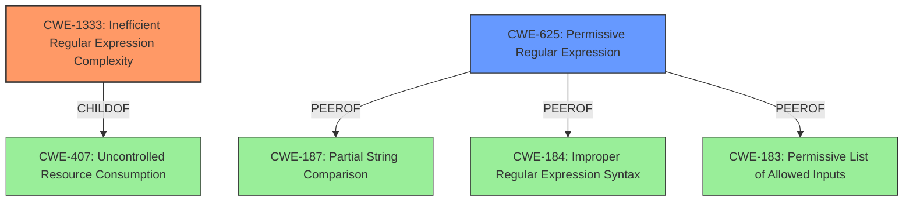

# Enhanced Analysis for CVE-2021-27405

# Summary
| CWE ID    | CWE Name                                                     | Confidence | CWE Abstraction Level | CWE Vulnerability Mapping Label | CWE-Vulnerability Mapping Notes |
| :-------- | :----------------------------------------------------------- | :--------- | :-------------------- | :------------------------------ | :------------------------------ |
| CWE-1333  | Inefficient Regular Expression Complexity                    | 1.0        | Base                  | Primary                         | Allowed                       |
| CWE-625   | Permissive Regular Expression                                  | 0.5        | Base                  | Secondary                       | Allowed                       |

## Evidence and Confidence

*   **Confidence Score:** 0.75
*   **Evidence Strength:** HIGH

## Relationship Analysis
The primary CWE is CWE-1333, which is a base-level CWE. CWE-1333 is a child of CWE-407 (Uncontrolled Resource Consumption), indicating a broader class of resource consumption issues. CWE-625 is a peer of CWE-187 (Partial String Comparison), CWE-184 (Improper Regular Expression Syntax), and CWE-183 (Permissive List of Allowed Inputs), suggesting alternative classifications for regular expression-related issues.



## Vulnerability Chain
The vulnerability chain involves an **inefficient regular expression**, leading to excessive CPU consumption and a denial-of-service condition.

## Summary of Analysis
The initial assessment, supported by vulnerability description key phrases and CVE reference content, identifies the **weakness** as a "**regular expression denial of service**". The vulnerability is due to an **inefficient regular expression** in the `@progfay/scrapbox-parser` Node.js package. The primary CWE match is CWE-1333 (Inefficient Regular Expression Complexity), which is at the Base level of abstraction and aligns with the root cause.

The Retriever Results list CWE-1333 as the top candidate with a score of 1.000. CWE-625 (Permissive Regular Expression) is also considered as a secondary candidate.

CWE-1333 directly addresses the **inefficient regular expression** that causes excessive CPU cycles, leading to a denial of service. The vulnerability's details match the CWE's characteristics. The security implication is a potential Denial of Service (DoS).

CWE-625 (Permissive Regular Expression) could be a contributing factor if the regular expression is too permissive, allowing inputs that trigger the inefficiency. However, the primary issue is the inefficiency of the regular expression itself rather than its permissiveness.

The selection of CWE-1333 is based on the evidence of an **inefficient regular expression** causing denial of service, as stated in the CVE reference links content summary. This aligns with the CWE's description and observed examples. The confidence level is high because the vulnerability description explicitly mentions "ReDoS" and the root cause is the inefficient regular expression.

I considered CWE-674 (Uncontrolled Recursion), CWE-617 (Reachable Assertion), CWE-1321 (Improperly Controlled Modification of Object Prototype Attributes ('Prototype Pollution')), CWE-185 (Incorrect Regular Expression), CWE-187 (Partial String Comparison), CWE-770 (Allocation of Resources Without Limits or Throttling), CWE-777 (Regular Expression without Anchors), and CWE-295 (Improper Certificate Validation) but these were not selected, because they did not align as closely with the root cause and specific details of the vulnerability as CWE-1333.


## CWE Relationship Analysis

Current CWEs represent these abstraction levels: .


### Vulnerability Chain Analysis

**Chain starting from CWE-674:**
- 674 (Uncontrolled Recursion) - ROOT


**Chain starting from CWE-185:**
- 185 (Incorrect Regular Expression) - ROOT


### CWE Relationship Diagram

```mermaid
graph TD
    classDef primary fill:#f96,stroke:#333,stroke-width:2px
    classDef secondary fill:#69f,stroke:#333
    classDef tertiary fill:#9e9,stroke:#333
```