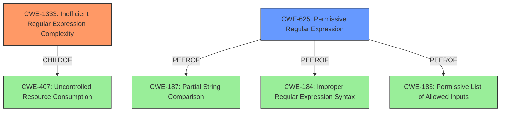

# Analysis for CVE-2021-27405

# Summary
| CWE ID    | CWE Name                                                     | Confidence | CWE Abstraction Level | CWE Vulnerability Mapping Label | CWE-Vulnerability Mapping Notes |
| :-------- | :----------------------------------------------------------- | :--------- | :-------------------- | :------------------------------ | :------------------------------ |
| CWE-1333  | Inefficient Regular Expression Complexity                    | 1.0        | Base                  | Primary                         | Allowed                       |
| CWE-625   | Permissive Regular Expression                                  | 0.5        | Base                  | Secondary                       | Allowed                       |

## Evidence and Confidence

*   **Confidence Score:** 0.75
*   **Evidence Strength:** HIGH

## Relationship Analysis
The primary CWE is CWE-1333, which is a base-level CWE. CWE-1333 is a child of CWE-407 (Uncontrolled Resource Consumption), indicating a broader class of resource consumption issues. CWE-625 is a peer of CWE-187 (Partial String Comparison), CWE-184 (Improper Regular Expression Syntax), and CWE-183 (Permissive List of Allowed Inputs), suggesting alternative classifications for regular expression-related issues.



## Vulnerability Chain
The vulnerability chain involves an **inefficient regular expression**, leading to excessive CPU consumption and a denial-of-service condition.

## Summary of Analysis
The initial assessment, supported by vulnerability description key phrases and CVE reference content, identifies the **weakness** as a "**regular expression denial of service**". The vulnerability is due to an **inefficient regular expression** in the `@progfay/scrapbox-parser` Node.js package. The primary CWE match is CWE-1333 (Inefficient Regular Expression Complexity), which is at the Base level of abstraction and aligns with the root cause.

The Retriever Results list CWE-1333 as the top candidate with a score of 1.000. CWE-625 (Permissive Regular Expression) is also considered as a secondary candidate.

CWE-1333 directly addresses the **inefficient regular expression** that causes excessive CPU cycles, leading to a denial of service. The vulnerability's details match the CWE's characteristics. The security implication is a potential Denial of Service (DoS).

CWE-625 (Permissive Regular Expression) could be a contributing factor if the regular expression is too permissive, allowing inputs that trigger the inefficiency. However, the primary issue is the inefficiency of the regular expression itself rather than its permissiveness.

The selection of CWE-1333 is based on the evidence of an **inefficient regular expression** causing denial of service, as stated in the CVE reference links content summary. This aligns with the CWE's description and observed examples. The confidence level is high because the vulnerability description explicitly mentions "ReDoS" and the root cause is the inefficient regular expression.

I considered CWE-674 (Uncontrolled Recursion), CWE-617 (Reachable Assertion), CWE-1321 (Improperly Controlled Modification of Object Prototype Attributes ('Prototype Pollution')), CWE-185 (Incorrect Regular Expression), CWE-187 (Partial String Comparison), CWE-770 (Allocation of Resources Without Limits or Throttling), CWE-777 (Regular Expression without Anchors), and CWE-295 (Improper Certificate Validation) but these were not selected, because they did not align as closely with the root cause and specific details of the vulnerability as CWE-1333.

# Enhanced Query for CVE-2021-27405

## Vulnerability Description
A ReDoS (**regular expression denial of service**) flaw was found in the @progfay/scrapbox-parser package before 6.0.3 for Node.js.

### Vulnerability Description Key Phrases
- **weakness:** **regular expression denial of service**
- **product:** @progfay/scrapbox-parser
- **version:** before 6.0.3

## CVE Reference Links Content Summary
```
{
  "vulnerability": {
    "root_cause": "The vulnerability is due to an inefficient regular expression in the `@progfay/scrapbox-parser` Node.js package.",
    "weaknesses": [
      "Regular Expression Denial-of-Service (ReDoS)"
    ],
    "impact": "Successful exploitation of this vulnerability could lead to Denial of Service (DoS).",
     "attack_vectors": [
      "By crafting a specific input string containing many '[' characters followed by a non-matching character that triggers excessive backtracking in the regular expression matching process."
    ],
    "required_capabilities": "An attacker does not need any specific capabilities or position. They just need the ability to cause the vulnerable code to process the malicious input string."
  },
  "affected_products": [
    "Multiple NetApp products incorporate Node.js."
  ],
  "Unaffected_products": [
    "7-Mode Transition Tool",
    "AFF Baseboard Management Controller (BMC) - A700s",
    "ATTO FibreBridge - 6500N",
    "ATTO FibreBridge - 7500N",
    "ATTO FibreBridge - 7600N",
    "Active IQ Unified Manager for Linux",
    "Active IQ Unified Manager for Microsoft Windows",
    "Active IQ Unified Manager for VMware vSphere",
    "Active IQ mobile app",
    "Brocade Fabric Operating System Firmware",
    "Brocade SAN Navigator (SANnav)",
    "Cloud Insights Telegraf Agent",
    "Cloud Manager",
    "Cloud Volumes ONTAP Mediator",
    "Clustered Data ONTAP",
    "Clustered Data ONTAP Antivirus Connector",
    "E-Series BIOS",
    "E-Series SANtricity OS Controller Baseboard Management Controller (BMC) - EF600A",
    "E-Series SANtricity OS Controller Software 11.x",
    "E-Series SANtricity Storage Manager",
    "E-Series SANtricity Web Services (REST API) for Web Services Proxy",
    "Element .NET SDK",
    "Element HealthTools",
    "Element JAVA SDK",
    "Element Plug-in for vCenter Server",
    "Element Python SDK",
    "FAS/AFF BIOS",
    "FAS/AFF Baseboard Management Controller (BMC)",
    "FAS/AFF Baseboard Management Controller (BMC) - 8300/8700/A400",
    "FAS/AFF Baseboard Management Controller (BMC) - A250/500f",
    "Host Utilities - SAN for Linux",
    "Host Utilities - SAN for Windows",
    "Inventory Collect Tool",
    "Management Services for Element Software and NetApp HCI",
    "MetroCluster Tiebreaker for clustered Data ONTAP",
    "NetApp Cloud Backup (formerly AltaVault)",
    "NetApp Cloud Backup OST Plug-in (formerly AltaVault OST Plug-in)",
     "NetApp Converged Systems Advisor Agent",
    "NetApp E-Series Performance Analyzer",
    "NetApp HCI Baseboard Management Controller (BMC) - H300S/H500S/H700S/H300E/H500E/H700E/H410S",
    "NetApp HCI Baseboard Management Controller (BMC) - H410C",
    "NetApp HCI Baseboard Management Controller (BMC) - H610C",
    "NetApp HCI Baseboard Management Controller (BMC) - H610S",
    "NetApp HCI Baseboard Management Controller (BMC) - H615C",
    "NetApp HCI Compute Node (Bootstrap OS)",
    "NetApp HCI Compute Node BIOS",
    "NetApp HCI Storage Node BIOS",
    "NetApp Manageability SDK",
    "NetApp NFS Plug-in for VMware VAAI",
    "NetApp SANtricity Cloud Connector",
    "NetApp SANtricity SMI-S Provider",
    "NetApp SMI-S Provider",
    "NetApp SolidFire & HCI Management Node",
    "NetApp SolidFire & HCI Storage Node (Element Software)",
    "NetApp SolidFire BIOS",
    "NetApp SolidFire Baseboard Management Controller (BMC)",
    "NetApp SolidFire Plug-in for vRealize Orchestrator (SolidFire vRO)",
    "NetApp Storage Encryption",
    "NetApp VASA Provider for Clustered Data ONTAP 9.6 and above",
    "NetApp XCP NFS",
    "NetApp XCP SMB",
    "ONTAP Mediator",
    "ONTAP Select Deploy administration utility",
    "OnCommand Insight",
    "OnCommand Workflow Automation",
    "Open Systems SnapVault Agent",
    "SANtricity Unified Manager",
    "SAS Firmware",
    "SRA Plugin for Linux",
    "SRA Plugin for Windows",
     "Service Processor",
    "Single Mailbox Recovery",
    "Snap Creator Framework",
    "SnapCenter",
     "SnapCenter Plug-in for VMware vSphere",
    "SnapDrive for Unix",
    "SnapManager for Exchange",
     "SnapManager for Hyper-V",
    "SnapManager for Oracle",
    "SnapManager for SAP",
    "SnapManager for Sharepoint",
    "SolidFire Storage Replication Adapter",
    "Storage Replication Adapter for Clustered Data ONTAP for VMware vSphere 9.6 and above",
    "Storage Services Connector",
    "StorageGRID (formerly StorageGRID Webscale)",
    "StorageGRID BIOS SG1000/SG100",
    "StorageGRID BIOS SG5660/SG5612/SG5760/SG5712",
    "StorageGRID BIOS SG6060/SGF6024",
    "StorageGRID Baseboard Management Controller (BMC)",
    "StorageGRID9 (9.x and prior)",
    "System Manager 9.x",
     "Trident",
    "Virtual Storage Console for VMware vSphere 9.6 and above"
  ],
 "remediation": "The vulnerability is fixed in version 6.0.3 of the `@progfay/scrapbox-parser` package. No specific workarounds are provided at this time. Software fixes will be made available through the NetApp Support website in the Software Download section.",
 "cvss_vector": "CVSS:3.1/AV:N/AC:L/PR:N/UI:N/S:U/C:N/I:N/A:H",
 "cvss_score": "7.5 (HIGH)"
}
```

## Retriever Results

### Top Combined Results

| Rank | CWE ID | Name | Abstraction | Usage  | Retrievers | Individual Scores |
|------|--------|------|-------------|-------|------------|-------------------|
| 1 | 1333 | Inefficient Regular Expression Complexity | Base | Allowed | alternate_terms | 1.000 |
| 2 | 674 | Uncontrolled Recursion | Class | Allowed-with-Review | sparse | 0.159 |
| 3 | 625 | Permissive Regular Expression | Base | Allowed | sparse | 0.155 |
| 4 | 617 | Reachable Assertion | Base | Allowed | sparse | 0.149 |
| 5 | 1321 | Improperly Controlled Modification of Object Prototype Attributes ('Prototype Pollution') | Variant | Allowed | sparse | 0.148 |
| 6 | 185 | Incorrect Regular Expression | Class | Allowed-with-Review | dense | 0.516 |
| 7 | 187 | Partial String Comparison | Variant | Allowed | graph | 0.003 |
| 8 | 770 | Allocation of Resources Without Limits or Throttling | Base | Allowed | sparse | 0.140 |
| 9 | 777 | Regular Expression without Anchors | Variant | Allowed | sparse | 0.139 |
| 10 | 295 | Improper Certificate Validation | Base | Allowed | sparse | 0.139 |


# Complete CWE Specifications


## CWE-1333: Inefficient Regular Expression Complexity
**Abstraction:** Base
**Status:** Draft

### Description
The product uses a regular expression with an inefficient, possibly exponential worst-case computational complexity that consumes excessive CPU cycles.

### Extended Description
Some regular expression engines have a feature called "backtracking". If the token cannot match, the engine "backtracks" to a position that may result in a different token that can match.
 Backtracking becomes a weakness if all of these conditions are met:


  - The number of possible backtracking attempts are exponential relative to the length of the input.

  - The input can fail to match the regular expression.

  - The input can be long enough.

 Attackers can create crafted inputs that intentionally cause the regular expression to use excessive backtracking in a way that causes the CPU consumption to spike. 

### Alternative Terms
ReDoS: ReDoS is an abbreviation of "Regular expression Denial of Service".
Regular Expression Denial of Service: While this term is attack-focused, this is commonly used to describe the weakness.
Catastrophic backtracking: This term is used to describe the behavior of the regular expression as a negative technical impact.

### Relationships
ChildOf -> CWE-407
ChildOf -> CWE-407

### Mapping Guidance
**Usage:** Allowed
**Rationale:** This CWE entry is at the Base level of abstraction, which is a preferred level of abstraction for mapping to the root causes of vulnerabilities.
**Comments:** Carefully read both the name and description to ensure that this mapping is an appropriate fit. Do not try to 'force' a mapping to a lower-level Base/Variant simply to comply with this preferred level of abstraction.
**Reasons:**
- Acceptable-Use


### Observed Examples
- **CVE-2020-5243:** server allows ReDOS with crafted User-Agent strings, due to overlapping capture groups that cause excessive backtracking.
- **CVE-2021-21317:** npm package for user-agent parser prone to ReDoS due to overlapping capture groups
- **CVE-2019-16215:** Markdown parser uses inefficient regex when processing a message, allowing users to cause CPU consumption and delay preventing processing of other messages.


## CWE-674: Uncontrolled Recursion
**Abstraction:** Class
**Status:** Draft

### Description
The product does not properly control the amount of recursion that takes place,  consuming excessive resources, such as allocated memory or the program stack.

### Extended Description
Not provided

### Alternative Terms
Stack Exhaustion

### Relationships
ChildOf -> CWE-834

### Mapping Guidance
**Usage:** Allowed-with-Review
**Rationale:** This CWE entry is a Class and might have Base-level children that would be more appropriate
**Comments:** Examine children of this entry to see if there is a better fit
**Reasons:**
- Abstraction


### Observed Examples
- **CVE-2007-1285:** Deeply nested arrays trigger stack exhaustion.
- **CVE-2007-3409:** Self-referencing pointers create infinite loop and resultant stack exhaustion.
- **CVE-2016-10707:** Javascript application accidentally changes input in a way that prevents a recursive call from detecting an exit condition.


## CWE-625: Permissive Regular Expression
**Abstraction:** Base
**Status:** Draft

### Description
The product uses a regular expression that does not sufficiently restrict the set of allowed values.

### Extended Description


This effectively causes the regexp to accept substrings that match the pattern, which produces a partial comparison to the target. In some cases, this can lead to other weaknesses. Common errors include:


  - not identifying the beginning and end of the target string

  - using wildcards instead of acceptable character ranges

  - others


### Alternative Terms
None

### Relationships
ChildOf -> CWE-185
PeerOf -> CWE-187
PeerOf -> CWE-184
PeerOf -> CWE-183

### Mapping Guidance
**Usage:** Allowed
**Rationale:** This CWE entry is at the Base level of abstraction, which is a preferred level of abstraction for mapping to the root causes of vulnerabilities.
**Comments:** Carefully read both the name and description to ensure that this mapping is an appropriate fit. Do not try to 'force' a mapping to a lower-level Base/Variant simply to comply with this preferred level of abstraction.
**Reasons:**
- Acceptable-Use


### Observed Examples
- **CVE-2021-22204:** Chain: regex in EXIF processor code does not correctly determine where a string ends (CWE-625), enabling eval injection (CWE-95), as exploited in the wild per CISA KEV.
- **CVE-2006-1895:** ".*" regexp leads to static code injection
- **CVE-2002-2175:** insertion of username into regexp results in partial comparison, causing wrong database entry to be updated when one username is a substring of another.


## CWE-617: Reachable Assertion
**Abstraction:** Base
**Status:** Draft

### Description
The product contains an assert() or similar statement that can be triggered by an attacker, which leads to an application exit or other behavior that is more severe than necessary.

### Extended Description


While assertion is good for catching logic errors and reducing the chances of reaching more serious vulnerability conditions, it can still lead to a denial of service.


For example, if a server handles multiple simultaneous connections, and an assert() occurs in one single connection that causes all other connections to be dropped, this is a reachable assertion that leads to a denial of service.


### Alternative Terms
assertion failure

### Relationships
ChildOf -> CWE-670
ChildOf -> CWE-670

### Mapping Guidance
**Usage:** Allowed
**Rationale:** This CWE entry is at the Base level of abstraction, which is a preferred level of abstraction for mapping to the root causes of vulnerabilities.
**Comments:** Carefully read both the name and description to ensure that this mapping is an appropriate fit. Do not try to 'force' a mapping to a lower-level Base/Variant simply to comply with this preferred level of abstraction.
**Reasons:**
- Acceptable-Use


### Observed Examples
- **CVE-2023-49286:** Chain: function in web caching proxy does not correctly check a return value (CWE-253) leading to a reachable assertion (CWE-617)
- **CVE-2006-6767:** FTP server allows remote attackers to cause a denial of service (daemon abort) via crafted commands which trigger an assertion failure.
- **CVE-2006-6811:** Chat client allows remote attackers to cause a denial of service (crash) via a long message string when connecting to a server, which causes an assertion failure.


## CWE-1321: Improperly Controlled Modification of Object Prototype Attributes ('Prototype Pollution')
**Abstraction:** Variant
**Status:** Incomplete

### Description
The product receives input from an upstream component that specifies attributes that are to be initialized or updated in an object, but it does not properly control modifications of attributes of the object prototype.

### Extended Description


By adding or modifying attributes of an object prototype, it is possible to create attributes that exist on every object, or replace critical attributes with malicious ones. This can be problematic if the product depends on existence or non-existence of certain attributes, or uses pre-defined attributes of object prototype (such as hasOwnProperty, toString or valueOf).


This weakness is usually exploited by using a special attribute of objects called proto, constructor or prototype. Such attributes give access to the object prototype. This weakness is often found in code that assigns object attributes based on user input, or merges or clones objects recursively.


### Alternative Terms
None

### Relationships
ChildOf -> CWE-915
ChildOf -> CWE-913
CanPrecede -> CWE-471

### Mapping Guidance
**Usage:** Allowed
**Rationale:** This CWE entry is at the Variant level of abstraction, which is a preferred level of abstraction for mapping to the root causes of vulnerabilities.
**Comments:** Carefully read both the name and description to ensure that this mapping is an appropriate fit. Do not try to 'force' a mapping to a lower-level Base/Variant simply to comply with this preferred level of abstraction.
**Reasons:**
- Acceptable-Use


### Observed Examples
- **CVE-2018-3721:** Prototype pollution by merging objects.
- **CVE-2019-10744:** Prototype pollution by setting default values to object attributes recursively.
- **CVE-2019-11358:** Prototype pollution by merging objects recursively.


## CWE-185: Incorrect Regular Expression
**Abstraction:** Class
**Status:** Draft

### Description
The product specifies a regular expression in a way that causes data to be improperly matched or compared.

### Extended Description
When the regular expression is used in protection mechanisms such as filtering or validation, this may allow an attacker to bypass the intended restrictions on the incoming data.

### Alternative Terms
None

### Relationships
ChildOf -> CWE-697
CanPrecede -> CWE-187
CanPrecede -> CWE-182

### Mapping Guidance
**Usage:** Allowed-with-Review
**Rationale:** This CWE entry is a Class and might have Base-level children that would be more appropriate
**Comments:** Examine children of this entry to see if there is a better fit
**Reasons:**
- Abstraction


### Additional Notes
**[Relationship]** While there is some overlap with allowlist/denylist problems, this entry is intended to deal with incorrectly written regular expressions, regardless of their intended use. Not every regular expression is intended for use as an allowlist or denylist. In addition, allowlists and denylists can be implemented using other mechanisms besides regular expressions.

**[Research Gap]** Regexp errors are likely a primary factor in many MFVs, especially those that require multiple manipulations to exploit. However, they are rarely diagnosed at this level of detail.


### Observed Examples
- **CVE-2002-2109:** Regexp isn't "anchored" to the beginning or end, which allows spoofed values that have trusted values as substrings.
- **CVE-2005-1949:** Regexp for IP address isn't anchored at the end, allowing appending of shell metacharacters.
- **CVE-2001-1072:** Bypass access restrictions via multiple leading slash, which causes a regular expression to fail.


## CWE-187: Partial String Comparison
**Abstraction:** Variant
**Status:** Incomplete

### Description
The product performs a comparison that only examines a portion of a factor before determining whether there is a match, such as a substring, leading to resultant weaknesses.

### Extended Description
For example, an attacker might succeed in authentication by providing a small password that matches the associated portion of the larger, correct password.

### Alternative Terms
None

### Relationships
ChildOf -> CWE-1023

### Mapping Guidance
**Usage:** Allowed
**Rationale:** This CWE entry is at the Variant level of abstraction, which is a preferred level of abstraction for mapping to the root causes of vulnerabilities.
**Comments:** Carefully read both the name and description to ensure that this mapping is an appropriate fit. Do not try to 'force' a mapping to a lower-level Base/Variant simply to comply with this preferred level of abstraction.
**Reasons:**
- Acceptable-Use


### Additional Notes
**[Relationship]** This is conceptually similar to other weaknesses, such as insufficient verification and regular expression errors. It is primary to some weaknesses.


### Observed Examples
- **CVE-2014-6394:** Product does not prevent access to restricted directories due to partial string comparison with a public directory
- **CVE-2004-1012:** Argument parser of an IMAP server treats a partial command "body[p" as if it is "body.peek", leading to index error and out-of-bounds corruption.
- **CVE-2004-0765:** Web browser only checks the hostname portion of a certificate when the hostname portion of the URI is not a fully qualified domain name (FQDN), which allows remote attackers to spoof trusted certificates.


## CWE-770: Allocation of Resources Without Limits or Throttling
**Abstraction:** Base
**Status:** Incomplete

### Description
The product allocates a reusable resource or group of resources on behalf of an actor without imposing any restrictions on the size or number of resources that can be allocated, in violation of the intended security policy for that actor.

### Extended Description


Code frequently has to work with limited resources, so programmers must be careful to ensure that resources are not consumed too quickly, or too easily. Without use of quotas, resource limits, or other protection mechanisms, it can be easy for an attacker to consume many resources by rapidly making many requests, or causing larger resources to be used than is needed. When too many resources are allocated, or if a single resource is too large, then it can prevent the code from working correctly, possibly leading to a denial of service.


### Alternative Terms
None

### Relationships
ChildOf -> CWE-400
ChildOf -> CWE-665
ChildOf -> CWE-400

### Mapping Guidance
**Usage:** Allowed
**Rationale:** This CWE entry is at the Base level of abstraction, which is a preferred level of abstraction for mapping to the root causes of vulnerabilities.
**Comments:** Carefully read both the name and description to ensure that this mapping is an appropriate fit. Do not try to 'force' a mapping to a lower-level Base/Variant simply to comply with this preferred level of abstraction.
**Reasons:**
- Acceptable-Use


### Additional Notes
**[Relationship]** This entry is different from uncontrolled resource consumption (CWE-400) in that there are other weaknesses that are related to inability to control resource consumption, such as holding on to a resource too long after use, or not correctly keeping track of active resources so that they can be managed and released when they are finished (CWE-771).

**[Theoretical]** Vulnerability theory is largely about how behaviors and resources interact. "Resource exhaustion" can be regarded as either a consequence or an attack, depending on the perspective. This entry is an attempt to reflect one of the underlying weaknesses that enable these attacks (or consequences) to take place.


### Observed Examples
- **CVE-2022-21668:** Chain: Python library does not limit the resources used to process images that specify a very large number of bands (CWE-1284), leading to excessive memory consumption (CWE-789) or an integer overflow (CWE-190).
- **CVE-2009-4017:** Language interpreter does not restrict the number of temporary files being created when handling a MIME request with a large number of parts..
- **CVE-2009-2726:** Driver does not use a maximum width when invoking sscanf style functions, causing stack consumption.


## CWE-777: Regular Expression without Anchors
**Abstraction:** Variant
**Status:** Incomplete

### Description
The product uses a regular expression to perform neutralization, but the regular expression is not anchored and may allow malicious or malformed data to slip through.

### Extended Description
When performing tasks such as validating against a set of allowed inputs (allowlist), data is examined and possibly modified to ensure that it is well-formed and adheres to a list of safe values. If the regular expression is not anchored, malicious or malformed data may be included before or after any string matching the regular expression. The type of malicious data that is allowed will depend on the context of the application and which anchors are omitted from the regular expression.

### Alternative Terms
None

### Relationships
ChildOf -> CWE-625

### Mapping Guidance
**Usage:** Allowed
**Rationale:** This CWE entry is at the Variant level of abstraction, which is a preferred level of abstraction for mapping to the root causes of vulnerabilities.
**Comments:** Carefully read both the name and description to ensure that this mapping is an appropriate fit. Do not try to 'force' a mapping to a lower-level Base/Variant simply to comply with this preferred level of abstraction.
**Reasons:**
- Acceptable-Use


### Observed Examples
- **CVE-2022-30034:** Chain: Web UI for a Python RPC framework does not use regex anchors to validate user login emails (CWE-777), potentially allowing bypass of OAuth (CWE-1390).


## CWE-295: Improper Certificate Validation
**Abstraction:** Base
**Status:** Draft

### Description
The product does not validate, or incorrectly validates, a certificate.

### Extended Description
When a certificate is invalid or malicious, it might allow an attacker to spoof a trusted entity by interfering in the communication path between the host and client. The product might connect to a malicious host while believing it is a trusted host, or the product might be deceived into accepting spoofed data that appears to originate from a trusted host.

### Alternative Terms
None

### Relationships
ChildOf -> CWE-287
ChildOf -> CWE-287
PeerOf -> CWE-322

### Mapping Guidance
**Usage:** Allowed
**Rationale:** This CWE entry is at the Base level of abstraction, which is a preferred level of abstraction for mapping to the root causes of vulnerabilities.
**Comments:** Carefully read both the name and description to ensure that this mapping is an appropriate fit. Do not try to 'force' a mapping to a lower-level Base/Variant simply to comply with this preferred level of abstraction.
**Reasons:**
- Acceptable-Use


### Observed Examples
- **CVE-2019-12496:** A Go framework for robotics, drones, and IoT devices skips verification of root CA certificates by default.
- **CVE-2014-1266:** chain: incorrect "goto" in Apple SSL product bypasses certificate validation, allowing Adversary-in-the-Middle (AITM) attack (Apple "goto fail" bug). CWE-705 (Incorrect Control Flow Scoping) -> CWE-561 (Dead Code) -> CWE-295 (Improper Certificate Validation) -> CWE-393 (Return of Wrong Status Code) -> CWE-300 (Channel Accessible by Non-Endpoint).
- **CVE-2021-22909:** Chain: router's firmware update procedure uses curl with "-k" (insecure) option that disables certificate validation (CWE-295), allowing adversary-in-the-middle (AITM) compromise with a malicious firmware image (CWE-494).

