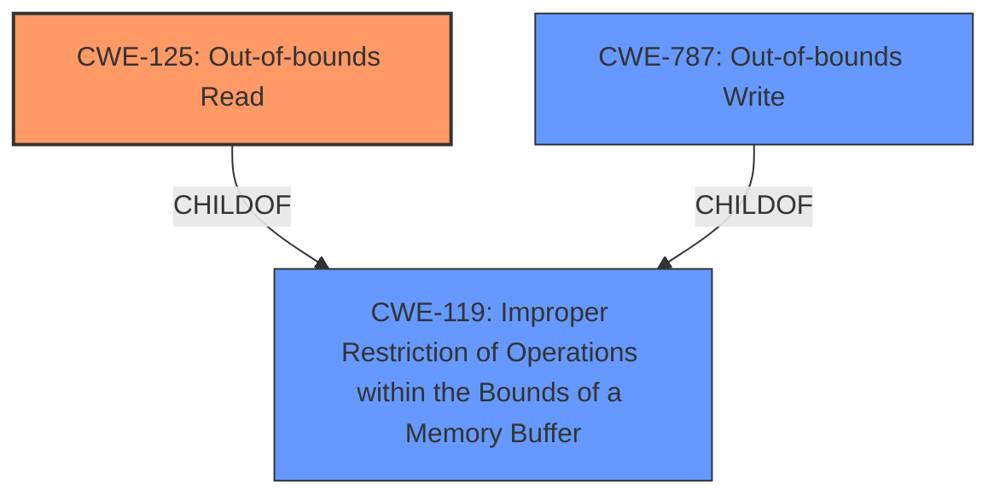

# Raw Analyzer Response for CVE-2021-27408

# Summary
| CWE ID | CWE Name | Confidence | CWE Abstraction Level | CWE Vulnerability Mapping Label | CWE-Vulnerability Mapping Notes |
|---|---|---|---|---|---|
| CWE-125 | Out-of-bounds Read | 1.0 | Base | Primary | Allowed |
| CWE-787 | Out-of-bounds Write | 0.5 | Base | Secondary | Allowed |

## Evidence and Confidence

*   **Confidence Score:** 0.9
*   **Evidence Strength:** HIGH

## Relationship Analysis
The primary CWE is CWE-125, which is a base-level CWE and accurately describes the **out-of-bounds read** vulnerability. CWE-125 is a child of CWE-119 (Improper Restriction of Operations within the Bounds of a Memory Buffer), but CWE-125 is more specific and thus a better fit. CWE-787 (Out-of-bounds Write) is included as a secondary CWE since the description mentions it can lead to arbitrary code execution when chained with an **out-of-bounds write**.

## Vulnerability Chain
The vulnerability chain starts with an **out-of-bounds read** (CWE-125), which can lead to information leakage. If this is chained with an **out-of-bounds write** vulnerability (CWE-787), it can potentially lead to arbitrary code execution.

## Summary of Analysis
The initial assessment identified CWE-125 as the primary weakness, based on the **Vulnerability Description Key Phrases** and the **CVE Reference Links Content Summary**, which explicitly mentions "**out-of-bounds read**". The Retriever Results also supports this, listing CWE-125 as the top match. The evidence from the vulnerability description indicates that the product is vulnerable to an **out-of-bounds read**, which is a clear match for CWE-125. The description explicitly uses the term "**out-of-bounds read**," so there is strong evidence for this classification.

The inclusion of CWE-787 as a secondary weakness is based on the description that the **out-of-bounds read** can be chained with an **out-of-bounds write** to achieve arbitrary code execution. While not the primary weakness, the potential for this chain warrants its inclusion. My confidence in the primary CWE is high (1.0), while the confidence in the secondary CWE is lower (0.5) due to the dependency on another vulnerability.

The selected CWEs are at the optimal level of specificity, as CWE-125 directly represents the **out-of-bounds read** vulnerability and CWE-787 represents the potential chained **out-of-bounds write** vulnerability.