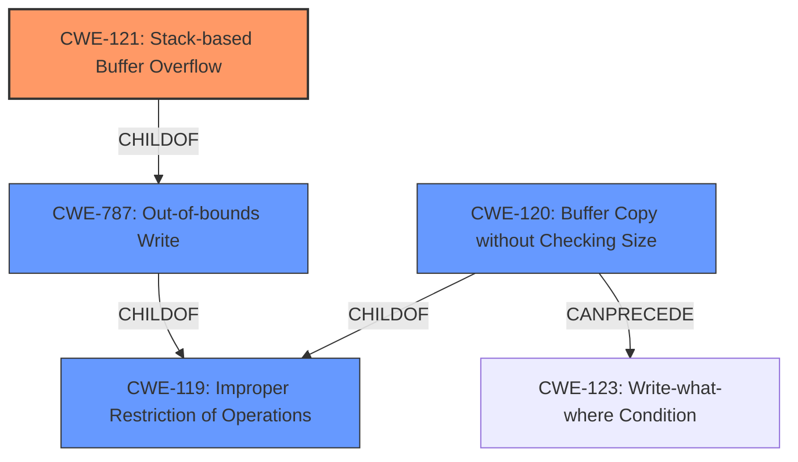

# Analysis for CVE-2021-27413

# Summary
| CWE ID | CWE Name | Confidence | CWE Abstraction Level | CWE Vulnerability Mapping Label | CWE-Vulnerability Mapping Notes |
|---|---|---|---|---|---|
| CWE-121 | Stack-based Buffer Overflow | 1.0 | Variant | Primary | Allowed |
| CWE-119 | Improper Restriction of Operations within the Bounds of a Memory Buffer | 0.7 | Class | Secondary | Discouraged |
| CWE-120 | Buffer Copy without Checking Size of Input ('Classic Buffer Overflow') | 0.6 | Base | Secondary | Allowed-with-Review |

## Evidence and Confidence

*   **Confidence Score:** 0.9
*   **Evidence Strength:** HIGH

## Relationship Analysis
The primary CWE is CWE-121, which is a variant of CWE-787 (Out-of-bounds Write), which in turn is a child of CWE-119 (Improper Restriction of Operations within the Bounds of a Memory Buffer). CWE-120 (Buffer Copy without Checking Size of Input) is also a child of CWE-119 and can precede CWE-123 (Write-what-where Condition). The relationships show a clear path from a general buffer handling issue (CWE-119) to a specific type of overflow (stack-based in CWE-121) or a classic buffer copy issue (CWE-120).

## Vulnerability Chain
The chain of events is as follows:
1.  Improper input validation of the length of user-supplied data.
2.  Copying the unvalidated data to a fixed-length stack-based buffer.
3.  **Stack-based buffer overflow** (CWE-121) due to the **lack of bounds checking**.
4.  Potential arbitrary code execution.

The root cause is the missing or improper input validation, which leads to the buffer overflow. The impact is arbitrary code execution.

## Summary of Analysis
The initial analysis identified a **stack-based buffer overflow**. The retriever results and the provided CVE Reference Links Content Summary strongly support this assessment. The vulnerability description clearly states the **weakness** as a **stack-based buffer overflow**. The CVE Reference Links Content Summary confirms this by stating that "The vulnerability is a stack-based buffer overflow...The software does not properly validate the length of user-supplied data when parsing the `B_PLC_NAME` element in an NCI file before copying it to a fixed-length, stack-based buffer".

The graph relationships confirm that CWE-121 is a specific type of buffer overflow, making it a more precise classification than its parent CWE-119. CWE-120 is also a possible candidate, but CWE-121 is more specific since the buffer is allocated on the stack.

The selected CWEs are at the optimal level of specificity because CWE-121 directly describes the **stack-based buffer overflow** condition, while CWE-119 and CWE-120 represent more general classes of buffer handling issues.

Relevant CWE Information:

# Enhanced Context (25 CWEs)

## CWE-124: Buffer Underwrite ('Buffer Underflow')
Not selected. This CWE describes writing before the beginning of the buffer which is not the case here.

## CWE-131: Incorrect Calculation of Buffer Size
Not selected. The description focuses on incorrect calculation, but the primary issue is the **lack of validation of the input size** before copying.

## CWE-805: Buffer Access with Incorrect Length Value
Not selected. While there might be an incorrect length value involved, the core issue is the **absence of input validation**, making CWE-121 and CWE-120 more fitting.

## CWE-191: Integer Underflow (Wrap or Wraparound)
Not selected. There is no evidence of integer underflow in the description.

## CWE-126: Buffer Over-read
Not selected. This CWE describes reading past the end of a buffer, which is not the case here.

## CWE-127: Buffer Under-read
Not selected. This CWE describes reading before the beginning of the buffer which is not the case here.

## CWE-193: Off-by-one Error
Not selected. The issue is not an off-by-one error but the **lack of input size validation** leading to a buffer overflow.

## CWE-680: Integer Overflow to Buffer Overflow
Not selected. There is no evidence of an integer overflow being involved in this vulnerability.

## CWE-125: Out-of-bounds Read
Not selected. The vulnerability is a buffer overflow (write), not a buffer over-read.

## CWE-190: Integer Overflow or Wraparound
Not selected. There is no evidence of an integer overflow in the description.

## CWE-1284: Improper Validation of Specified Quantity in Input
While this CWE is relevant as a contributing factor, the direct cause is the **buffer overflow**, so CWE-121 is more appropriate.

## CWE-119: Improper Restriction of Operations within the Bounds of a Memory Buffer
Selected as a secondary CWE. Although CWE-121 is more specific, CWE-119 represents the general class of buffer handling issues. The mapping guidance discourages its use when more specific CWEs are available.

## CWE-128: Wrap-around Error
Not selected. There is no evidence of a wrap-around error.

## CWE-170: Improper Null Termination
Not selected. There is no evidence of improper null termination.

## CWE-120: Buffer Copy without Checking Size of Input ('Classic Buffer Overflow')
Selected as a secondary CWE candidate. It describes the fundamental issue of copying a buffer without size checks, which leads to the overflow. The CVE description indicates that the software "does not properly validate the length of user-supplied data when parsing the `B_PLC_NAME` element in an NCI file before copying it to a fixed-length, stack-based buffer."

## CWE-123: Write-what-where Condition
Not selected. It's a potential consequence of a buffer overflow, but not the primary **weakness**.

## CWE-617: Reachable Assertion
Not selected. The description does not indicate any assertion issues.

## CWE-195: Signed to Unsigned Conversion Error
Not selected. There is no evidence of signed to unsigned conversion errors.

## CWE-463: Deletion of Data Structure Sentinel
Not selected. There is no evidence of deletion of data structure sentinel.

## CWE-1339: Insufficient Precision or Accuracy of a Real Number
Not selected. There is no evidence of floating point precision issues.