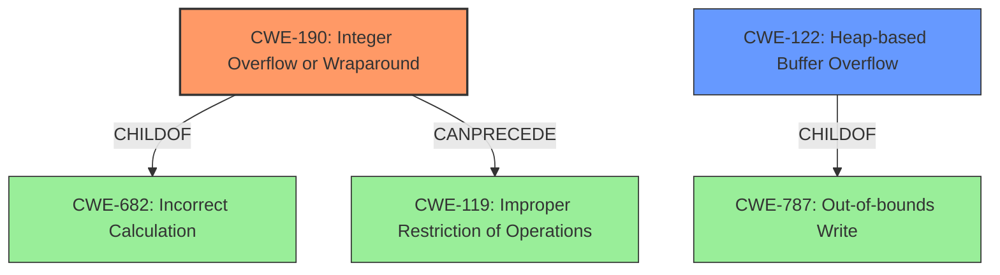

# Analysis Report for CVE-2021-27417

# Vulnerability Analysis Report: CVE-2021-27417

## Description


## Analysis (with Relationship Data)

# Summary
| CWE ID | CWE Name | Confidence | CWE Abstraction Level | CWE Vulnerability Mapping Label | CWE-Vulnerability Mapping Notes |
|---|---|---|---|---|---|
| CWE-190 | Integer Overflow or Wraparound | 1.0 | Base | Primary | Allowed |
| CWE-122 | Heap-based Buffer Overflow | 0.8 | Variant | Secondary | Allowed |

## Evidence and Confidence

*   **Confidence Score:** 0.9
*   **Evidence Strength:** HIGH

## Relationship Analysis
The primary CWE is CWE-190, which describes the root cause **integer wraparound**. The secondary CWE is CWE-122, which describes the impact **heap-based buffer overflow**. CWE-190 is a child of CWE-682 (Incorrect Calculation). CWE-122 is a child of CWE-787 (Out-of-bounds Write). CWE-190 can precede CWE-119 (Improper Restriction of Operations Within the Bounds of a Memory Buffer).



## Vulnerability Chain
The vulnerability chain starts with an **integer wraparound** (CWE-190) in the `calloc` function. This leads to incorrect memory allocation, which results in a **heap-based buffer overflow** (CWE-122).

## Summary of Analysis
The primary vulnerability is an **integer wraparound** (CWE-190) in the `calloc` function, which leads to a **heap-based buffer overflow** (CWE-122).

The vulnerability description states: "eCosCentric eCosPro RTOS Versions 2.0.1 through 4.5.3 are vulnerable to **integer wraparound** in function calloc (an implementation of malloc). The unverified memory assignment can lead to arbitrary memory allocation, resulting in a **heap-based buffer overflow**."

The CVE Reference Links Content Summary confirms: "Integer wraparound in the `calloc` function implementation within the eCosCentric eCosPro RTOS. This occurs because the size parameter for memory allocation is not properly validated, leading to an integer overflow/wraparound... The incorrect memory allocation due to the wraparound can lead to a heap-based buffer overflow."

CWE-190 (Integer Overflow or Wraparound) is the most appropriate CWE to describe the **root cause** of the vulnerability. The CWE description states: "The product performs a calculation that can produce an integer overflow or wraparound when the logic assumes that the resulting value will always be larger than the original value." This perfectly matches the **integer wraparound** in the `calloc` function.

CWE-122 (Heap-based Buffer Overflow) is a secondary CWE to describe the impact of the vulnerability. The CWE description states: "A heap overflow condition is a buffer overflow, where the buffer that can be overwritten is allocated in the heap portion of memory, generally meaning that the buffer was allocated using a routine such as malloc()." This matches the resulting **heap-based buffer overflow** due to incorrect memory allocation.

The retriever results also list CWE-190 as the top result with a high score, supporting its selection.

Other CWEs Considered:

*   CWE-191 (Integer Underflow (Wrap or Wraparound)): While related to integer issues, the vulnerability is specifically an **integer wraparound**, not an underflow.
*   CWE-197 (Numeric Truncation Error): This CWE involves truncation during type conversion, which is not the primary issue in this vulnerability.
*   CWE-1284 (Improper Validation of Specified Quantity in Input): While input validation is related, the core issue is the **integer wraparound** itself, not just the lack of validation.

Relevant CWE Information:

## Enhanced Context (25 CWEs)

### CWE-191: Integer Underflow (Wrap or Wraparound)
**Abstraction Level**: Base
**Similarity Score**: 0.81
**Source**: dense

**Description**:
The product subtracts one value from another, such that the result is less than the minimum allowable integer value, which produces a value that is not equal to the correct result.

**Mapping Guidance**:
- Usage: Allowed
- Rationale: This CWE entry is at the Base level of abstraction, which is a preferred level of abstraction for mapping to the root causes of vulnerabilities.

### CWE-197: Numeric Truncation Error
**Abstraction Level**: Base
**Similarity Score**: 0.79
**Source**: dense

**Description**:
Truncation errors occur when a primitive is cast to a primitive of a smaller size and data is lost in the conversion.

**Mapping Guidance**:
- Usage: Allowed
- Rationale: This CWE entry is at the Base level of abstraction, which is a preferred level of abstraction for mapping to the root causes of vulnerabilities.

### CWE-131: Incorrect Calculation of Buffer Size
**Abstraction Level**: Base
**Similarity Score**: 0.78
**Source**: dense

**Description**:
The product does not correctly calculate the size to be used when allocating a buffer, which could lead to a buffer overflow.

**Mapping Guidance**:
- Usage: Allowed
- Rationale: This CWE entry is at the Base level of abstraction, which is a preferred level of abstraction for mapping to the root causes of vulnerabilities.

### CWE-193: Off-by-one Error
**Abstraction Level**: Base
**Similarity Score**: 0.77
**Source**: dense

**Description**:
A product calculates or uses an incorrect maximum or minimum value that is 1 more, or 1 less, than the correct value.

**Mapping Guidance**:
- Usage: Allowed
- Rationale: This CWE entry is at the Base level of abstraction, which is a preferred level of abstraction for mapping to the root causes of vulnerabilities.

### CWE-681: Incorrect Conversion between Numeric Types
**Abstraction Level**: Base
**Similarity Score**: 0.77
**Source**: dense

**Description**:
When converting from one data type to another, such as long to integer, data can be omitted or translated in a way that produces unexpected values. If the resulting values are used in a sensitive context, then dangerous behaviors may occur.

**Mapping Guidance**:
- Usage: Allowed
- Rationale: This CWE entry is at the Base level of abstraction, which is a preferred level of abstraction for mapping to the root causes of vulnerabilities.

### CWE-805: Buffer Access with Incorrect Length Value
**Abstraction Level**: Base
**Similarity Score**: 0.76
**Source**: dense

**Description**:
The product uses a sequential operation to read or write a buffer, but it uses an incorrect length value that causes it to access memory that is outside of the bounds of the buffer.

**Mapping Guidance**:
- Usage: Allowed
- Rationale: This CWE entry is at the Base level of abstraction, which is a preferred level of abstraction for mapping to the root causes of vulnerabilities.

### CWE-125: Out-of-bounds Read
**Abstraction Level**: Base
**Similarity Score**: 0.75
**Source**: dense

**Description**:
The product reads data past the end, or before the beginning, of the intended buffer.

**Mapping Guidance**:
- Usage: Allowed
- Rationale: This CWE entry is at the Base level of abstraction, which is a preferred level of abstraction for mapping to the root causes of vulnerabilities.

### CWE-190: Integer Overflow or Wraparound
**Abstraction Level**: Base
**Similarity Score**: 0.75
**Source**: dense

**Description**:
The product performs a calculation that can
         produce an integer overflow or wraparound when the logic
         assumes that the resulting value will always be larger than
         the original value. This occurs when an integer value is
         incremented to a value that is too large to store in the
         associated representation. When this occurs, the value may
         become a very small or negative number.

**Mapping Guidance**:
- Usage: Allowed
- Rationale: This CWE entry is at the Base level of abstraction, which is a preferred level of abstraction for mapping to the root causes of vulnerabilities.

### CWE-823: Use of Out-of-range Pointer Offset
**Abstraction Level**: Base
**Similarity


## CWE Relationship Analysis

Current CWEs represent these abstraction levels: .


### Vulnerability Chain Analysis

**Chain starting from CWE-823:**
- 823 (Use of Out-of-range Pointer Offset) - ROOT


**Chain starting from CWE-787:**
- 787 (Out-of-bounds Write) - ROOT


### CWE Relationship Diagram

```mermaid
graph TD
    classDef primary fill:#f96,stroke:#333,stroke-width:2px
    classDef secondary fill:#69f,stroke:#333
    classDef tertiary fill:#9e9,stroke:#333
```


*Report generated on 2025-04-01 22:53:10*
