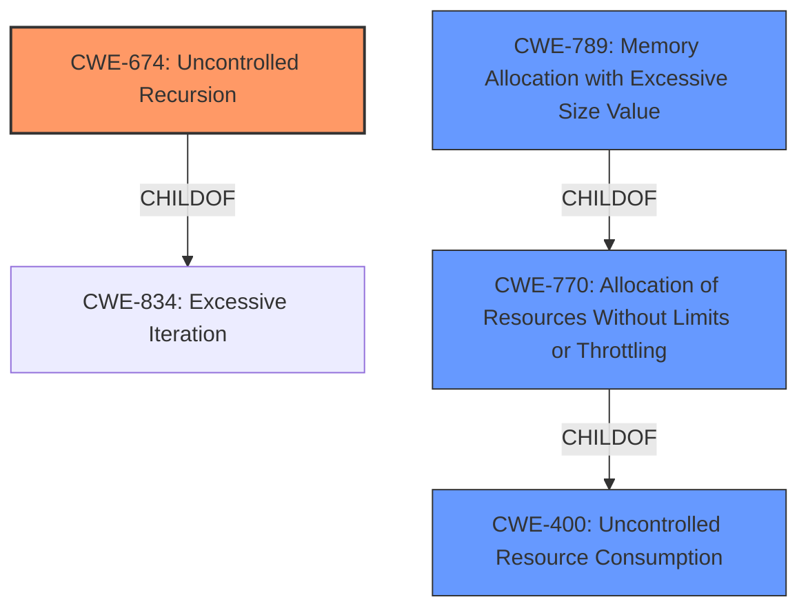

# Analysis for CVE-2021-27434

# Summary
| CWE ID | CWE Name | Confidence | CWE Abstraction Level | CWE Vulnerability Mapping Label | CWE-Vulnerability Mapping Notes |
|---|---|---|---|---|---|
| CWE-674 | Uncontrolled Recursion | 1.0 | Class | Primary | Allowed-with-Review |
| CWE-400 | Uncontrolled Resource Consumption | 0.7 | Class | Secondary | Discouraged |
| CWE-789 | Memory Allocation with Excessive Size Value | 0.6 | Variant | Secondary | Allowed |

## Evidence and Confidence

*   **Confidence Score:** 0.9
*   **Evidence Strength:** HIGH

## Relationship Analysis
The primary relationship is that CWE-674 **Uncontrolled Recursion** is a **ChildOf** CWE-834 **Excessive Iteration**. CWE-400 **Uncontrolled Resource Consumption** is a parent of CWE-770 **Allocation of Resources Without Limits or Throttling**, and CWE-789 **Memory Allocation with Excessive Size Value** is a variant of CWE-770. The vulnerability leads to a stack overflow which is a form of resource exhaustion. Therefore, the hierarchical relationship between these CWEs helps to understand the potential progression and impact of the vulnerability.

## Vulnerability Chain
The vulnerability chain starts with an **uncontrolled recursion** (CWE-674), leading to **uncontrolled resource consumption** (CWE-400) and potentially triggering a **stack overflow** because of **memory allocation with excessive size value** (CWE-789).

## Summary of Analysis
The initial assessment identified **uncontrolled recursion** as the main **weakness** causing a stack overflow, which aligns with CWE-674. The vulnerability description explicitly states "***uncontrolled recursion***, which may allow an attacker to trigger a stack overflow." The reference links also confirm that the vulnerability involves issues in how the .NET Framework handles file access. The retriever results also showed that CWE-674 is a good match.

CWE-674 is a Class-level CWE, and the mapping guidance recommends reviewing children to find a more specific fit if available, but no children were present. CWE-674's description matches the vulnerability well: "The product does not properly control the amount of recursion that takes place, consuming excessive resources, such as allocated memory or the program stack."

CWE-400 **Uncontrolled Resource Consumption** was considered because stack overflow is a form of resource exhaustion. While CWE-400 is applicable as an impact, it is discouraged because it is frequently misused, and a more precise mapping is available. The child CWE-770, **Allocation of Resources Without Limits or Throttling**, is more specific, and CWE-789 **Memory Allocation with Excessive Size Value** is an even more specific variant. I'm including CWE-400 and CWE-789 as a secondary option because it explains the consequences of the uncontrolled recursion.

Relevant CWE Information:

# Enhanced Context (25 CWEs)

## CWE-674: Uncontrolled Recursion
**Abstraction:** Class
The product does not properly control the amount of recursion that takes place,  consuming excessive resources, such as allocated memory or the program stack.

## CWE-400: Uncontrolled Resource Consumption
**Abstraction:** Class
The product does not properly control the allocation and maintenance of a limited resource, thereby enabling an actor to influence the amount of resources consumed, eventually leading to the exhaustion of available resources.

## CWE-789: Memory Allocation with Excessive Size Value
**Abstraction:** Variant
The product allocates memory based on an untrusted, large size value, but it does not ensure that the size is within expected limits, allowing arbitrary amounts of memory to be allocated.