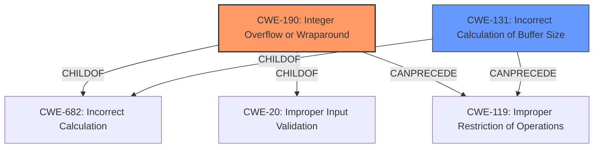

# Raw Analyzer Response for CVE-2021-27439

# Summary
| CWE ID  | CWE Name  | Confidence | CWE Abstraction Level | CWE Vulnerability Mapping Label | CWE-Vulnerability Mapping Notes |
|------------------|-----------------------------------------------------|------------|-----------------------|------------------------------------|-----------------------------------|
| CWE-190 | Integer Overflow or Wraparound | 1  | Base  | Primary | Allowed |
| CWE-131 | Incorrect Calculation of Buffer Size  | 0.7 | Base  | Secondary Candidate  | Allowed |

## Evidence and Confidence

*   **Confidence Score:** 0.9
*   **Evidence Strength:** HIGH

## Relationship Analysis
The primary CWE, CWE-190 [Integer Overflow or Wraparound], is a base-level CWE that describes a calculation resulting in a value exceeding the maximum representable value, aligning directly with the **integer wrap-around** root cause. It is a child of CWE-682 [Incorrect Calculation] and CWE-20 [Improper Input Validation] and can precede CWE-119 [Improper Restriction of Operations Within the Bounds of a Memory Buffer]. The secondary CWE, CWE-131 [Incorrect Calculation of Buffer Size], describes errors in calculating buffer sizes, potentially leading to buffer overflows, aligning with the **improper memory assignment** weakness.

## Vulnerability Chain
The vulnerability chain starts with the **integer wrap-around** (CWE-190) due to an incorrect calculation within the `tos_mmheap_alloc` function. This leads to **improper memory assignment**, resulting in arbitrary memory allocation. The impact includes a crash and potential remote code injection/execution.

## Summary of Analysis
The analysis is based on the provided vulnerability description and CVE reference, which clearly indicate an **integer wrap-around** in the `tos_mmheap_alloc` function leading to **improper memory assignment**.

The vulnerability description states: "TencentOS-tiny version 3.1.0 is vulnerable to **integer wrap-around** in function tos_mmheap_alloc incorrect calculation of effective memory allocation size. This **improper memory assignment** can lead to arbitrary memory allocation, resulting in unexpected behavior such as a crash or a remote code injection/execution."

The primary CWE selection, CWE-190 [Integer Overflow or Wraparound], is justified by the **integer wrap-around** root cause and its potential to cause an incorrect memory allocation size. The selection of CWE-190 is further supported by its high retriever score and the provided mapping guidance, which allows its usage at the Base level of abstraction. The secondary CWE candidate, CWE-131 [Incorrect Calculation of Buffer Size], is selected because it highlights the incorrect calculation of memory allocation size.

Other CWEs Considered But Not Used:

*   CWE-197 [Numeric Truncation Error]: While numeric errors are relevant, the description specifically mentions wrap-around, making CWE-190 a more precise fit.
*   CWE-1284 [Improper Validation of Specified Quantity in Input]: Although input validation issues can be linked, the root cause is more directly related to the wrap-around error in memory calculation rather than a lack of validation of input quantity.
*   CWE-789 [Memory Allocation with Excessive Size Value]: This is a possible outcome, but the root cause is the integer overflow, not necessarily an excessive size value being directly provided.
*   CWE-191 [Integer Underflow (Wrap or Wraparound)]: While similar to overflow, the description explicitly mentions wrap-around, and overflow is more likely in allocation size calculations.
*   CWE-126 [Buffer Over-read]: This relates to reading past buffer boundaries, which isn't explicitly mentioned as the root cause, but is more of an impact.
*   CWE-128 [Wrap-around Error]: While this is related, CWE-190 is more specific to integer overflows or wraparounds.
*   CWE-754 [Improper Check for Unusual or Exceptional Conditions]: This is a more general category and not as specific as the integer overflow.
*   CWE-1325 [Improperly Controlled Sequential Memory Allocation]: This is more related to managing multiple objects and their allocations, which is not the primary issue here.