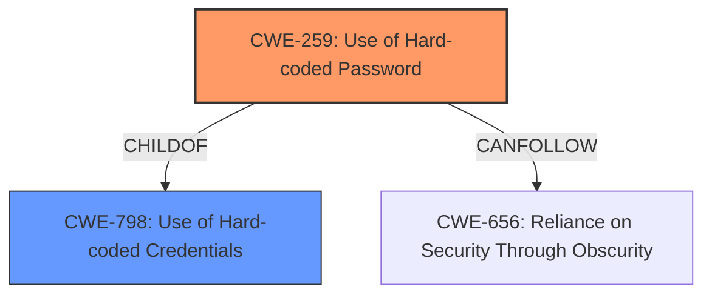

# Analysis for CVE-2021-27440

# Summary
| CWE ID  | CWE Name                     | Confidence | CWE Abstraction Level | CWE Vulnerability Mapping Label | CWE-Vulnerability Mapping Notes |
|---------|------------------------------|------------|-----------------------|---------------------------------|-----------------------------------|
| CWE-259 | Use of Hard-coded Password | 1          | Variant               | Allowed                         | Primary CWE                       |

## Evidence and Confidence

*   **Confidence Score:** 1
*   **Evidence Strength:** HIGH

## Relationship Analysis
The primary relationship that influenced the choice of CWE-259 is its direct link to CWE-798 (Use of Hard-coded Credentials) as a ChildOf. CWE-259 is a Variant of CWE-798, specifying that the hard-coded credential is a password. Given that the vulnerability description specifically mentions a **hard-coded password**, selecting the more specific Variant, CWE-259, is most appropriate.

## Vulnerability Chain
The vulnerability chain starts with the **root cause** of using a **hard-coded password** (CWE-259). This can potentially lead to full control of the DFR or privilege escalation as the end impact based on "Impact of exploitation" of the CVE Reference Links Content Summary.

## Summary of Analysis
The initial analysis strongly supports the selection of CWE-259 due to the explicit mention of a **hard-coded password**. The "Vulnerability Description Key Phrases" section identifies "**hard-coded password**" as the root cause. The "CVE Reference Links Content Summary" also states the root cause is a "hard-coded password".

The Retriever Results list CWE-259 as the top candidate. The Complete CWE Specifications for CWE-259 further solidify this choice, as it describes the exact scenario presented in the vulnerability description: "The product contains a hard-coded password, which it uses for its own inbound authentication or for outbound communication to external components."

The hierarchical relationship, with CWE-259 being a Variant of CWE-798, confirms that CWE-259 provides a more specific and accurate classification. The MITRE mapping guidance allows for the use of Variant-level CWEs when appropriate.

CWE-94 (Improper Control of Generation of Code ('Code Injection')) and CWE-798 (Use of Hard-coded Credentials) were considered because they were listed as the Primary CWE Match and Top CWEs in the "CWE for similar CVE Descriptions" section. However, CWE-94 describes a Code Injection vulnerability, which is a potential impact, not the root cause in this scenario, therefore is incorrect. CWE-798 is a parent of CWE-259, but CWE-259 is a better fit due to its specificity.

Therefore, the final decision is to assign CWE-259 as the primary CWE. The evidence directly supports this classification, and the hierarchical relationships and mapping guidance confirm that it is the most appropriate choice.