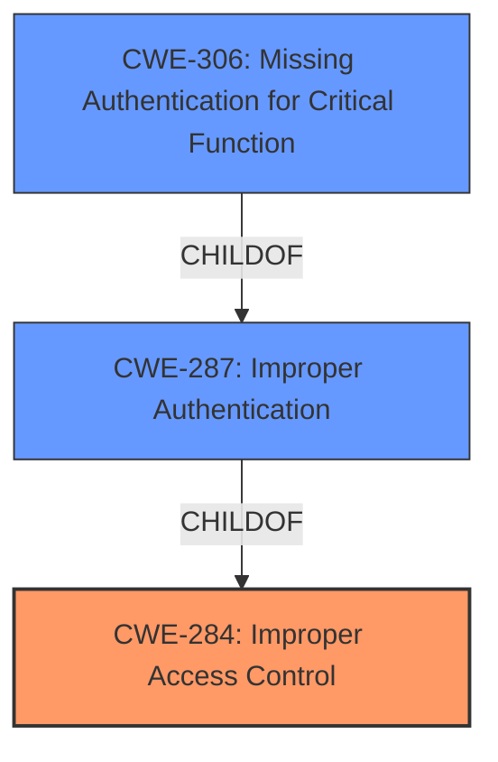

# Analysis for CVE-2021-27444

# Summary
| CWE ID | CWE Name | Confidence | CWE Abstraction Level | CWE Vulnerability Mapping Label | CWE-Vulnerability Mapping Notes |
|---|---|---|---|---|---|
| CWE-284 | Improper Access Control | 0.9 | Pillar | Primary | Discouraged |
| CWE-306 | Missing Authentication for Critical Function | 0.7 | Base | Secondary | Allowed |

## Evidence and Confidence

*   **Confidence Score:** 0.8
*   **Evidence Strength:** HIGH

## Relationship Analysis
The primary CWE is CWE-284, which is a Pillar, representing a high-level view of the **improper access control** issue. CWE-306 is a child of CWE-287 (Improper Authentication), which in turn is a child of CWE-284. This relationship indicates that **missing authentication** could be a specific instance of **improper access control**.

## Vulnerability Chain
The vulnerability chain starts with the **improper access control**, leading to the ability for an unauthenticated attacker to access sensitive information and perform administrative actions.

## Summary of Analysis
The initial assessment identified **improper access controls** as the root cause, supported by the vulnerability description and CVE details. The retriever results also highlighted CWE-284 as a potential match. While CWE-284 is a high-level "Pillar" CWE, it aligns with the general description of the vulnerability. The CVE reference specifically mentions **improper access control**, and the vulnerability allows an unauthenticated attacker to access sensitive information and perform administrative actions.

The "Complete CWE Specifications" section indicates that CWE-284 is discouraged because it is a high-level abstraction. The suggested alternatives are CWE-862 (Missing Authorization), CWE-863 (Incorrect Authorization), CWE-732 (Incorrect Permission Assignment for Critical Resource), and CWE-306 (Missing Authentication). Given that the vulnerability allows an unauthenticated attacker to perform actions, CWE-306 (Missing Authentication for Critical Function) is considered as a secondary CWE because it is a base-level CWE that more accurately describes the **lack of authentication** for critical functions.

*   **CWE-284: Improper Access Control**
    *   The vulnerability description explicitly mentions "**improper access controls**."
    *   The CVE reference content summary states: "**Improper access control** within the Weintek cMT product line's EasyWeb interface."
    *   This aligns with the CWE-284 description: "The product does not restrict or incorrectly restricts access to a resource from an unauthorized actor."
    *   Usage: Discouraged, due to the high-level nature of the CWE.
    *   Confidence: 0.9

*   **CWE-306: Missing Authentication for Critical Function**
    *   The vulnerability enables an unauthenticated attacker to "access and download sensitive information and perform administrative actions."
    *   This aligns with the CWE-306 description: "The product does not perform any authentication for functionality that requires a provable user identity or consumes a significant amount of resources."
    *   Usage: Allowed.
    *   Confidence: 0.7

The selected CWEs are at the optimal level of specificity based on the provided evidence. While more specific CWEs might exist, the current information points to a general **improper access control** issue (CWE-284) and the **lack of authentication** for critical functions (CWE-306).