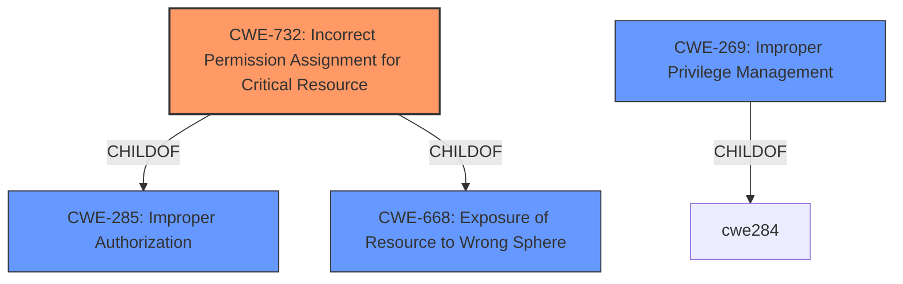

# Analysis for CVE-2021-27445

# Summary
| CWE ID | CWE Name | Confidence | CWE Abstraction Level | CWE Vulnerability Mapping Label | CWE-Vulnerability Mapping Notes |
|---|---|---|---|---|---|
| CWE-732 | Incorrect Permission Assignment for Critical Resource | 1.0 | Class | Allowed-with-Review | Primary CWE. The product specifies permissions for a security-critical resource in a way that allows that resource to be read or modified by unintended actors. |
| CWE-269 | Improper Privilege Management | 0.5 | Class | Discouraged | Secondary Candidate. The product does not properly assign, modify, track, or check privileges for an actor, creating an unintended sphere of control for that actor. |

## Evidence and Confidence

*   **Confidence Score:** 0.8
*   **Evidence Strength:** HIGH

## Relationship Analysis
The primary CWE is CWE-732, which is a class-level CWE. It has child relationships to CWE-285 (Improper Authorization) and CWE-668 (Exposure of Resource to Wrong Sphere). The relationship indicates that incorrect permission assignments can lead to broader authorization issues or exposure problems.

## Vulnerability Chain
The vulnerability chain starts with **insecure file permissions** (CWE-732), which leads to **improper privilege management** (CWE-269), and ultimately results in the ability to **escalate privileges**.

## Summary of Analysis
The vulnerability is due to **insecure file permissions**. The primary CWE selected is CWE-732 (Incorrect Permission Assignment for Critical Resource) as it accurately describes the **root cause** where the product specifies permissions for a security-critical resource that allows unintended actors to read or modify it. The vulnerability description clearly states "**insecure file permissions** that could be exploited to escalate privileges on the device." The CVE Reference Links Content Summary reinforces this by stating "The affected product has insecure file permissions," indicating that the **root cause** of the vulnerability is indeed related to incorrect permission assignments.

CWE-269 (Improper Privilege Management) was considered because the impact of the vulnerability is privilege escalation. However, CWE-269 is discouraged as it is often misused and conflated with privilege escalation. The **root cause** is the **insecure file permissions**, not directly an error in privilege management itself, making CWE-732 a more appropriate choice.

Other CWEs such as CWE-59 (Improper Link Resolution Before File Access), CWE-276 (Incorrect Default Permissions), CWE-379 (Creation of Temporary File in Directory with Insecure Permissions), and CWE-378 (Creation of Temporary File With Insecure Permissions) were considered but ultimately deemed less suitable as they didn't directly address the **root cause** of **insecure file permissions** for critical resources. These are focused on symlink issues or temporary file handling which are not mentioned in the description.

The selection of CWE-732 is at the Class level. While more specific Base or Variant level CWEs might exist, the provided information does not provide enough detail to descend further into the hierarchy. Therefore, CWE-732 is the most specific and accurate representation of the vulnerability based on the available evidence.