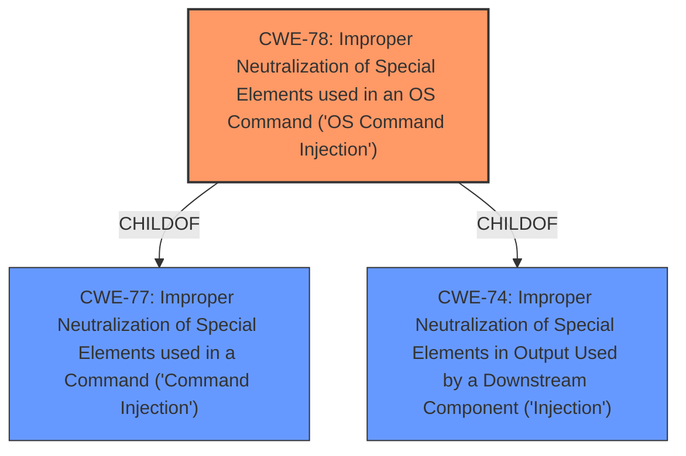

# Analysis Report for CVE-2021-27447

# Vulnerability Analysis Report: CVE-2021-27447

## Description


## Analysis (with Relationship Data)

# Summary

| CWE ID | CWE Name | Confidence | CWE Abstraction Level | CWE Vulnerability Mapping Label | CWE-Vulnerability Mapping Notes |
|---|---|---|---|---|---|
| CWE-78 | Improper Neutralization of Special Elements used in an OS Command ('OS Command Injection') | 1.0 | Base | Primary | Allowed |

## Evidence and Confidence

*   **Confidence Score:** 1.0
*   **Evidence Strength:** HIGH

## Relationship Analysis

The primary CWE is CWE-78, which is a Base level CWE. CWE-78 is a child of CWE-77 and CWE-74. The tool suggested CWE-77 but the additional context makes it clear that this is OS Command injection which is CWE-78.



## Vulnerability Chain

The chain of root cause and weaknesses that followed for the Vulnerability Description:
  - **Root Cause:** **Improper Neutralization of Special Elements used in an OS Command ('OS Command Injection') CWE-78**
  - **Impact:** Arbitrary Code Execution

## Summary of Analysis

The initial analysis identified **command injection** as the primary **weakness**. The `CVE Reference Links Content Summary` confirms "The affected product is vulnerable to a **command injection**" and the `weaknesses` section lists "Improper Neutralization of Special Elements used in a Command ('Command Injection') CWE-77". Based on the provided evidence, the root cause is clearly a **command injection** vulnerability. The retriever results also identify CWE-77 as the top candidate.

However, the vulnerability description and the summary both specify "arbitrary code execution" which strongly suggests that this is an OS Command Injection vulnerability (CWE-78) rather than a more general command injection (CWE-77). CWE-78 is more specific and is a child of CWE-77 which is also a child of the more general CWE-74.

I am overriding the retriever's suggestion of CWE-77 and selecting CWE-78 because the evidence points to OS Command Injection.

Relevant CWE Information:

# Enhanced Context (25 CWEs)

## CWE-78: Improper Neutralization of Special Elements used in an OS Command ('OS Command Injection')
**Abstraction:** Base
**Status:** Stable

### Description
The product constructs all or part of an OS command using externally-influenced input from an upstream component, but it does not neutralize or incorrectly neutralizes special elements that could modify the intended OS command when it is sent to a downstream component.

### Extended Description

This weakness can lead to a vulnerability in environments in which the attacker does not have direct access to the operating system, such as in web applications.

### Mapping Guidance
**Usage:** Allowed
**Rationale:** This CWE entry is at the Base level of abstraction, which is a preferred level of abstraction for mapping to the root causes of vulnerabilities.

## CWE-77: Improper Neutralization of Special Elements used in a Command ('Command Injection')
**Abstraction:** Class
**Status:** Draft

### Description
The product constructs all or part of a command using externally-influenced input from an upstream component, but it does not neutralize or incorrectly neutralizes special elements that could modify the intended command when it is sent to a downstream component.

### Mapping Guidance
**Usage:** Allowed-with-Review
**Rationale:** CWE-77 is often misused when OS command injection (CWE-78) was intended instead [REF-1287].
**Suggested Alternatives:**
- CWE-78: OS Command Injection

## CWE-74: Improper Neutralization of Special Elements in Output Used by a Downstream Component ('Injection')
**Abstraction:** Class
**Status:** Incomplete

### Description
The product constructs all or part of a command, data structure, or record using externally-influenced input from an upstream component, but it does not neutralize or incorrectly neutralizes special elements that could modify how it is parsed or interpreted when it is sent to a downstream component.

### Mapping Guidance
**Usage:** Discouraged
**Rationale:** CWE-74 is high-level and often misused when lower-level weaknesses are more appropriate.

### Summary of other CWEs Considered and Rejected
- CWE-77: Improper Neutralization of Special Elements used in a Command ('Command Injection'): While the vulnerability is a form of command injection, the arbitrary code execution impact indicates it's specifically related to OS commands, making CWE-78 a more precise fit. The mapping guidance for CWE-77 even suggests considering CWE-78 when OS command injection is suspected.
- CWE-74: Improper Neutralization of Special Elements in Output Used by a Downstream Component ('Injection'): This is a high-level class. Command injection is a better fit.


## CWE Relationship Analysis

Current CWEs represent these abstraction levels: .


### Vulnerability Chain Analysis

**Chain starting from CWE-78:**
- 78 (Improper Neutralization of Special Elements used in an OS Command ('OS Command Injection')) - ROOT


**Chain starting from CWE-74:**
- 74 (Improper Neutralization of Special Elements in Output Used by a Downstream Component ('Injection')) - ROOT


### CWE Relationship Diagram

```mermaid
graph TD
    classDef primary fill:#f96,stroke:#333,stroke-width:2px
    classDef secondary fill:#69f,stroke:#333
    classDef tertiary fill:#9e9,stroke:#333
```


*Report generated on 2025-04-01 21:16:29*
