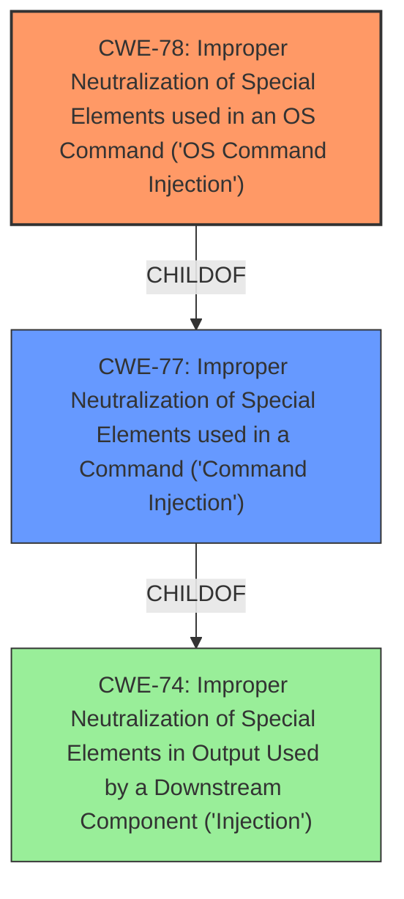

# Analysis for CVE-2021-27449

# Summary
| CWE ID | CWE Name | Confidence | CWE Abstraction Level | CWE Vulnerability Mapping Label | CWE-Vulnerability Mapping Notes |
|---|---|---|---|---|---|
| CWE-78 | Improper Neutralization of Special Elements used in an OS Command ('OS Command Injection') | 1.0 | Base | Allowed | Primary CWE |
| CWE-77 | Improper Neutralization of Special Elements used in a Command ('Command Injection') | 0.7 | Class | Allowed-with-Review | Secondary Candidate |

## Evidence and Confidence

*   **Confidence Score:** 1.0
*   **Evidence Strength:** HIGH

## Relationship Analysis
The primary relationship influencing the CWE selection is the hierarchical relationship between CWE-77 and CWE-78, where CWE-78 is a child (Base) of CWE-77 (Class). Since the vulnerability specifically involves OS commands, CWE-78 is chosen for its specificity. There are also CANFOLLOW relationships, where OS Command Injection can be followed by things like Incomplete List of Disallowed Inputs.

## Vulnerability Chain
The vulnerability chain starts with the **improper neutralization** of special elements in OS commands, leading to **command injection** and ultimately resulting in the ability to **execute commands** on the web server.

## Summary of Analysis
The initial assessment strongly points towards CWE-78, OS Command Injection, due to the explicit mention of a "command injection vulnerability that can be exploited to execute commands in the web server." This is further supported by the CVE Reference Links Content Summary, which states, "The MesaLabs AmegaView product has a command injection vulnerability. Specifically, the product fails to properly neutralize special elements used in commands," and "Command Injection (CWE-77): The vulnerability allows an attacker to inject and execute arbitrary commands on the web server of the affected device."

The retriever results also list CWE-77 and CWE-78 as the top candidates. CWE-78 is a Base level CWE while CWE-77 is a Class level CWE. Given the specificity of the vulnerability involving OS commands, CWE-78 is the more appropriate choice.

The selection of CWE-78 is based on the evidence directly mentioning command injection, the nature of the commands being OS commands, and the guidance to select the most specific CWE.

# Relevant CWE Information:

## Vulnerability Description
Mesa Labs AmegaView Versions 3.0 and prior has a **command injection** vulnerability that can be exploited to execute commands in the web server.

### Vulnerability Description Key Phrases
- **weakness:** **command injection**
- **impact:** execute commands
- **product:** Mesa Labs AmegaView
- **version:** 3.0 and prior

## CVE Reference Links Content Summary
Based on the provided content, here's the breakdown of CVE-2021-27449:

**Root cause of vulnerability:**

*   The MesaLabs AmegaView product has a command injection vulnerability. Specifically, the product fails to properly neutralize special elements used in commands.

**Weaknesses/vulnerabilities present:**

*   **Command Injection (CWE-77):** The vulnerability allows an attacker to inject and execute arbitrary commands on the web server of the affected device.

**Impact of exploitation:**

*   Successful exploitation can lead to arbitrary code execution on the web server of the device.
*   This can result in a complete compromise of the affected system, enabling the attacker to perform a variety of malicious actions like data theft, system manipulation, denial of service, and more.

**Attack vectors:**

*   **Remote exploitation:** This vulnerability can be exploited remotely.
*   **Low attack complexity:** Exploitation is relatively easy, requiring low skill level.
*   **Requires low privileges:** Successful exploitation can be performed with low level privileges

**Required attacker capabilities/position:**

*   The attacker needs to have network access to the affected device and some level of credentials.

## Retriever Results

### Top Combined Results

| Rank | CWE ID | Name | Abstraction | Usage  | Retrievers | Individual Scores |
|------|--------|------|-------------|-------|------------|-------------------|
| 1 | 77 | Improper Neutralization of Special Elements used in a Command ('Command Injection') | Class | Allowed-with-Review | alternate_terms | 1.000 |
| 2 | 78 | Improper Neutralization of Special Elements used in an OS Command ('OS Command Injection') | Base | Allowed | alternate_terms | 0.700 |
| 3 | 88 | Improper Neutralization of Argument Delimiters in a Command ('Argument Injection') | Base | Allowed | sparse | 0.167 |
| 4 | 138 | Improper Neutralization of Special Elements | Class | Discouraged | sparse | 0.159 |
| 5 | 89 | Improper Neutralization of Special Elements used in an SQL Command ('SQL Injection') | Base | Allowed | sparse | 0.151 |
| 6 | 94 | Improper Control of Generation of Code ('Code Injection') | Base | Allowed-with-Review | dense | 0.579 |
| 7 | 98 | Improper Control of Filename for Include/Require Statement in PHP Program ('PHP Remote File Inclusion') | Variant | Allowed | graph | 0.002 |
| 8 | 502 | Deserialization of Untrusted Data | Base | Allowed | sparse | 0.151 |
| 9 | 95 | Improper Neutralization of Directives in Dynamically Evaluated Code ('Eval Injection') | Variant | Allowed | sparse | 0.151 |
| 10 | 1336 | Improper Neutralization of Special Elements Used in a Template Engine | Base | Allowed | sparse | 0.148 |

# Complete CWE Specifications

## CWE-78: Improper Neutralization of Special Elements used in an OS Command ('OS Command Injection')

**Technical Explanation:**
The vulnerability involves the product constructing an OS command using externally-influenced input without proper neutralization of special elements. This allows an attacker to modify the intended OS command. The evidence from the CVE description and summary confirms the presence of command injection.
**Security Implications:** Successful exploitation leads to arbitrary code execution on the web server, potentially compromising the entire system.
**Relationship Analysis:** CWE-78 is a child of CWE-77 (Improper Neutralization of Special Elements used in a Command) and CWE-74 (Improper Neutralization of Special Elements in Output Used by a Downstream Component ('Injection')). Since the injection is specifically related to OS commands, CWE-78 is more specific and appropriate than its parents.
**MITRE Mapping Guidance:** The usage is "ALLOWED," and the rationale states that "This CWE entry is at the Base level of abstraction, which is a preferred level of abstraction for mapping to the root causes of vulnerabilities."
**Confidence:** 1.0

## CWE-77: Improper Neutralization of Special Elements used in a Command ('Command Injection')

**Technical Explanation:**
While the vulnerability is primarily OS command injection, CWE-77 represents the more general case of command injection. The vulnerability description mentions "command injection" without specifying the type of command, initially suggesting CWE-77.
**Security Implications:** Similar to CWE-78, successful exploitation allows arbitrary command execution.
**Relationship Analysis:** CWE-77 is a parent of CWE-78.
**MITRE Mapping Guidance:** The usage is "Allowed-with-Review," and the comments state, "Ensure that the analysis focuses on the root-cause error that allows the execution of commands, as there are many weaknesses that can lead to this consequence." The suggested alternative is CWE-78, reinforcing the decision to use CWE-78.
**Confidence:** 0.7

## Rejected Candidates:
*   **CWE-88 (Improper Neutralization of Argument Delimiters in a Command ('Argument Injection'))**: While argument injection can be related to command injection, the primary issue here is the lack of neutralization of special elements in the command itself, not just the arguments.
*   **CWE-138 (Improper Neutralization of Special Elements)**: This is a Class-level CWE and too generic.
*   **CWE-89 (Improper Neutralization of Special Elements used in an SQL Command ('SQL Injection'))**: This is specific to SQL commands, which is not relevant to this vulnerability.
*   **CWE-94 (Improper Control of Generation of Code ('Code Injection