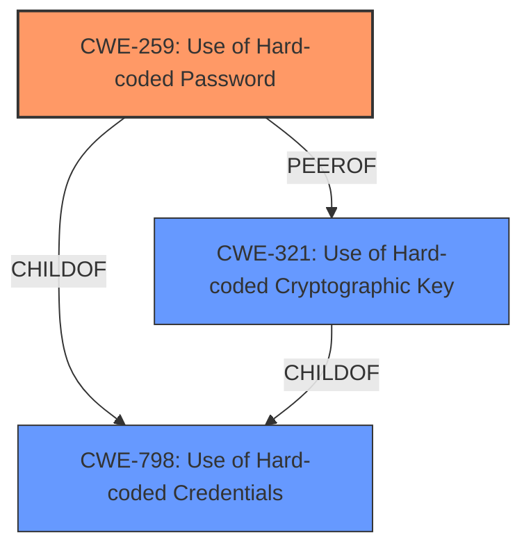

# Analysis for CVE-2021-27452

# Summary
| CWE ID | CWE Name | Confidence | CWE Abstraction Level | CWE Vulnerability Mapping Label | CWE-Vulnerability Mapping Notes |
|---|---|---|---|---|---|
| CWE-259 | Use of Hard-coded Password | 1.0 | Variant | Allowed | Primary CWE |
| CWE-798 | Use of Hard-coded Credentials | 0.8 | Base | Allowed | Secondary Candidate |
| CWE-321 | Use of Hard-coded Cryptographic Key | 0.6 | Variant | Allowed | Secondary Candidate |

## Evidence and Confidence

*   **Confidence Score:** 0.9
*   **Evidence Strength:** HIGH

## Relationship Analysis
The primary CWE, CWE-259 [CWE-259: Use of Hard-coded Password], is a Variant of CWE-798 [CWE-798: Use of Hard-coded Credentials]. CWE-798 [CWE-798: Use of Hard-coded Credentials] itself is a Base CWE. The relationship indicates that CWE-259 [CWE-259: Use of Hard-coded Password] is a more specific instance of CWE-798 [CWE-798: Use of Hard-coded Credentials], focusing on the use of hard-coded passwords specifically, as opposed to other types of hard-coded credentials (e.g., cryptographic keys). CWE-321 [CWE-321: Use of Hard-coded Cryptographic Key] is a PeerOf to CWE-259 [CWE-259: Use of Hard-coded Password], showing that both relate to hardcoded secrets, but one is for passwords, the other for keys.

## Vulnerability Chain
The chain starts with the **hard-coded password** (CWE-259 [CWE-259: Use of Hard-coded Password]), leading to unauthorized access and ultimately allowing an attacker to take control of the merging unit.

## Summary of Analysis
The initial assessment based on the vulnerability description and key phrases strongly points to CWE-259 [CWE-259: Use of Hard-coded Password] as the primary weakness. The description explicitly states that the software contains a **hard-coded password**. The CVE Reference Links Content Summary further reinforces this by stating "The device has a hardcoded password which is used for access control" and "The software contains a hard-coded password".

The retriever results also support this, with CWE-259 [CWE-259: Use of Hard-coded Password] being the top-ranked CWE.

The relationship analysis confirms that CWE-259 [CWE-259: Use of Hard-coded Password] is a more specific variant of CWE-798 [CWE-798: Use of Hard-coded Credentials], making it the more appropriate choice.

The selected CWE is at the optimal level of specificity because it precisely describes the **root cause** of the vulnerability, which is the use of a **hard-coded password** for authentication.

CWE-798 [CWE-798: Use of Hard-coded Credentials] was considered but not selected as the primary CWE because while it encompasses the general issue of hard-coded credentials, CWE-259 [CWE-259: Use of Hard-coded Password] specifically addresses the use of hard-coded passwords, aligning more precisely with the vulnerability description.

CWE-321 [CWE-321: Use of Hard-coded Cryptographic Key] was considered, but it's about hard-coded cryptographic keys and not passwords.