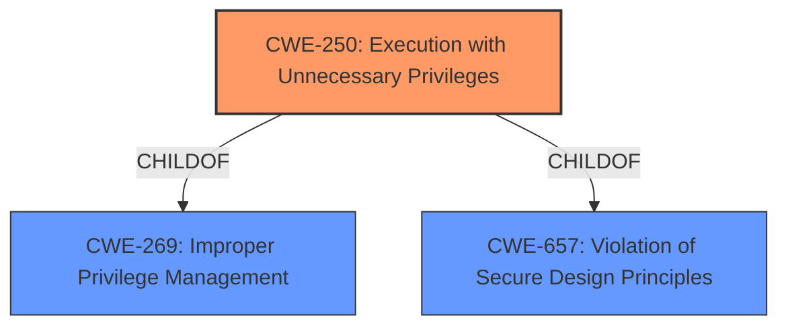

# Enhanced Analysis for CVE-2021-27454

# Summary
| CWE ID | CWE Name | Confidence | CWE Abstraction Level | CWE Vulnerability Mapping Label | CWE-Vulnerability Mapping Notes |
|---|---|---|---|---|---|
| CWE-250 | Execution with Unnecessary Privileges | 1.0 | Base | Allowed | Primary CWE |

## Evidence and Confidence

*   **Confidence Score:** 1.0
*   **Evidence Strength:** HIGH

## Relationship Analysis
The primary CWE is CWE-250, which is a Base level CWE. CWE-250 is a child of CWE-269 and CWE-657. The relationship analysis confirms that focusing on the root cause of **"Execution with Unnecessary Privileges"** provides the most accurate and specific classification. There are no chain relationships to consider in this case.



## Vulnerability Chain
The vulnerability chain consists of a single point of failure:
  - **Root Cause:** The software performs an operation at a privilege level higher than necessary.
  - **Impact:** Privilege escalation by a local attacker.

## Summary of Analysis
The initial analysis focused on identifying the root cause of the vulnerability, which the description clearly states is the **"software performs an operation at a privilege level higher than the minimum level required."** This perfectly aligns with CWE-250 (Execution with Unnecessary Privileges).

The evidence to back this up comes from the "CVE Reference Links Content Summary":
- **Root cause of vulnerability:** The software performs an operation at a privilege level higher than the minimum level required.
- **Weaknesses/vulnerabilities present:** Execution with Unnecessary Privileges (CWE-250).

The relationship analysis further solidified this choice, as it emphasized the importance of focusing on the root cause for accurate classification. The retriever results also had CWE-250 as the highest ranked CWE. The mapping guidance for CWE-250 explicitly states that it is at the Base level of abstraction, which is preferred, and the usage is ALLOWED. This confirms that CWE-250 is the most appropriate and specific classification for this vulnerability.

Relevant CWE Information:

# Enhanced Context (25 CWEs)

## CWE-226: Sensitive Information in Resource Not Removed Before Reuse
**Abstraction Level**: Base
**Similarity Score**: 0.82
**Source**: dense

## CWE-404: Improper Resource Shutdown or Release
**Abstraction Level**: Class
**Similarity Score**: 0.78
**Source**: dense

## CWE-667: Improper Locking
**Abstraction Level**: Class
**Similarity Score**: 0.78
**Source**: dense

## CWE-664: Improper Control of a Resource Through its Lifetime
**Abstraction Level**: Pillar
**Similarity Score**: 0.77
**Source**: dense

## CWE-212: Improper Removal of Sensitive Information Before Storage or Transfer
**Abstraction Level**: Base
**Similarity Score**: 0.77
**Source**: dense

## CWE-280: Improper Handling of Insufficient Permissions or Privileges 
**Abstraction Level**: Base
**Similarity Score**: 0.77
**Source**: dense

## CWE-274: Improper Handling of Insufficient Privileges
**Abstraction Level**: Base
**Similarity Score**: 0.77
**Source**: dense

## CWE-908: Use of Uninitialized Resource
**Abstraction Level**: Base
**Similarity Score**: 0.76
**Source**: dense

## CWE-653: Improper Isolation or Compartmentalization
**Abstraction Level**: Class
**Similarity Score**: 0.76
**Source**: dense

## CWE-665: Improper Initialization
**Abstraction Level**: Class
**Similarity Score**: 0.76
**Source**: dense

## CWE-916: Use of Password Hash With Insufficient Computational Effort
**Abstraction Level**: Base
**Similarity Score**: 7870.43
**Source**: sparse

## CWE-639: Authorization Bypass Through User-Controlled Key
**Abstraction Level**: Base
**Similarity Score**: 7810.29
**Source**: sparse

## CWE-259: Use of Hard-coded Password
**Abstraction Level**: Variant
**Similarity Score**: 7530.48
**Source**: sparse

## CWE-863: Incorrect Authorization
**Abstraction Level**: Class
**Similarity Score**: 7518.79
**Source**: sparse

## CWE-798: Use of Hard-coded Credentials
**Abstraction Level**: Base
**Similarity Score**: 7471.27
**Source**: sparse

## CWE-201: Insertion of Sensitive Information Into Sent Data
**Abstraction Level**: base
**Similarity Score**: 4.33
**Source**: graph

## CWE-321: Use of Hard-coded Cryptographic Key
**Abstraction Level**: variant
**Similarity Score**: 4.12
**Source**: graph

## CWE-259: Use of Hard-coded Password
**Abstraction Level**: variant
**Similarity Score**: 4.12
**Source**: graph

## CWE-798: Use of Hard-coded Credentials
**Abstraction Level**: base
**Similarity Score**: 3.64
**Source**: graph

## CWE-257: Storing Passwords in a Recoverable Format
**Abstraction Level**: base
**Similarity Score**: 3.64
**Source**: graph

## CWE-73: External Control of File Name or Path
**Abstraction Level**: base
**Similarity Score**: 3.23
**Source**: graph

## CWE-226: Sensitive Information in Resource Not Removed Before Reuse
**Abstraction Level**: Base
**Similarity Score**: 2.93
**Source**: graph

## CWE-212: Improper Removal of Sensitive Information Before Storage or Transfer
**Abstraction Level**: Base
**Similarity Score**: 2.91
**Source**: graph

## CWE-322: Key Exchange without Entity Authentication
**Abstraction Level**: base
**Similarity Score**: 2.87
**Source**: graph

## CWE-350: Reliance on Reverse DNS Resolution for a Security-Critical Action
**Abstraction Level**: variant
**Similarity Score**: 2.55
**Source**: graph

I considered other CWEs from the retriever results, but they were deemed less relevant:
- CWE-259 (Use of Hard-coded Password), CWE-916 (Use of Password Hash With Insufficient Computational Effort), and CWE-798 (Use of Hard-coded Credentials) are related to credential management, which is not the primary issue in this vulnerability.
- CWE-1220 (Insufficient Granularity of Access Control), CWE-284 (Improper Access Control), CWE-639 (Authorization Bypass Through User-Controlled Key), CWE-280 (Improper Handling of Insufficient Permissions or Privileges) are related to access control, but the root cause is not about incorrect access control logic, but about running with higher privileges than necessary.
- CWE-1256 (Improper Restriction of Software Interfaces to Hardware Features) relates to hardware feature control, which is not described in the vulnerability.
- CWE-379 (Creation of Temporary File in Directory with Insecure Permissions) is related to temporary file management, which is not relevant in this context.


## CWE Relationship Analysis

Current CWEs represent these abstraction levels: .


### Vulnerability Chain Analysis

**Chain starting from CWE-350:**
- 350 (Reliance on Reverse DNS Resolution for a Security-Critical Action) - ROOT


**Chain starting from CWE-404:**
- 404 (Improper Resource Shutdown or Release) - ROOT


### CWE Relationship Diagram

```mermaid
graph TD
    classDef primary fill:#f96,stroke:#333,stroke-width:2px
    classDef secondary fill:#69f,stroke:#333
    classDef tertiary fill:#9e9,stroke:#333
```