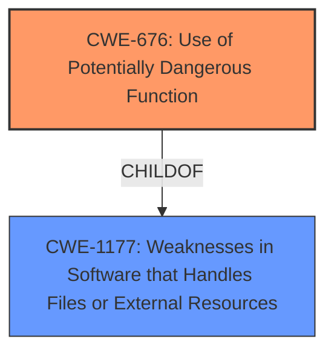

# Analysis Report for CVE-2021-27474

# Vulnerability Analysis Report: CVE-2021-27474

## Description


## Analysis (with Relationship Data)

# Summary
| CWE ID | CWE Name | Confidence | CWE Abstraction Level | CWE Vulnerability Mapping Label | CWE-Vulnerability Mapping Notes |
|---|---|---|---|---|---|
| CWE-676 | Use of Potentially Dangerous Function | 1 | Base | Allowed | Primary CWE |

## Evidence and Confidence

*   **Confidence Score:** 1
*   **Evidence Strength:** HIGH

## Relationship Analysis
The primary relationship that influenced the decision was the ChildOf relationship between CWE-676 and CWE-1177, indicating that CWE-676 is a specific type of weakness related to functions. No chain or peer relationships appeared relevant. The Base abstraction level was appropriate as it directly describes the weakness.



## Vulnerability Chain
The vulnerability chain starts with the **improper restriction** of functions, leading to the use of potentially dangerous functions, and ultimately allowing an unauthenticated attacker to modify sensitive data.
  - Root Cause: **Improper Restriction** of Functions
  - Weakness: CWE-676 Use of Potentially Dangerous Function
  - Impact: Modification of Sensitive Data

## Summary of Analysis
The analysis concludes that the most appropriate CWE for this vulnerability is CWE-676 (Use of Potentially Dangerous Function). This determination is based on the provided vulnerability description, CVE Reference Links Content Summary, and the MITRE CWE specifications.

The primary evidence supporting this classification comes from the "CVE Reference Links Content Summary," which states: "The application doesn't properly restrict functions related to IIS remoting." This directly aligns with the description of CWE-676, which addresses situations where a product invokes a potentially dangerous function that could introduce a vulnerability if used incorrectly.

The "Vulnerability Description" also supports this finding, mentioning that the application "does not properly restrict all functions relating to IIS remoting services." This reinforces the idea that the application uses functions which, if not properly restricted, can lead to security vulnerabilities.

The MITRE mapping guidance for CWE-676 states that it is at the Base level of abstraction, which is a preferred level for mapping the root causes of vulnerabilities, and that its usage is ALLOWED.

The retriever results also listed CWE-676 as the top candidate, further supporting its selection.

Other CWEs were considered, such as CWE-306 (Missing Authentication for Critical Function), CWE-287 (Improper Authentication), and CWE-522 (Insufficiently Protected Credentials). However, these were not as directly relevant as CWE-676. The vulnerability's core issue is not the absence of authentication or the improper handling of credentials, but rather the **improper restriction** of potentially dangerous functions, making CWE-676 the most accurate and specific classification.

The selected CWE is at the optimal level of specificity (Base) because it directly reflects the **root cause** of the vulnerability as described in the provided information.


## CWE Relationship Analysis

Current CWEs represent these abstraction levels: .


### Vulnerability Chain Analysis

**Chain starting from CWE-306:**
- 306 (Missing Authentication for Critical Function) - ROOT


**Chain starting from CWE-676:**
- 676 (Use of Potentially Dangerous Function) - ROOT


### CWE Relationship Diagram

```mermaid
graph TD
    classDef primary fill:#f96,stroke:#333,stroke-width:2px
    classDef secondary fill:#69f,stroke:#333
    classDef tertiary fill:#9e9,stroke:#333
```


*Report generated on 2025-04-02 07:18:26*
