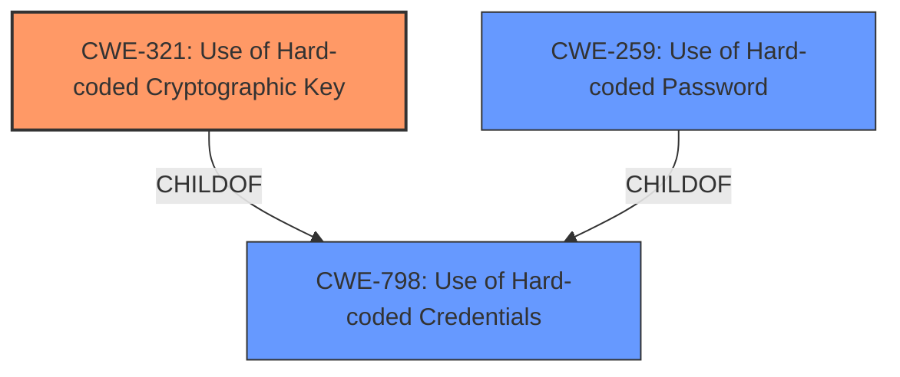

# Raw Analyzer Response for CVE-2021-27481

# Summary
| CWE ID | CWE Name | Confidence | CWE Abstraction Level | CWE Vulnerability Mapping Label | CWE-Vulnerability Mapping Notes |
|---|---|---|---|---|---|
| CWE-321 | Use of Hard-coded Cryptographic Key | 1 | Variant | Allowed | Primary CWE |
| CWE-798 | Use of Hard-coded Credentials | 0.9 | Base | Allowed | Secondary Candidate |
| CWE-259 | Use of Hard-coded Password | 0.8 | Variant | Allowed | Secondary Candidate |

## Evidence and Confidence

*   **Confidence Score:** 0.95
*   **Evidence Strength:** HIGH

## Relationship Analysis
The primary CWE is CWE-321, which is a variant of CWE-798 (Use of Hard-coded Credentials). CWE-798 is a base CWE and also a parent of CWE-259 (Use of Hard-coded Password). The relationships influenced the decision to select CWE-321 as the primary because the vulnerability specifically mentions a cryptographic key.

## Vulnerability Chain
The vulnerability chain starts with the **hardcoded encryption key** (CWE-321). If exploited, this leads to an attacker gaining access to sensitive information.

## Summary of Analysis
The initial analysis identified the **rootcause** as a **hardcoded encryption key**. The evidence for this is found in both the "Vulnerability Description Key Phrases" and the "CVE Reference Links Content Summary". The vulnerability description states, "The affected products utilize an encryption key in the data exchange process, which is **hardcoded**." The CVE Reference Links Content Summary confirms this: "The application uses a **hard-coded cryptographic key** in the data exchange process."

The Retriever Results also support this, with CWE-321 (Use of Hard-coded Cryptographic Key), CWE-798 (Use of Hard-coded Credentials), and CWE-259 (Use of Hard-coded Password) being the top matches.

Based on the evidence, CWE-321 (Use of Hard-coded Cryptographic Key) is the most specific and appropriate CWE. It accurately describes the vulnerability and is at the Variant level of abstraction, which is preferred. CWE-798 (Use of Hard-coded Credentials) is a broader category, and while it applies, CWE-321 is more precise. CWE-259 (Use of Hard-coded Password) is less relevant because the vulnerability involves a cryptographic key, not a password. The relationship graph also supports this decision, showing that CWE-321 is a child of CWE-798, indicating a more specific classification.

CWE-327 (Use of a Broken or Risky Cryptographic Algorithm) was considered but not used, because the issue is not about the algorithm itself being broken or risky, but about the key being hard-coded.

CWE-425 (Direct Request ('Forced Browsing')) was considered but is not applicable because the vulnerability is not about bypassing authorization checks.

CWE-1394 (Use of Default Cryptographic Key) was considered, but the description specifies hard-coded rather than the use of a default key.

The selection of CWE-321 is based on strong evidence and is at the optimal level of specificity.

Relevant CWE Information:

# Enhanced Context (25 CWEs)

## CWE-312: Cleartext Storage of Sensitive Information
**Abstraction Level**: Base
**Similarity Score**: 0.81
**Source**: dense

**Description**:
The product stores sensitive information in cleartext within a resource that might be accessible to another control sphere.

**Mapping Guidance**:
- Usage: Allowed
- Rationale: This CWE entry is at the Base level of abstraction, which is a preferred level of abstraction for mapping to the root causes of vulnerabilities.

## CWE-311: Missing Encryption of Sensitive Data
**Abstraction Level**: Class
**Similarity Score**: 0.80
**Source**: dense

**Description**:
The product does not encrypt sensitive or critical information before storage or transmission.

**Mapping Guidance**:
- Usage: Discouraged
- Rationale: CWE-311 is high-level with more precise children available. It is a level-1 Class (i.e., a child of a Pillar).

## CWE-319: Cleartext Transmission of Sensitive Information
**Abstraction Level**: Base
**Similarity Score**: 0.79
**Source**: dense

**Description**:
The product transmits sensitive or security-critical data in cleartext in a communication channel that can be sniffed by unauthorized actors.

**Mapping Guidance**:
- Usage: Allowed
- Rationale: This CWE entry is at the Base level of abstraction, which is a preferred level of abstraction for mapping to the root causes of vulnerabilities.

## CWE-1391: Use of Weak Credentials
**Abstraction Level**: Class
**Similarity Score**: 0.78
**Source**: dense

**Description**:
The product uses weak credentials (such as a default key or hard-coded password) that can be calculated, derived, reused, or guessed by an attacker.

**Mapping Guidance**:
- Usage: Allowed-with-Review
- Rationale: This CWE entry is a Class and might have Base-level children that would be more appropriate

## CWE-798: Use of Hard-coded Credentials
**Abstraction Level**: Base
**Similarity Score**: 0.77
**Source**: dense

**Description**:
The product contains hard-coded credentials, such as a password or cryptographic key.

**Mapping Guidance**:
- Usage: Allowed
- Rationale: This CWE entry is at the Base level of abstraction, which is a preferred level of abstraction for mapping to the root causes of vulnerabilities.

## CWE-1240: Use of a Cryptographic Primitive with a Risky Implementation
**Abstraction Level**: Base
**Similarity Score**: 0.77
**Source**: dense

**Description**:
To fulfill the need for a cryptographic primitive, the product implements a cryptographic algorithm using a non-standard, unproven, or disallowed/non-compliant cryptographic implementation.

**Mapping Guidance**:
- Usage: Allowed
- Rationale: This CWE entry is at the Base level of abstraction, which is a preferred level of abstraction for mapping to the root causes of vulnerabilities.

## CWE-807: Reliance on Untrusted Inputs in a Security Decision
**Abstraction Level**: Base
**Similarity Score**: 0.76
**Source**: dense

**Description**:
The product uses a protection mechanism that relies on the existence or values of an input, but the input can be modified by an untrusted actor in a way that bypasses the protection mechanism.

**Mapping Guidance**:
- Usage: Allowed
- Rationale: This CWE entry is at the Base level of abstraction, which is a preferred level of abstraction for mapping to the root causes of vulnerabilities.

## CWE-345: Insufficient Verification of Data Authenticity
**Abstraction Level**: Class
**Similarity Score**: 0.76
**Source**: dense

**Description**:
The product does not sufficiently verify the origin or authenticity of data, in a way that causes it to accept invalid data.

**Mapping Guidance**:
- Usage: Discouraged
- Rationale: This CWE entry is a level-1 Class (i.e., a child of a Pillar). It might have lower-level children that would be more appropriate

## CWE-538: Insertion of Sensitive Information into Externally-Accessible File or Directory
**Abstraction Level**: Base
**Similarity Score**: 0.76
**Source**: dense

**Description**:
The product places sensitive information into files or directories that are accessible to actors who are allowed to have access to the files, but not to the sensitive information.

**Mapping Guidance**:
- Usage: Allowed
- Rationale: This CWE entry is at the Base level of abstraction, which is a preferred level of abstraction for mapping to the root causes of vulnerabilities.

## CWE-321: Use of Hard-coded Cryptographic Key
**Abstraction Level**: Variant
**Similarity Score**: 0.75
**Source**: dense

**Description**:
The use of a hard-coded cryptographic key significantly increases the possibility that encrypted data may be recovered.

**Mapping Guidance**:
- Usage: Allowed
- Rationale: This CWE entry is at the Variant level of abstraction, which is a preferred level of abstraction for mapping to the root causes of vulnerabilities.

## CWE-798: Use of Hard-coded Credentials
**Abstraction Level**: Base
**Similarity Score**: 6578.74
**Source**: sparse

**Description**:
The product contains hard-coded credentials, such as a