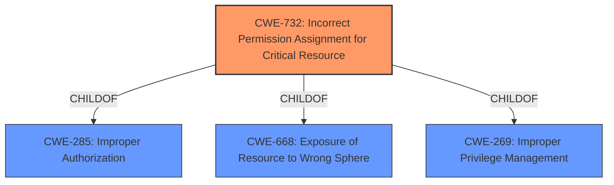

# Analysis Report for CVE-2021-27483

# Vulnerability Analysis Report: CVE-2021-27483

## Description


## Analysis (with Relationship Data)

# Summary
| CWE ID | CWE Name | Confidence | CWE Abstraction Level | CWE Vulnerability Mapping Label | CWE-Vulnerability Mapping Notes |
|---|---|---|---|---|---|
| CWE-732 | Incorrect Permission Assignment for Critical Resource | 0.9 | Class | Allowed-with-Review | Primary CWE |
| CWE-269 | Improper Privilege Management | 0.6 | Class | Discouraged | Secondary Candidate |

## Evidence and Confidence

*   **Confidence Score:** 0.9
*   **Evidence Strength:** HIGH

## Relationship Analysis
The primary CWE selected is CWE-732, which is a Class-level CWE. It has hierarchical relationships with CWE-285 (Authorization Bypass) and CWE-668 (Exposure of Resource to Wrong Sphere). Since the vulnerability description focuses on **insecure file system permissions** leading to privilege escalation, CWE-732 is the most appropriate. CWE-269 (Improper Privilege Management) is a parent of CWE-732 and a broader classification, but the description gives more detail than just **improper privilege management**. The graph helps to visualize how CWE-732 relates to broader authorization and resource exposure issues.



## Vulnerability Chain
The chain of events is as follows:
1.  **Root Cause:** **Insecure file system permissions**.
2.  Weakness: A lower privilege user can access or modify critical resources due to **incorrect permission assignment**.
3.  Impact: Privilege escalation to an administrative level user.

The chain starts with the **insecure permissions** (CWE-732), leading to the possibility of unauthorized access and ultimately privilege escalation.

## Summary of Analysis
The initial analysis focused on identifying the root cause of the vulnerability, which is the **insecure file system permissions**. The vulnerability description and the CVE Reference Links Content Summary both explicitly mention this. The Retriever Results also highlighted CWE-732 as a potential candidate.

The choice of CWE-732 is based on the following evidence:
*   The vulnerability description states: "The affected products contain **insecure filesystem permissions** that could allow a lower privilege user to escalate privileges to an administrative level user."
*   The CVE Reference Links Content Summary states: "The affected ZOLL Defibrillator Dashboard product has **insecure filesystem permissions**."

CWE-732's description, "The product specifies permissions for a security-critical resource in a way that allows that resource to be read or modified by unintended actors," aligns perfectly with the vulnerability.

CWE-269 was considered as a broader, more general classification, but it was deemed less specific than CWE-732 given the available evidence. The MITRE mapping guidance for CWE-269 discourages its use when more specific CWEs are available.

The selection of CWE-732 is at the optimal level of specificity, as it directly addresses the root cause of the vulnerability (**insecure filesystem permissions**) and its potential impact (privilege escalation). It is a Class-level CWE, which is appropriate given the level of detail provided in the vulnerability description.


## CWE Relationship Analysis

Current CWEs represent these abstraction levels: .


### Vulnerability Chain Analysis

**Chain starting from CWE-732:**
- 732 (Incorrect Permission Assignment for Critical Resource) - ROOT


**Chain starting from CWE-285:**
- 285 (Improper Authorization) - ROOT


### CWE Relationship Diagram

```mermaid
graph TD
    classDef primary fill:#f96,stroke:#333,stroke-width:2px
    classDef secondary fill:#69f,stroke:#333
    classDef tertiary fill:#9e9,stroke:#333
```


*Report generated on 2025-04-02 09:33:04*
