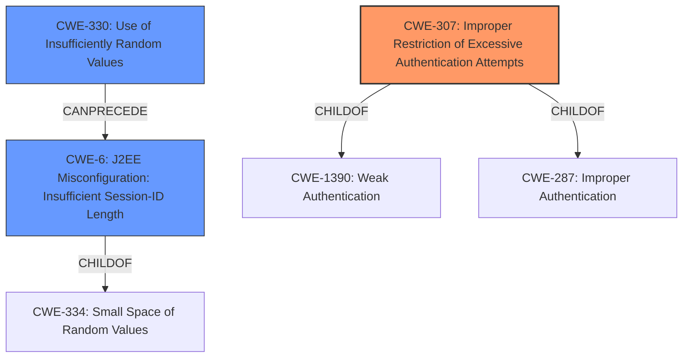

# Raw Analyzer Response for CVE-2021-27514

# Summary
| CWE ID  | CWE Name                                                                | Confidence | CWE Abstraction Level | CWE Vulnerability Mapping Label | CWE-Vulnerability Mapping Notes |
| :-------- | :---------------------------------------------------------------------- | :--------- | :---------------------- | :------------------------------ | :------------------------------ |
| CWE-307   | Improper Restriction of Excessive Authentication Attempts             | 0.9        | Base                    | Primary                         | Allowed                       |
| CWE-6     | J2EE Misconfiguration: Insufficient Session-ID Length                 | 0.7        | Variant                 | Secondary                       | Allowed                       |
| CWE-330   | Use of Insufficiently Random Values                                 | 0.6        | Class                   | Secondary                       | Discouraged                    |

## Evidence and Confidence

*   **Confidence Score:** 0.8
*   **Evidence Strength:** HIGH

## Relationship Analysis
The primary CWE is CWE-307 Improper Restriction of Excessive Authentication Attempts, which is a child of CWE-1390 Weak Authentication and CWE-287 Improper Authentication. This indicates a weakness in how the system handles multiple authentication attempts. CWE-6 J2EE Misconfiguration: Insufficient Session-ID Length is a variant of CWE-334, which is related to predictable or weak session IDs. CWE-330 Use of Insufficiently Random Values can lead to weak session IDs, and is a parent of CWE-338 Use of Cryptographically Weak Pseudo-Random Number Generator (PRNG).

## Vulnerability Chain
The vulnerability chain starts with the **weak session ID** generation (potentially due to CWE-330), leading to an insufficient session ID length (CWE-6). This makes the system vulnerable to brute-force attacks because the attacker can try multiple session IDs. The **improper restriction of excessive authentication attempts** (CWE-307) then allows an attacker to try many session IDs without being blocked, eventually leading to an authentication bypass and unauthorized access.

## Summary of Analysis
The initial assessment focused on the **weakness** related to the easily brute-forceable session ID. The Retriever results pointed to several relevant CWEs including CWE-307, CWE-1391, and CWE-6. Based on the vulnerability description and the provided CVE Reference Links Content Summary, the core issue is that the system allows for brute-force attacks due to the short session ID and lack of rate limiting, meaning the system does not implement sufficient measures to prevent multiple failed authentication attempts within a short time frame. This aligns directly with CWE-307, "Improper Restriction of Excessive Authentication Attempts".

The vulnerability description states: "EyesOfNetwork 5.3-10 uses an **integer of between 8 and 10 digits for the session ID**, which might be leveraged for brute-force authentication bypass". Also from the CVE Reference Links Content Summary, "Session ID Brute-Forcing: The session ID generation is weak (8-10 digits) making it vulnerable to brute-force attacks". This indicates that the system does not prevent attackers from making multiple authentication attempts.

CWE-6, "J2EE Misconfiguration: Insufficient Session-ID Length" is also considered because the session ID length is insufficient, contributing to the ease of brute-forcing. However, the primary issue is the lack of rate limiting, making CWE-307 the primary weakness. CWE-330, "Use of Insufficiently Random Values" is considered a possible root cause for the weak session ID generation, but there's no direct evidence to confirm this. Thus, it's a secondary consideration.

The selected CWEs are at the optimal level of specificity because they directly address the root cause and contributing factors of the vulnerability. CWE-307 accurately describes the lack of rate limiting on authentication attempts. CWE-6 highlights the insufficient session ID length, and CWE-330 identifies the possibility of insufficient randomness in session ID generation.

Relevant CWE Information:

# Enhanced Context (25 CWEs)
The following CWEs were identified as potentially relevant to this vulnerability:

## CWE-274: Improper Handling of Insufficient Privileges
**Abstraction Level**: Base
**Similarity Score**: 0.78
**Source**: dense

**Description**:
The product does not handle or incorrectly handles when it has insufficient privileges to perform an operation, leading to resultant weaknesses.

**Mapping Guidance**:
- Usage: Discouraged
- Rationale: This CWE entry could be deprecated in a future version of CWE.

## CWE-330: Use of Insufficiently Random Values
**Abstraction Level**: Class
**Similarity Score**: 0.78
**Source**: dense

**Description**:
The product uses insufficiently random numbers or values in a security context that depends on unpredictable numbers.

**Mapping Guidance**:
- Usage: Discouraged
- Rationale: This CWE entry is a level-1 Class (i.e., a child of a Pillar). It might have lower-level children that would be more appropriate

## CWE-1391: Use of Weak Credentials
**Abstraction Level**: Class
**Similarity Score**: 0.78
**Source**: dense

**Description**:
The product uses weak credentials (such as a default key or hard-coded password) that can be calculated, derived, reused, or guessed by an attacker.

**Mapping Guidance**:
- Usage: Allowed-with-Review
- Rationale: This CWE entry is a Class and might have Base-level children that would be more appropriate

## CWE-280: Improper Handling of Insufficient Permissions or Privileges
**Abstraction Level**: Base
**Similarity Score**: 0.78
**Source**: dense

**Description**:
The product does not handle or incorrectly handles when it has insufficient privileges to access resources or functionality as specified by their permissions. This may cause it to follow unexpected code paths that may leave the product in an invalid state.

**Mapping Guidance**:
- Usage: Allowed
- Rationale: This CWE entry is at the Base level of abstraction, which is a preferred level of abstraction for mapping to the root causes of vulnerabilities.

## CWE-807: Reliance on Untrusted Inputs in a Security Decision
**Abstraction Level**: Base
**Similarity Score**: 0.78
**Source**: dense

**Description**:
The product uses a protection mechanism that relies on the existence or values of an input, but the input can be modified by an untrusted actor in a way that bypasses the protection mechanism.

**Mapping Guidance**:
- Usage: Allowed
- Rationale: This CWE entry is at the Base level of abstraction, which is a preferred level of abstraction for mapping to the root causes of vulnerabilities.

## CWE-668: Exposure of Resource to Wrong Sphere
**Abstraction Level**: Class
**Similarity Score**: 0.77
**Source**: dense

**Description**:
The product exposes a resource to the wrong control sphere, providing unintended actors with inappropriate access to the resource.

**Mapping Guidance**:
- Usage: Discouraged
- Rationale: CWE-668 is high-level and is often misused as a catch-all when lower-level CWE IDs might be applicable. It is sometimes used for low-information vulnerability reports [REF-1287]. It is a level-1 Class (i.e., a child of a Pillar). It is not useful for trend analysis.

## CWE-267: Privilege Defined With Unsafe Actions
**Abstraction Level**: Base
**Similarity Score**: 0.77
**Source**: dense

**Description**:
A particular privilege, role, capability, or right can be used to perform unsafe actions that were not intended, even when it is assigned to the correct entity.

**Mapping Guidance**:
- Usage: Allowed
- Rationale: This CWE entry is at the Base level of abstraction, which is a preferred level of abstraction for mapping to the root causes of vulnerabilities.

## CWE-639: Authorization Bypass Through User-Controlled Key
**Abstraction Level**: Base
**Similarity Score**: 0.77
**Source**: dense

**Description**:
The system's authorization functionality does not prevent one user from gaining access to another user's data or record by modifying the key value identifying the data.

**Mapping Guidance