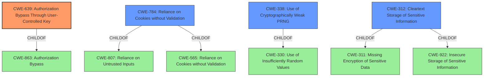

# Enhanced Analysis for CVE-2021-27522

# Summary
| CWE ID | CWE Name | Confidence | CWE Abstraction Level | CWE Vulnerability Mapping Label | CWE-Vulnerability Mapping Notes |
|---|---|---|---|---|---|
| CWE-639 | Authorization Bypass Through User-Controlled Key | 1.0 | Base | Primary | Allowed |
| CWE-784 | Reliance on Cookies without Validation and Integrity Checking in a Security Decision | 0.9 | Variant | Secondary | Allowed |
| CWE-338 | Use of Cryptographically Weak Pseudo-Random Number Generator (PRNG) | 0.7 | Base | Secondary | Allowed |
| CWE-312 | Cleartext Storage of Sensitive Information | 0.5 | Base | Secondary | Allowed |

## Evidence and Confidence

*   **Confidence Score:** 0.8
*   **Evidence Strength:** HIGH

## Relationship Analysis
The primary CWE is CWE-639 **Authorization Bypass Through User-Controlled Key**, which indicates that the application's authorization mechanism fails to prevent a user from accessing another user's data by manipulating a key value. This is related to CWE-863 **Authorization Bypass** through a parent-child relationship, as CWE-639 is a specific type of authorization bypass.

CWE-784 **Reliance on Cookies without Validation and Integrity Checking in a Security Decision** is a variant of CWE-807 **Reliance on Untrusted Inputs in a Security Decision** and CWE-565 **Reliance on Cookies without Validation and Integrity Checking**, indicating that the vulnerability specifically involves the application's reliance on cookies for security decisions without proper validation.



## Vulnerability Chain
The vulnerability chain starts with **insecure cookie generation** and the **predictable hash** derived from the hidden ID (Hid), leading to the **lack of proper session management** and **cookie manipulation**, and finally culminating in **privilege escalation**.

Insecure Cookie Generation -> Predictable Hash (MD5) -> Cookie Manipulation -> Authorization Bypass -> Privilege Escalation

## Summary of Analysis
The analysis is based on the provided evidence, which clearly indicates that the application relies on a weak cookie-based mechanism for authentication and authorization. The key phrases "modifying the initial letter of the key of a user cookie" and "the key of the administrator cookie can be obtained" point directly to the ability to manipulate the cookie to gain unauthorized access.

The selection of CWE-639 **Authorization Bypass Through User-Controlled Key** is based on the fact that an attacker can modify the cookie key (the "user-controlled key") to gain access to administrator privileges, thus bypassing authorization. The evidence from "CVE Reference Links Content Summary" that "the system's authorization functionality does not prevent one user from gaining access to another user's data or record by modifying the key value identifying the data" directly supports this.

CWE-784 **Reliance on Cookies without Validation and Integrity Checking in a Security Decision** is a secondary CWE, as the application relies on cookies without properly validating their integrity.

CWE-338 **Use of Cryptographically Weak Pseudo-Random Number Generator (PRNG)** is another secondary CWE because the application uses MD5, a weak hashing algorithm, to generate the `Hs` value in the cookie.

CWE-312 **Cleartext Storage of Sensitive Information** is considered as a possible CWE because the cookie is not encrypted.

The selected CWEs are at the optimal level of specificity, with CWE-639 being a base-level CWE and CWE-784 being a variant. This ensures that the classification accurately reflects the root cause of the vulnerability.

Relevant CWE Information:

# Enhanced Context (25 CWEs)
The following CWEs were identified as potentially relevant to this vulnerability:

## CWE-614: Sensitive Cookie in HTTPS Session Without 'Secure' Attribute
**Abstraction Level**: Variant
**Similarity Score**: 0.80
**Source**: dense

**Description**:
The Secure attribute for sensitive cookies in HTTPS sessions is not set, which could cause the user agent to send those cookies in plaintext over an HTTP session.

**Mapping Guidance**:
- Usage: Allowed
- Rationale: This CWE entry is at the Variant level of abstraction, which is a preferred level of abstraction for mapping to the root causes of vulnerabilities.

## CWE-784: Reliance on Cookies without Validation and Integrity Checking in a Security Decision
**Abstraction Level**: Variant
**Similarity Score**: 0.78
**Source**: dense

**Description**:
The product uses a protection mechanism that relies on the existence or values of a cookie, but it does not properly ensure that the cookie is valid for the associated user.

**Mapping Guidance**:
- Usage: Allowed
- Rationale: This CWE entry is at the Variant level of abstraction, which is a preferred level of abstraction for mapping to the root causes of vulnerabilities.

## CWE-1004: Sensitive Cookie Without 'HttpOnly' Flag
**Abstraction Level**: Variant
**Similarity Score**: 0.77
**Source**: dense

**Description**:
The product uses a cookie to store sensitive information, but the cookie is not marked with the HttpOnly flag.

**Mapping Guidance**:
- Usage: Allowed
- Rationale: This CWE entry is at the Variant level of abstraction, which is a preferred level of abstraction for mapping to the root causes of vulnerabilities.

## CWE-807: Reliance on Untrusted Inputs in a Security Decision
**Abstraction Level**: Base
**Similarity Score**: 0.77
**Source**: dense

**Description**:
The product uses a protection mechanism that relies on the existence or values of an input, but the input can be modified by an untrusted actor in a way that bypasses the protection mechanism.

**Mapping Guidance**:
- Usage: Allowed
- Rationale: This CWE entry is at the Base level of abstraction, which is a preferred level of abstraction for mapping to the root causes of vulnerabilities.

## CWE-472: External Control of Assumed-Immutable Web Parameter
**Abstraction Level**: Base
**Similarity Score**: 0.77
**Source**: dense

**Description**:
The web application does not sufficiently verify inputs that are assumed to be immutable but are actually externally controllable, such as hidden form fields.

**Mapping Guidance**:
- Usage: Allowed
- Rationale: This CWE entry is at the Base level of abstraction, which is a preferred level of abstraction for mapping to the root causes of vulnerabilities.

## CWE-565: Reliance on Cookies without Validation and Integrity Checking
**Abstraction Level**: Base
**Similarity Score**: 0.77
**Source**: dense

**Description**:
The product relies on the existence or values of cookies when performing security-critical operations, but it does not properly ensure that the setting is valid for the associated user.

**Mapping Guidance**:
- Usage: Allowed
- Rationale: This CWE entry is at the Base level of abstraction, which is a preferred level of abstraction for mapping to the root causes of vulnerabilities.

## CWE-319: Cleartext Transmission of Sensitive Information
**Abstraction Level**: Base
**Similarity Score**: 0.76
**Source**: dense

**Description**:
The product transmits sensitive or security-critical data in cleartext in a communication channel that can be sniffed by unauthorized actors.

**Mapping Guidance**:
- Usage: Allowed
- Rationale: This CWE entry is at the Base level of abstraction, which is a preferred level of abstraction for mapping to the root causes of vulnerabilities.

## CWE


## CWE Relationship Analysis

Current CWEs represent these abstraction levels: .


### Vulnerability Chain Analysis

**Chain starting from CWE-614:**
- 614 (Sensitive Cookie in HTTPS Session Without 'Secure' Attribute) - ROOT


**Chain starting from CWE-312:**
- 312 (Cleartext Storage of Sensitive Information) - ROOT


### CWE Relationship Diagram

```mermaid
graph TD
    classDef primary fill:#f96,stroke:#333,stroke-width:2px
    classDef secondary fill:#69f,stroke:#333
    classDef tertiary fill:#9e9,stroke:#333
```