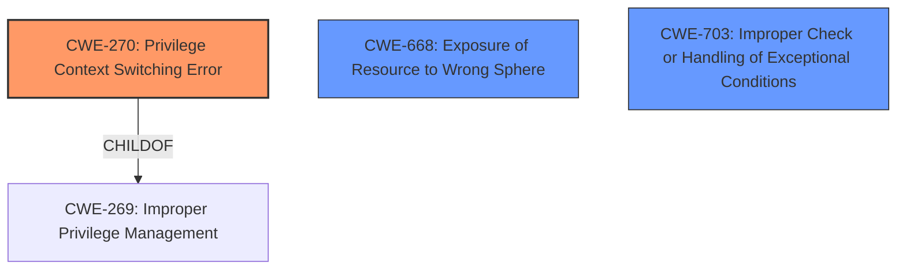

# Raw Analyzer Response for CVE-2021-27562

# Summary
| CWE ID | CWE Name | Confidence | CWE Abstraction Level | CWE Vulnerability Mapping Label | CWE-Vulnerability Mapping Notes |
|---|---|---|---|---|---|
| CWE-270 | Privilege Context Switching Error | 0.75 | Base | Allowed | Primary CWE |
| CWE-668 | Exposure of Resource to Wrong Sphere | 0.5 | Class | Discouraged | Secondary Candidate |
| CWE-703 | Improper Check or Handling of Exceptional Conditions | 0.4 | Pillar | Discouraged | Secondary Candidate |

## Evidence and Confidence

*   **Confidence Score:** 0.75
*   **Evidence Strength:** MEDIUM

## Relationship Analysis
The primary CWE, CWE-270 (Privilege Context Switching Error), is a base-level CWE and a child of CWE-269 (Improper Privilege Management). This hierarchical relationship indicates that CWE-270 is a more specific case of a broader privilege management issue. The vulnerability description mentions the "NS world" calling secure functions, suggesting a context switch between different privilege levels.

CWE-668 (Exposure of Resource to Wrong Sphere) is a class-level CWE that could potentially apply, as the vulnerability involves the "NS world" accessing secure functions. However, it's a discouraged mapping due to its high-level nature.

CWE-703 (Improper Check or Handling of Exceptional Conditions) is a pillar-level CWE and is generally discouraged due to its broadness. It's included as a possibility because the system halt could be viewed as an unhandled exceptional condition.

## Vulnerability Chain
The vulnerability chain involves the following:
1.  The NS world (Non-Secure world) calls secure functions under the NSPE (Non-Secure Processing Environment) handler mode.
2.  This call leads to a privilege context switching error, potentially due to improper privilege management.
3.  The impact includes a system halt, overwrite of secure data, or the printing out of secure data.

Here, the **Privilege Context Switching Error** (CWE-270) is the root cause, leading to the described impacts.

## Summary of Analysis
The initial assessment, based on the vulnerability description, points to a **Privilege Context Switching Error** (CWE-270) as the most likely root cause. The vulnerability description states that when the "NS world" calls secure functions, it can lead to a system halt or data corruption. This indicates a problem with how the system handles privilege changes during function calls between different security contexts. The provided text supports this assessment: "the NS world may trigger a system halt, an overwrite of secure data, or the printing out of secure data when calling secure functions under the NSPE handler mode."

The retriever results also suggest CWE-270, although with a relatively low score. However, given the specific context of privilege switching mentioned in the vulnerability description, CWE-270 seems to be the most appropriate choice among the candidates.

CWE-668 (Exposure of Resource to Wrong Sphere) was considered, but it's a broader class-level CWE and the description leans more towards a privilege context issue. The usage is discouraged for this reason.

CWE-703 (Improper Check or Handling of Exceptional Conditions) was also considered, but it is a very high-level pillar and therefore too general.

The final selection of CWE-270 is based on the evidence of privilege context switching between the NS world and secure functions, which aligns well with the CWE's description. It is at the Base level of abstraction, which is preferred for root cause analysis.

Relevant CWE Information:
*   **CWE-270: Privilege Context Switching Error** - The product does not properly manage privileges while it is switching between different contexts that have different privileges or spheres of control.
*   **CWE-668: Exposure of Resource to Wrong Sphere** - The product exposes a resource to the wrong control sphere, providing unintended actors with inappropriate access to the resource.
*   **CWE-703: Improper Check or Handling of Exceptional Conditions** - The product does not properly anticipate or handle exceptional conditions that rarely occur during normal operation of the product.