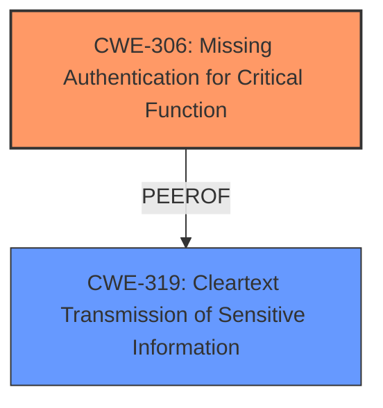

# Raw Analyzer Response for CVE-2021-27570

# Summary
| CWE ID    | CWE Name                                                                | Confidence | CWE Abstraction Level | CWE Vulnerability Mapping Label | CWE-Vulnerability Mapping Notes |
| --------- | ----------------------------------------------------------------------- | ---------- | ----------------------- | ------------------------------- | ----------------------------- |
| CWE-306   | Missing Authentication for Critical Function                            | 0.9        | Base                    | Allowed                         | Primary CWE                   |
| CWE-319   | Cleartext Transmission of Sensitive Information                         | 0.8        | Base                    | Allowed                         | Secondary CWE                 |

## Evidence and Confidence

*   **Confidence Score:** 0.85
*   **Evidence Strength:** HIGH

## Relationship Analysis
The primary weakness is the **missing authentication** for a critical function (closing processes). This is directly represented by CWE-306. The sensitive information (process name) is transmitted in cleartext, which is represented by CWE-319.

## Vulnerability Chain
The vulnerability chain starts with the **missing authentication** (**ROOTCAUSE**), which allows attackers to send specially crafted packets to close any running process. The process name is transmitted in cleartext, which makes it easier for attackers to identify and target specific processes.

## Summary of Analysis
The primary vulnerability is the **lack of authentication** for the critical function of closing processes, which is well-represented by CWE-306. This allows attackers to close any running process by sending a specially crafted packet. The fact that the process name is transmitted in cleartext (CWE-319) is a secondary weakness that facilitates the attack, but the core issue is the **missing authentication**.

The selection of CWE-306 and CWE-319 is based on the following evidence:

*   Vulnerability Description: "Attackers can close any running process by sending the process name in a specially crafted packet. This information is sent in cleartext and is not protected by any authentication logic."
*   CVE Reference Links Content Summary: "**Missing Authentication:** The application does not verify the source of the close process command, or validate the user's authority." and "**Cleartext Transmission:** The process name is transmitted in cleartext within the UDP packet."

CWE-306 and CWE-319 are at the Base level of abstraction, which is the preferred level for mapping root causes of vulnerabilities.

Relevant CWE Information:

# Enhanced Context (25 CWEs)
The following CWEs were identified as potentially relevant to this vulnerability:

## CWE-294: Authentication Bypass by Capture-replay
**Abstraction Level**: Base
**Similarity Score**: 0.79

## CWE-807: Reliance on Untrusted Inputs in a Security Decision
**Abstraction Level**: Base
**Similarity Score**: 0.78

## CWE-303: Incorrect Implementation of Authentication Algorithm
**Abstraction Level**: Base
**Similarity Score**: 0.77

## CWE-345: Insufficient Verification of Data Authenticity
**Abstraction Level**: Class
**Similarity Score**: 0.77

## CWE-302: Authentication Bypass by Assumed-Immutable Data
**Abstraction Level**: Base
**Similarity Score**: 0.76

## CWE-319: Cleartext Transmission of Sensitive Information
**Abstraction Level**: Base
**Similarity Score**: 0.76

## CWE-1289: Improper Validation of Unsafe Equivalence in Input
**Abstraction Level**: Base
**Similarity Score**: 0.76

## CWE-941: Incorrectly Specified Destination in a Communication Channel
**Abstraction Level**: Base
**Similarity Score**: 0.76

## CWE-288: Authentication Bypass Using an Alternate Path or Channel
**Abstraction Level**: Base
**Similarity Score**: 0.76

## CWE-1391: Use of Weak Credentials
**Abstraction Level**: Class
**Similarity Score**: 0.76

## CWE-319: Cleartext Transmission of Sensitive Information
**Abstraction Level**: Base
**Similarity Score**: 5312.68

## CWE-184: Incomplete List of Disallowed Inputs
**Abstraction Level**: Base
**Similarity Score**: 5179.83

## CWE-1284: Improper Validation of Specified Quantity in Input
**Abstraction Level**: Base
**Similarity Score**: 4992.61

## CWE-923: Improper Restriction of Communication Channel to Intended Endpoints
**Abstraction Level**: Class
**Similarity Score**: 4967.87

## CWE-346: Origin Validation Error
**Abstraction Level**: Class
**Similarity Score**: 4965.18

## CWE-434: Unrestricted Upload of File with Dangerous Type
**Abstraction Level**: base
**Similarity Score**: 4.33

## CWE-78: Improper Neutralization of Special Elements used in an OS Command ('OS Command Injection')
**Abstraction Level**: base
**Similarity Score**: 4.33

## CWE-79: Improper Neutralization of Input During Web Page Generation ('Cross-site Scripting')
**Abstraction Level**: base
**Similarity Score**: 4.33

## CWE-22: Improper Limitation of a Pathname to a Restricted Directory ('Path Traversal')
**Abstraction Level**: base
**Similarity Score**: 4.33

## CWE-1284: Improper Validation of Specified Quantity in Input
**Abstraction Level**: base
**Similarity Score**: 4.33

## CWE-98: Improper Control of Filename for Include/Require Statement in PHP Program ('PHP Remote File Inclusion')
**Abstraction Level**: variant
**Similarity Score**: 3.24

## CWE-789: Memory Allocation with Excessive Size Value
**Abstraction Level**: variant
**Similarity Score**: 3.24

## CWE-617: Reachable Assertion
**Abstraction Level**: base
**Similarity Score**: 3.14

## CWE-190: Integer Overflow or Wraparound
**Abstraction Level**: base
**Similarity Score**: 3.07

## CWE-20: Improper Input Validation
**Abstraction Level**: class
**Similarity Score**: 2.98

CWEs Considered but Not Used:

*   CWE-287 (Improper Authentication): While related, CWE-306 (Missing Authentication for Critical Function) is more specific because it highlights the absence of authentication for a function that clearly requires it.
*   CWE-20 (Improper Input Validation): This is a high-level class CWE. The more specific CWE-306 and CWE-319 describe the actual flaws more accurately.
*   CWE-346 (Origin Validation Error): While there's no validation of the source, the core issue is the absence of authentication.