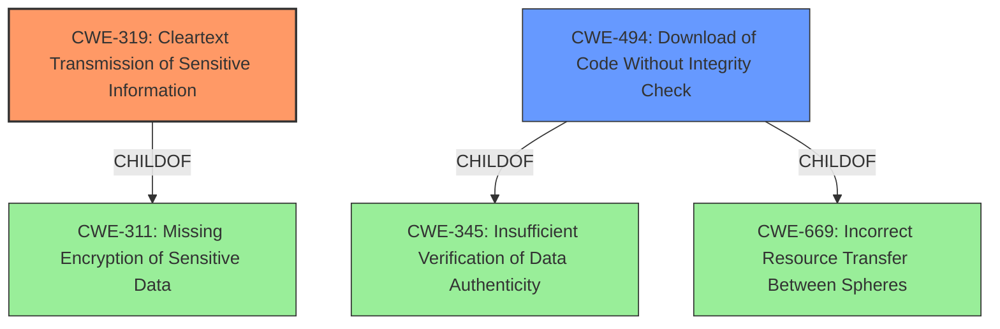

# Raw Analyzer Response for CVE-2021-27574

# Summary
| CWE ID | CWE Name | Confidence | CWE Abstraction Level | CWE Vulnerability Mapping Label | CWE-Vulnerability Mapping Notes |
|---|---|---|---|---|---|
| CWE-319 | Cleartext Transmission of Sensitive Information | 1.0 | Base | Allowed | Primary CWE |
| CWE-494 | Download of Code Without Integrity Check | 0.8 | Base | Allowed | Secondary CWE |

## Evidence and Confidence

*   **Confidence Score:** 0.9
*   **Evidence Strength:** HIGH

## Relationship Analysis
The primary relationship that impacted my decision was the ChildOf relationship. CWE-319 [CWE-319: Cleartext Transmission of Sensitive Information] is a base CWE, providing a good level of specificity for the **rootcause** where the application uses cleartext HTTP for updates. The secondary CWE is CWE-494 [CWE-494: Download of Code Without Integrity Check], which follows the first CWE as there is no integrity check when downloading an update. Both are base CWEs so they have the best levels of abstraction.

## Vulnerability Chain
The vulnerability chain starts with the **root cause** of using cleartext HTTP for updates. This leads to the download of code without integrity checks. The end result is a machine-in-the-middle attack to download a malicious binary.

Cleartext Communication (CWE-319) -> No Integrity Check (CWE-494) -> Malicious Binary Download (Impact)

## Summary of Analysis
My analysis is heavily based on the provided evidence, especially the "Vulnerability Description Key Phrases" and "CVE Reference Links Content Summary." The **rootcause** is explicitly stated as the application using **cleartext HTTP to check and request updates**. This directly aligns with CWE-319 [CWE-319: Cleartext Transmission of Sensitive Information].

The "CVE Reference Links Content Summary" further supports this by highlighting the lack of encryption and integrity checks. This leads to the secondary CWE of CWE-494 [CWE-494: Download of Code Without Integrity Check], as the application doesn't verify the authenticity of the downloaded updates.

The hierarchical relationships influenced my decision by ensuring that I selected the most specific and relevant CWEs. Both CWE-319 [CWE-319: Cleartext Transmission of Sensitive Information] and CWE-494 [CWE-494: Download of Code Without Integrity Check] are base-level CWEs, providing the optimal level of specificity.

Other CWEs Considered:

*   CWE-295 [CWE-295: Improper Certificate Validation]: While related to certificate issues, the primary problem isn't the validation of certificates but the use of cleartext HTTP.
*   CWE-306 [CWE-306: Missing Authentication for Critical Function]: Authentication might be missing, but the more immediate issue is the cleartext transmission.
*   CWE-346 [CWE-346: Origin Validation Error]: This is too broad and doesn't directly address the cleartext communication and lack of integrity check.

The selected CWEs are at the optimal level of specificity because they directly address the root cause and the immediate consequence of the vulnerability.

Relevant CWE Information:

# Enhanced Context (25 CWEs)
The following CWEs were identified as potentially relevant to this vulnerability:

## CWE-345: Insufficient Verification of Data Authenticity
**Abstraction Level**: Class
**Similarity Score**: 0.79
**Source**: dense

**Description**:
The product does not sufficiently verify the origin or authenticity of data, in a way that causes it to accept invalid data.

**Mapping Guidance**:
- Usage: Discouraged
- Rationale: This CWE entry is a level-1 Class (i.e., a child of a Pillar). It might have lower-level children that would be more appropriate

## CWE-303: Incorrect Implementation of Authentication Algorithm
**Abstraction Level**: Base
**Similarity Score**: 0.77
**Source**: dense

**Description**:
The requirements for the product dictate the use of an established authentication algorithm, but the implementation of the algorithm is incorrect.

**Mapping Guidance**:
- Usage: Allowed
- Rationale: This CWE entry is at the Base level of abstraction, which is a preferred level of abstraction for mapping to the root causes of vulnerabilities.

## CWE-203: Observable Discrepancy
**Abstraction Level**: Base
**Similarity Score**: 0.77
**Source**: dense

**Description**:
The product behaves differently or sends different responses under different circumstances in a way that is observable to an unauthorized actor, which exposes security-relevant information about the state of the product, such as whether a particular operation was successful or not.

**Mapping Guidance**:
- Usage: Allowed
- Rationale: This CWE entry is at the Base level of abstraction, which is a preferred level of abstraction for mapping to the root causes of vulnerabilities.

## CWE-807: Reliance on Untrusted Inputs in a Security Decision
**Abstraction Level**: Base
**Similarity Score**: 0.76
**Source**: dense

**Description**:
The product uses a protection mechanism that relies on the existence or values of an input, but the input can be modified by an untrusted actor in a way that bypasses the protection mechanism.

**Mapping Guidance**:
- Usage: Allowed
- Rationale: This CWE entry is at the Base level of abstraction, which is a preferred level of abstraction for mapping to the root causes of vulnerabilities.

## CWE-295: Improper Certificate Validation
**Abstraction Level**: Base
**Similarity Score**: 0.76
**Source**: dense

**Description**:
The product does not validate, or incorrectly validates, a certificate.

**Mapping Guidance**:
- Usage: Allowed
- Rationale: This CWE entry is at the Base level of abstraction, which is a preferred level of abstraction for mapping to the root causes of vulnerabilities.

## CWE-668: Exposure of Resource to Wrong Sphere
**Abstraction Level**: Class
**Similarity Score**: 0.76
**Source**: dense

**Description**:
The product exposes a resource to the wrong control sphere, providing unintended actors with inappropriate access to the resource.

**Mapping Guidance**:
- Usage: Discouraged
- Rationale: CWE-668 is high-level and is often misused as a catch-all when lower-level CWE IDs might be applicable. It is sometimes used for low-information vulnerability reports [REF-1287]. It is a level-1 Class (i.e., a child of a Pillar). It is not useful for trend analysis.

## CWE-319: Cleartext Transmission of Sensitive Information
**Abstraction Level**: Base
**Similarity Score**: 0.76
**Source**: dense

**Description**:
The product transmits sensitive or security-critical data in cleartext in a communication channel that can be sniffed by unauthorized actors.

**Mapping Guidance**:
- Usage: Allowed
- Rationale: This CWE entry is at the Base level of abstraction, which is a preferred level of abstraction for mapping to the root causes of vulnerabilities.

## CWE-1391: Use of Weak Credentials
**Abstraction Level**: Class
**Similarity Score**: 0.76
**Source**: dense

**Description**:
The product uses weak credentials (such as a default key or hard-coded password) that can be calculated, derived, reused, or guessed by an attacker.

**Mapping Guidance**:
- Usage: Allowed-with-Review
- Rationale: This CWE entry is a Class and might have Base-level children that would be more appropriate

## CWE-1289: Improper Validation of Unsafe Equivalence in Input
**Abstraction Level**: Base
**Similarity Score**: 0.76
**Source**: dense

**Description**:
The product receives an input value that is used as a resource identifier or other type of reference, but it does not validate or incorrectly validates that the input is equivalent to a potentially-unsafe value.

**Mapping Guidance**:
- Usage: Allowed
- Rationale: This CWE entry is at the Base level of abstraction, which is a preferred level of abstraction for mapping to the root causes of vulnerabilities.

## CWE-297: Improper Validation of Certificate with Host Mismatch
**Abstraction Level**: Variant
**Similarity Score**: