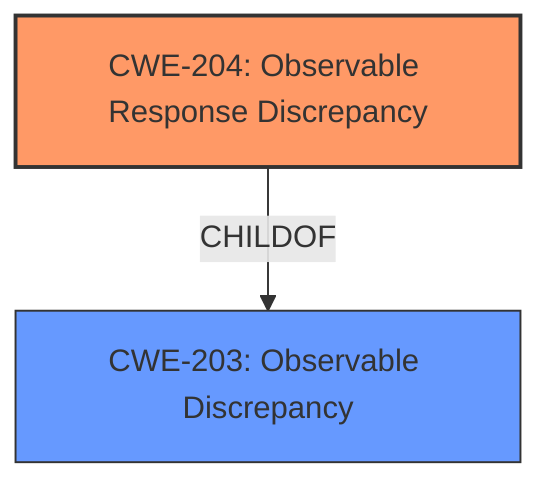

# Raw Analyzer Response for CVE-2021-27583

# Summary
| CWE ID | CWE Name | Confidence | CWE Abstraction Level | CWE Vulnerability Mapping Label | CWE-Vulnerability Mapping Notes |
|---|---|---|---|---|---|
| CWE-204 | Observable Response Discrepancy | 1.0 | Base | Primary | Allowed |

## Evidence and Confidence

*   **Confidence Score:** 1.0
*   **Evidence Strength:** HIGH

## Relationship Analysis
The primary relationship that influences this decision is the direct match between the vulnerability description and the definition of CWE-204, Observable Response Discrepancy. The vulnerability reveals information about the existence of users based on different responses to password reset requests. CWE-204 is a child of CWE-203 (Observable Discrepancy) which is a more general case. Since CWE-204 specifically addresses observable *response* discrepancies, it's a more specific and appropriate fit.

## Vulnerability Chain
The chain of events is as follows:
1.  The **password reset functionality** exhibits different responses based on whether the provided email address exists (ROOT CAUSE).
2.  This allows an **attacker** to determine valid usernames (WEAKNESS).
3.  This **information** can then be used for further attacks, such as password brute-forcing (IMPACT).

## Summary of Analysis
The analysis strongly supports the classification of this vulnerability as CWE-204, Observable Response Discrepancy. The **root cause** is the distinguishable response based on whether a user exists in the database, directly matching the CWE description.

The evidence from the CVE Reference Links Content Summary is: "The password reset functionality of Directus 8.7.2 provides different responses based on whether the provided email address exists within the system."

The retriever results also list CWE-204 as the top match.

The relationship analysis further strengthens this conclusion, as CWE-204 is a specific instance of a more general observable discrepancy (CWE-203), making it the more accurate choice.

The chosen CWE is at the optimal level of specificity because it directly addresses the observable discrepancy in the password reset response, rather than a more general information exposure weakness.

CWEs Considered and Rejected:

*   CWE-472: External Control of Assumed-Immutable Web Parameter - While this might be tangentially related if an attacker could manipulate parameters, the core issue is the *observable response discrepancy*, not the manipulation of parameters.
*   CWE-201: Insertion of Sensitive Information Into Sent Data - This CWE is about sending sensitive information, which is not the case here. The vulnerability is about *different* responses, not necessarily the inclusion of sensitive data.
*   CWE-256: Plaintext Storage of a Password - This is unrelated to the vulnerability description.
*   CWE-306: Missing Authentication for Critical Function - This is also unrelated, as the issue is not about missing authentication.
* CWE-620: Unverified Password Change - The issue is not about the act of changing the password, but rather the information leak that occurs during the reset process.
* CWE-226: Sensitive Information in Resource Not Removed Before Reuse - Not relevant because this is about releasing a resource without clearing it first.
* CWE-327: Use of a Broken or Risky Cryptographic Algorithm - No cryptography is mentioned in the description.
* CWE-287: Improper Authentication - Authentication is not the primary concern in this vulnerability.
* CWE-668: Exposure of Resource to Wrong Sphere - Too broad; CWE-204 is a more precise fit.