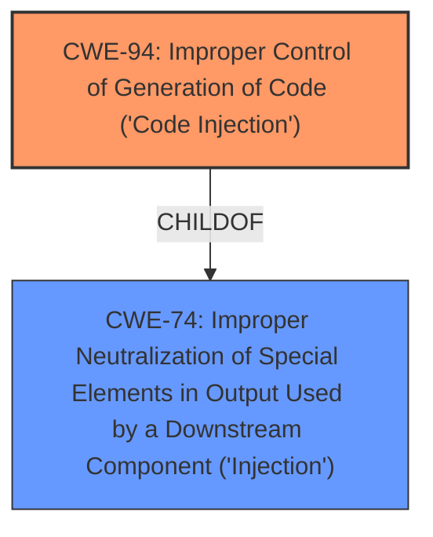

# Raw Analyzer Response for CVE-2021-27614

# Summary
| CWE ID | CWE Name | Confidence | CWE Abstraction Level | CWE Vulnerability Mapping Label | CWE-Vulnerability Mapping Notes |
|---|---|---|---|---|---|
| CWE-94 | Improper Control of Generation of Code ('Code Injection') | 0.9 | Base | Allowed-with-Review | Primary CWE |
| CWE-74 | Improper Neutralization of Special Elements in Output Used by a Downstream Component ('Injection') | 0.7 | Class | Discouraged | Secondary Candidate |

## Evidence and Confidence

*   **Confidence Score:** 0.9
*   **Evidence Strength:** HIGH

## Relationship Analysis
The primary relationship influencing the decision is the ChildOf relationship between CWE-94 and CWE-74. CWE-94 is a more specific type of injection, focusing on the injection of code. The analysis prefers the more specific CWE-94 because the vulnerability description explicitly mentions "**code injection**".

## Vulnerability Chain
The chain of events involves the attacker injecting code into the application, which then allows the attacker to control the application's behavior.

## Summary of Analysis
The initial assessment identified **code injection** as the primary weakness. This is supported by the vulnerability description, which states that the application "allows an attacker to inject code that can be executed by the application." The relationship graph shows that CWE-94 is a child of CWE-74, but CWE-94 is preferred due to the explicit mention of "**code injection**". The final decision is based on the provided evidence and the hierarchical relationships between the CWEs.

The assessment is heavily based on the following evidence from the vulnerability description:
*   "allows an attacker to inject **code** that can be executed by the application"

This evidence directly supports the selection of CWE-94.

Relevant CWE Information:

# Enhanced Context (25 CWEs)
The following CWEs were identified as potentially relevant to this vulnerability:

## CWE-74: Improper Neutralization of Special Elements in Output Used by a Downstream Component ('Injection')
**Abstraction Level**: Class
**Similarity Score**: 0.76
**Source**: dense

**Description**:
The product constructs all or part of a command, data structure, or record using externally-influenced input from an upstream component, but it does not neutralize or incorrectly neutralizes special elements that could modify how it is parsed or interpreted when it is sent to a downstream component.

**Mapping Guidance**:
- Usage: Discouraged
- Rationale: CWE-74 is high-level and often misused when lower-level weaknesses are more appropriate.

## CWE-94: Improper Control of Generation of Code ('Code Injection')
**Abstraction:** Base
**Status:** Draft

### Description
The product constructs all or part of a code segment using externally-influenced input from an upstream component, but it does not neutralize or incorrectly neutralizes special elements that could modify the syntax or behavior of the intended code segment.

### Extended Description

When a product allows a user's input to contain code syntax, it might be possible for an attacker to craft the code in such a way that it will alter the intended control flow of the product. Such an alteration could lead to arbitrary code execution.

Injection problems encompass a wide variety of issues -- all mitigated in very different ways. For this reason, the most effective way to discuss these weaknesses is to note the distinct features which classify them as injection weaknesses. The most important issue to note is that all injection problems share one thing in common -- i.e., they allow for the injection of control plane data into the user-controlled data plane. This means that the execution of the process may be altered by sending code in through legitimate data channels, using no other mechanism. While buffer overflows, and many other flaws, involve the use of some further issue to gain execution, injection problems need only for the data to be parsed. The most classic instantiations of this category of weakness are SQL injection and format string vulnerabilities.

## CWE-668: Exposure of Resource to Wrong Sphere
**Abstraction Level**: Class
**Similarity Score**: 0.75
**Source**: dense

**Description**:
The product exposes a resource to the wrong control sphere, providing unintended actors with inappropriate access to the resource.

### Technical Explanation for CWE-94
CWE-94, Improper Control of Generation of Code ('**Code Injection**'), is the primary CWE because the vulnerability allows an attacker to inject code that can be executed by the application. This directly matches the CWE's description: "The product constructs all or part of a code segment using externally-influenced input from an upstream component, but it does not neutralize or incorrectly neutralizes special elements that could modify the syntax or behavior of the intended code segment." The security implication is that an attacker can control the application's behavior, impacting its integrity and availability. The mapping guidance suggests that it is allowed with review since code execution can result from other weaknesses.

### Technical Explanation for CWE-74
CWE-74, Improper Neutralization of Special Elements in Output Used by a Downstream Component ('Injection'), is considered as a secondary CWE because it is a more general form of injection. The vulnerability involves injecting code, which is a specific type of injection. The security implication is that an attacker can modify how the application is parsed or interpreted. The mapping guidance recommends using more specific CWEs when available.

### Alternative CWEs Considered and Not Used
CWE-20, CWE-668, CWE-611, CWE-89, CWE-22, CWE-328, and CWE-306 were considered but not selected as primary CWEs because they do not specifically address the **code injection** aspect of the vulnerability. They are either too general or address different types of weaknesses. For instance, CWE-20 (Improper Input Validation) is a broad category, and while input validation might be a factor, the core issue is the injection of code. Similarly, CWE-668 (Exposure of Resource to Wrong Sphere) is a high-level class that does not accurately represent the specific weakness.