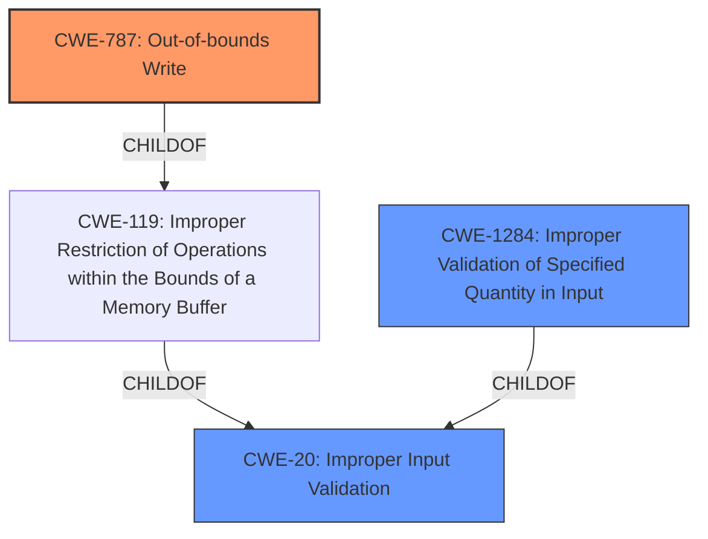

# Raw Analyzer Response for CVE-2021-27620

# Summary
| CWE ID | CWE Name | Confidence | CWE Abstraction Level | CWE Vulnerability Mapping Label | CWE-Vulnerability Mapping Notes |
|---|---|---|---|---|---|
| CWE-787 | Out-of-bounds Write | 0.9 | Base | Allowed | Primary CWE. The **internal memory corruption** is directly caused by the out-of-bounds write |
| CWE-20 | Improper Input Validation | 0.7 | Class | Discouraged | Secondary CWE. The **insufficient input validation** is a contributing factor but not the direct cause. |
| CWE-1284 | Improper Validation of Specified Quantity in Input | 0.6 | Base | Allowed | Secondary CWE. A more specific variant of input validation |

## Evidence and Confidence

*   **Confidence Score:** 0.8
*   **Evidence Strength:** MEDIUM

## Relationship Analysis
The primary weakness is CWE-787, which is a base-level CWE. CWE-787 is a child of CWE-119 (Improper Restriction of Operations within the Bounds of a Memory Buffer), which in turn is a child of CWE-20 (Improper Input Validation). The vulnerability description indicates **insufficient input validation** which leads to **internal memory corruption**. This suggests a chain where **insufficient input validation** could lead to an out-of-bounds write. CWE-1284 is a child of CWE-20 and specifies that the improper validation relates to a specified quantity in the input.

## Vulnerability Chain
The vulnerability chain starts with **insufficient input validation**, which leads to **internal memory corruption** due to an out-of-bounds write, ultimately causing a system crash.

**Insufficient Input Validation** -> **Out-of-Bounds Write** -> **System Crash**

CWE-20 (Improper Input Validation) -> CWE-787 (Out-of-bounds Write) -> Impact (System Crash)

## Summary of Analysis
The analysis is based on the vulnerability description provided. The key phrases "insufficient input validation" and "**internal memory corruption**" are crucial. The description states that the **insufficient input validation** in method UpsAddPart() will trigger an **internal memory corruption** error in the system causing the system to crash and rendering it unavailable".

CWE-787 (Out-of-bounds Write) is chosen as the primary CWE because the "**internal memory corruption**" directly results from writing data outside the intended buffer. This is the most specific weakness identified.

CWE-20 (Improper Input Validation) is a secondary CWE because the **insufficient input validation** is a contributing factor. However, CWE-20 is a class-level CWE and the mapping guidance discourages its use when more specific CWEs are available.

CWE-1284 (Improper Validation of Specified Quantity in Input) is also included as a secondary CWE. It's a base-level CWE and a child of CWE-20, representing a more specific type of input validation issue that relates to the quantity of input.

Other CWEs Considered:

*   CWE-119 (Improper Restriction of Operations within the Bounds of a Memory Buffer): While related to CWE-787, it is a class-level CWE, and CWE-787 provides more specific information about the out-of-bounds write.
*   CWE-200 (Exposure of Sensitive Information to an Unauthorized Actor): This is not applicable because the vulnerability does not directly involve exposing sensitive information.
*   CWE-190 (Integer Overflow or Wraparound): While integer overflows can sometimes lead to memory corruption, the description doesn't explicitly mention an integer overflow.
*   CWE-287 (Improper Authentication): This is not applicable because the vulnerability is exploitable by an unauthenticated attacker due to **insufficient input validation**, not authentication failures.
*   CWE-918 (Server-Side Request Forgery (SSRF)): This is not applicable as the vulnerability does not involve forging server-side requests.
* CWE-41: Improper Resolution of Path Equivalence: This is not applicable as the vulnerability does not involve Path Traversal.
* CWE-611: Improper Restriction of XML External Entity Reference: This is not applicable as the vulnerability does not involve XML External Entity.

The chosen CWEs are at the optimal level of specificity, with CWE-787 being a base-level CWE that accurately describes the **internal memory corruption**, and CWE-20 and CWE-1284 providing context about the **insufficient input validation** that contributed to the vulnerability.