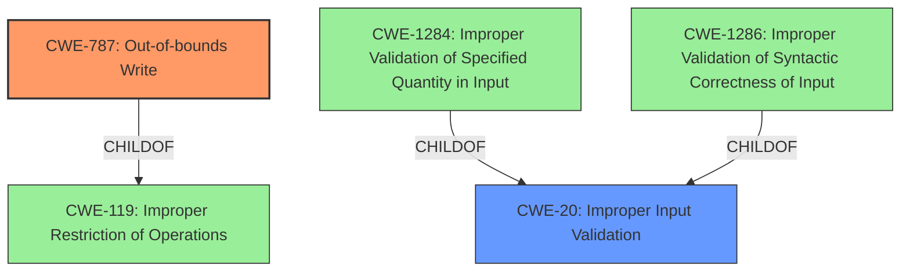

# Enhanced Analysis for CVE-2021-27625

# Summary
| CWE ID  | CWE Name                                                        | Confidence | CWE Abstraction Level | CWE Vulnerability Mapping Label | CWE-Vulnerability Mapping Notes |
|---------|-----------------------------------------------------------------|------------|-----------------------|---------------------------------|-----------------------------------|
| CWE-787 | Out-of-bounds Write                                             | 0.9        | Base                  | Allowed                         | Primary CWE                       |
| CWE-20  | Improper Input Validation                                       | 0.7        | Class                 | Discouraged                     | Secondary candidate               |

## Evidence and Confidence

*   **Confidence Score:** 0.8
*   **Evidence Strength:** HIGH

## Relationship Analysis
The primary relationship that impacted my decision was the ChildOf relationship between CWE-787 and CWE-119, and between CWE-20 and multiple specific input validation CWEs. I chose CWE-787 as the primary because the description explicitly mentions **internal memory corruption**. Although **insufficient input validation** is also mentioned as a root cause, I considered it a secondary factor that led to the primary weakness of memory corruption.



## Vulnerability Chain
The chain of root cause and weaknesses followed for the Vulnerability Description:
1.  **Insufficient Input Validation** (Root Cause)
2.  **Internal Memory Corruption** (Primary Weakness)
3.  System Crash (Impact)

## Summary of Analysis
My analysis is primarily based on the provided evidence, specifically the vulnerability description key phrases. The description mentions "**insufficient input validation**" as the root cause and "**internal memory corruption**" as a weakness, leading to a system crash.

The graph relationships influenced my selection by highlighting the connection between CWE-787 (Out-of-bounds Write) and CWE-119 (Improper Restriction of Operations within the Bounds of a Memory Buffer), as well as the relationship between CWE-20 (Improper Input Validation) and more specific input validation CWEs.

I chose CWE-787 as the primary CWE because the "**internal memory corruption**" is more directly related to writing outside the bounds of a buffer. CWE-20 is added as a secondary CWE because the "**insufficient input validation**" is the root cause that leads to the memory corruption.

My selected CWEs are at the optimal level of specificity because CWE-787 is a Base level CWE that accurately describes the memory corruption issue, and CWE-20 is a Class level CWE that identifies the root cause of the vulnerability.

Relevant CWE Information:

# Enhanced Context (25 CWEs)

## CWE-787: Out-of-bounds Write
**Technical Explanation:** The vulnerability description explicitly mentions "**internal memory corruption**," which directly aligns with the characteristics of CWE-787. This means that the software is writing data beyond the allocated buffer, causing memory corruption.
**Security Implications:** This can lead to arbitrary code execution, denial of service, or other unpredictable behavior.
**Relationship:** CWE-787 is a base CWE and a child of CWE-119.
**Mapping Guidance Influence:** The mapping guidance allows for the use of CWE-787 as it is a Base level of abstraction.
**Primary/Secondary:** Primary

## CWE-20: Improper Input Validation
**Technical Explanation:** The vulnerability description mentions "**insufficient input validation**" as the root cause. This means the software does not properly validate the input, which could lead to writing data beyond the intended buffer, triggering the memory corruption.
**Security Implications:** Attackers can craft malicious inputs to exploit the lack of validation, leading to various issues like denial of service.
**Relationship:** CWE-20 is a Class CWE.
**Mapping Guidance Influence:** The mapping guidance discourages the use of CWE-20 when lower-level CWEs are available. However, I am including it as a secondary CWE because it is a contributing factor to the vulnerability.
**Primary/Secondary:** Secondary

## Considered but not used:
*   **CWE-119:** While related as a parent of CWE-787, it is less specific than CWE-787.
*   **CWE-1284, CWE-1286:** Although the vulnerability involves insufficient input validation, there isn't enough information to determine if the issue is related to a specific quantity or syntactic correctness.
*   **CWE-822:** There's no explicit mention of untrusted pointer dereference.
*   **CWE-190:** No mention of integer overflow.
*   **CWE-287:** No mention of authentication issues.
*   **CWE-918:** No mention of server-side request forgery.
*   **CWE-789:** No mention of memory allocation with excessive size.
*   **CWE-125:** The description focuses on memory corruption, implying a write issue rather than a read.


## CWE Relationship Analysis

Current CWEs represent these abstraction levels: .


### Vulnerability Chain Analysis

**Chain starting from CWE-787:**
- 787 (Out-of-bounds Write) - ROOT


**Chain starting from CWE-125:**
- 125 (Out-of-bounds Read) - ROOT


### CWE Relationship Diagram

```mermaid
graph TD
    classDef primary fill:#f96,stroke:#333,stroke-width:2px
    classDef secondary fill:#69f,stroke:#333
    classDef tertiary fill:#9e9,stroke:#333
```