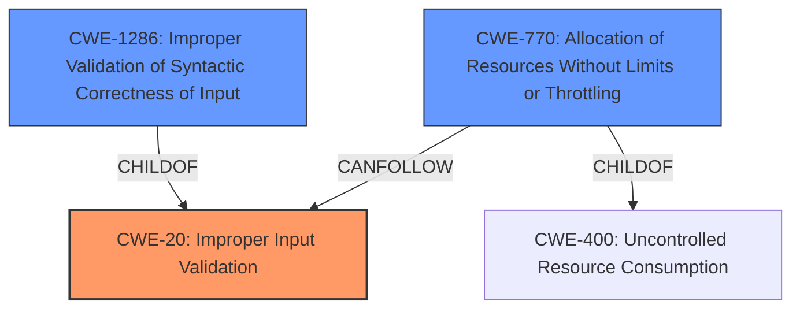

# Enhanced Analysis for CVE-2021-27628

# Summary
| CWE ID | CWE Name | Confidence | CWE Abstraction Level | CWE Vulnerability Mapping Label | CWE-Vulnerability Mapping Notes |
|---|---|---|---|---|---|
| CWE-20 | Improper Input Validation | 0.9 | Class | Primary | Discouraged |
| CWE-770 | Allocation of Resources Without Limits or Throttling | 0.6 | Base | Secondary | Allowed |

## Evidence and Confidence

*   **Confidence Score:** 0.9
*   **Evidence Strength:** HIGH

## Relationship Analysis
The primary CWE is CWE-20 which is a Class level CWE. The retriever results suggested lower level CWEs that are children of CWE-20. Specifically CWE-1286. However, CWE-20 is still a good initial choice as the description is vague and further analysis would be needed to determine if CWE-1286 is a better fit. CWE-770 is related to resource allocation and denial of service.



## Vulnerability Chain
The vulnerability chain starts with **improper input validation** (CWE-20) which leads to an internal error causing the system to crash, leading to a denial of service. The crash could also be related to resource exhaustion (CWE-770) due to the **improper input validation**.

## Summary of Analysis
The initial assessment focuses on the provided evidence, specifically the **rootcause** of "**improper input validation**" which leads to a system crash.

The vulnerability description states: "allows an unauthenticated attacker without specific knowledge of the system to send a specially crafted packet over a network which will trigger an internal error in the system due to **improper input validation** in method DpRTmPrepareReq() causing the system to crash and rendering it unavailable."

This directly supports the selection of CWE-20: Improper Input Validation.

CWE-20 is a Class level CWE that is often misused and the mapping guidance suggests using a more specific child CWE. However, the description doesn't provide enough information to select a more specific CWE.

The crash suggests a potential denial of service, so CWE-770 Allocation of Resources Without Limits or Throttling was also considered.

*   **CWE-20: Improper Input Validation**
    *   The vulnerability description explicitly mentions "**improper input validation**" as the **root cause**.
    *   The system crashes due to this **improper validation**, indicating a failure to properly handle the input.
    *   CWE-20 is a Class, and while the mapping guidance suggests using a more specific child, the provided information does not allow for a more granular selection.
    *   Confidence: 0.9
*   **CWE-770: Allocation of Resources Without Limits or Throttling**
    *   The crash could be caused by excessive resource consumption triggered by the **improperly validated** input, leading to a denial of service.
    *   The system may allocate resources without proper checks, causing it to crash when a specially crafted packet is sent.
    *   Confidence: 0.6

Other CWEs Considered:

*   CWE-1286: Improper Validation of Syntactic Correctness of Input - This CWE is a child of CWE-20 and more specific. It was considered but not selected because the vulnerability description doesn't give enough information to support the selection.
*   CWE-22: Improper Limitation of a Pathname to a Restricted Directory ('Path Traversal') - This CWE relates to path traversal vulnerabilities, which is not relevant to the vulnerability description.
*   CWE-94: Improper Control of Generation of Code ('Code Injection') - This CWE relates to code injection vulnerabilities, which is not relevant to the vulnerability description.
*   CWE-200: Exposure of Sensitive Information to an Unauthorized Actor - This CWE relates to information exposure, which is not relevant to the vulnerability description.
*   CWE-73: External Control of File Name or Path - This CWE relates to file name or path manipulation, which is not relevant to the vulnerability description.
*   CWE-23: Relative Path Traversal - This CWE relates to relative path traversal vulnerabilities, which is not relevant to the vulnerability description.
*   CWE-863: Incorrect Authorization - This CWE relates to incorrect authorization, which is not relevant to the vulnerability description.
*   CWE-444: Inconsistent Interpretation of HTTP Requests ('HTTP Request/Response Smuggling') - This CWE relates to HTTP request smuggling, which is not relevant to the vulnerability description.


## CWE Relationship Analysis

Current CWEs represent these abstraction levels: .


### Vulnerability Chain Analysis

**Chain starting from CWE-73:**
- 73 (External Control of File Name or Path) - ROOT


**Chain starting from CWE-444:**
- 444 (Inconsistent Interpretation of HTTP Requests ('HTTP Request/Response Smuggling')) - ROOT


### CWE Relationship Diagram

```mermaid
graph TD
    classDef primary fill:#f96,stroke:#333,stroke-width:2px
    classDef secondary fill:#69f,stroke:#333
    classDef tertiary fill:#9e9,stroke:#333
```