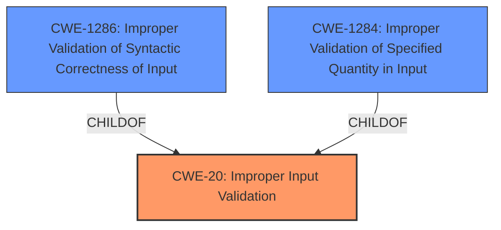

# Analysis for CVE-2021-27629

# Summary
| CWE ID    | CWE Name                                                                           | Confidence | CWE Abstraction Level | CWE Vulnerability Mapping Label | CWE-Vulnerability Mapping Notes |
| :-------- | :--------------------------------------------------------------------------------- | :--------- | :---------------------- | :------------------------------ | :------------------------------ |
| CWE-20    | Improper Input Validation                                                         | 0.8        | Class                   | Primary CWE                     | Discouraged                   |

## Evidence and Confidence

*   **Confidence Score:** 0.8
*   **Evidence Strength:** HIGH

## Relationship Analysis
The primary relationship influencing my decision is the ChildOf relationship, as the selected CWE is a child of a broader category. While CWE-20 is a Class-level CWE, it captures the root cause described in the vulnerability description. Although more specific CWEs could exist, the available evidence does not allow for a more precise classification.

## Vulnerability Chain
The vulnerability chain starts with **improper input validation** (CWE-20), which leads to an internal error, and finally results in a system crash and unavailability.

## Summary of Analysis
The initial analysis focused on the **improper input validation** root cause. The retriever results suggested CWE-20, CWE-1286 and CWE-1284.
CWE-20 is a Class-level CWE, and the mapping guidance discourages its use, suggesting lower-level children instead. However, the vulnerability description lacks the specificity to determine the exact type of **improper input validation**.
The final decision to use CWE-20 is based on the clear statement of **improper input validation** as the root cause. This is explicitly mentioned in the "Vulnerability Description Key Phrases" section.
While a more specific CWE would be ideal, the provided evidence does not support it.

Relevant CWE Information:

# Enhanced Context (25 CWEs)

## CWE-20: Improper Input Validation
**Abstraction:** Class
**Status:** Stable

### Description
The product receives input or data, but it does
        not validate or incorrectly validates that the input has the
        properties that are required to process the data safely and
        correctly.

### Extended Description
Input validation is a frequently-used technique for checking potentially dangerous inputs in order to ensure that the inputs are safe for processing within the code, or when communicating with other components. When software does not validate input properly, an attacker is able to craft the input in a form that is not expected by the rest of the application. This will lead to parts of the system receiving unintended input, which may result in altered control flow, arbitrary control of a resource, or arbitrary code execution.

### Mapping Guidance
**Usage:** Discouraged
**Rationale:** CWE-20 is commonly misused in low-information vulnerability reports when lower-level CWEs could be used instead, or when more details about the vulnerability are available [REF-1287]. It is not useful for trend analysis. It is also a level-1 Class (i.e., a child of a Pillar).
**Comments:** Consider lower-level children such as Improper Use of Validation Framework (CWE-1173) or improper validation involving specific types or properties of input such as Specified Quantity (CWE-1284); Specified Index, Position, or Offset (CWE-1285); Syntactic Correctness (CWE-1286); Specified Type (CWE-1287); Consistency within Input (CWE-1288); or Unsafe Equivalence (CWE-1289).

**EVIDENCE:**
> allows an unauthenticated attacker without specific knowledge of the system to send a specially crafted packet over a network which will trigger an internal error in the system due to **improper input validation** in method EncPSetUnsupported() causing the system to crash and rendering it unavailable.

The vulnerability description clearly states that **improper input validation** is the root cause of the crash. The specially crafted packet exploits this weakness to trigger an internal error. The primary security implication is denial of service due to system unavailability.

I considered CWE-1286 (Improper Validation of Syntactic Correctness of Input) and CWE-1284 (Improper Validation of Specified Quantity in Input), but the description doesn't provide enough information to determine if the validation error is related to syntactic correctness or a specific quantity. Therefore, I opted for the more general CWE-20.