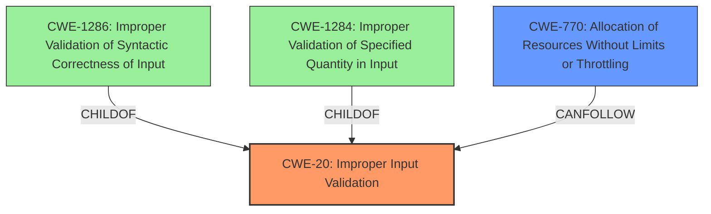

# Analysis for CVE-2021-27633

# Summary
| CWE ID | CWE Name | Confidence | CWE Abstraction Level | CWE Vulnerability Mapping Label | CWE-Vulnerability Mapping Notes |
|---|---|---|---|---|---|
| CWE-20 | Improper Input Validation | 0.8 | Class | Primary | Discouraged |
| CWE-770 | Allocation of Resources Without Limits or Throttling | 0.6 | Base | Secondary | Allowed |

## Evidence and Confidence

*   **Confidence Score:** 0.7
*   **Evidence Strength:** MEDIUM

## Relationship Analysis
The primary CWE is CWE-20, which is a Class-level CWE. It has several children that could be more specific. The retriever results suggest CWE-1286 (Improper Validation of Syntactic Correctness of Input), CWE-1284 (Improper Validation of Specified Quantity in Input), and others. These more specific CWEs are children of CWE-20. CWE-770 is a Base level CWE that can be related to resource exhaustion, which is the impact of this vulnerability.

## Vulnerability Chain
The vulnerability chain starts with **improper input validation** (CWE-20), which leads to an internal error, causing the system to crash and become unavailable. A potential chain can include CWE-770 (Allocation of Resources Without Limits or Throttling) as the resource exhaustion leads to the crash.

## Summary of Analysis
The vulnerability description indicates **improper input validation** as the root cause. The system crashes due to this **improper input validation**.

The vulnerability description states: "allows an unauthenticated attacker without specific knowledge of the system to send a specially crafted packet over a network which will trigger an internal error in the system due to **improper input validation** in method ThCPIC() causing the system to crash and rendering it unavailable."

CWE-20 (Improper Input Validation) is a Class-level CWE that describes the general case of failing to validate input. Although CWE-20 is discouraged, the information provided is not sufficient to pinpoint a more specific CWE. The retriever results suggest that CWE-1286 and CWE-1284 are good candidates, but the description doesn't provide enough detail to determine whether the input has syntactic errors or invalid quantities. Therefore, CWE-20 is the most appropriate primary CWE based on the available information.

CWE-770 (Allocation of Resources Without Limits or Throttling) is considered as a secondary weakness because the improper validation leads to an internal error, causing the system to crash. This could be due to the system allocating resources without limits, ultimately leading to denial of service.

I am using CWE-20 despite it being discouraged because the evidence only points to general **improper input validation** and nothing more specific. If more details were available, then a more specific child of CWE-20 would be more appropriate.