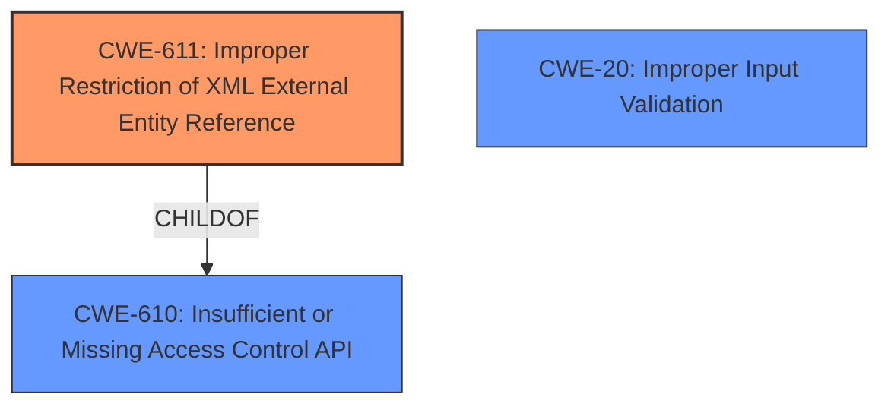

# Analysis Report for CVE-2021-27635

# Vulnerability Analysis Report: CVE-2021-27635

## Description


## Analysis (with Relationship Data)

# Summary
| CWE ID | CWE Name | Confidence | CWE Abstraction Level | CWE Vulnerability Mapping Label | CWE-Vulnerability Mapping Notes |
|---|---|---|---|---|---|
| CWE-611 | Improper Restriction of XML External Entity Reference | 1.0 | Base | Allowed | Primary CWE |
| CWE-20 | Improper Input Validation | 0.5 | Class | Discouraged | Secondary Candidate |

## Evidence and Confidence

*   **Confidence Score:** 0.8
*   **Evidence Strength:** HIGH

## Relationship Analysis
The primary CWE is CWE-611, which is a Base level CWE. This CWE is related to improper handling of XML external entities, which aligns with the **missing XML validation** that leads to XXE attacks. CWE-611 is a child of CWE-610 (Insufficient or Missing Access Control API). CWE-20 was considered as a secondary CWE as the description refers to **missing XML validation**, but it is a high level Class.



## Vulnerability Chain
The vulnerability chain starts with **missing XML validation** (CWE-611), leading to the ability to submit specially crafted XML. This allows an attacker to read arbitrary files (confidentiality impact) or cause the system to crash (availability impact).

## Summary of Analysis
The initial assessment identified CWE-611 as the primary weakness due to the **missing XML Validation** and the ability to submit a specially crafted XML file.

The evidence from the vulnerability description is:
"because of **missing XML Validation**, this vulnerability enables attacker to fully compromise confidentiality by allowing them to read any file on the filesystem or fully compromise availability by causing the system to crash"

The evidence from the CVE Reference Links Content Summary is:
"Due to the lack of validation of external entities, an authenticated attacker is able to submit specially crafted XML and compromise the integrity (by reading files of the OS) and the availability (by causing process to crash)."

The retriever results and vulnerability description clearly points to CWE-611 as the primary root cause. The graph relationships confirm that CWE-611 is a child of CWE-610, making it a more specific and appropriate choice than the higher-level CWE-20.

Relevant CWE Information:
CWE-611 is the most specific CWE based on the description of the vulnerability, fitting the base level of abstraction.
CWE-20 is a class level CWE and is not the optimal level of specificity.
CWE-611 is the base level CWE and the most accurate representation of the **missing XML validation** weakness.


## CWE Relationship Analysis

Current CWEs represent these abstraction levels: .


### Vulnerability Chain Analysis

**Chain starting from CWE-611:**
- 611 (Improper Restriction of XML External Entity Reference) - ROOT


**Chain starting from CWE-20:**
- 20 (Improper Input Validation) - ROOT


### CWE Relationship Diagram

```mermaid
graph TD
    classDef primary fill:#f96,stroke:#333,stroke-width:2px
    classDef secondary fill:#69f,stroke:#333
    classDef tertiary fill:#9e9,stroke:#333
```


*Report generated on 2025-04-01 16:17:34*
