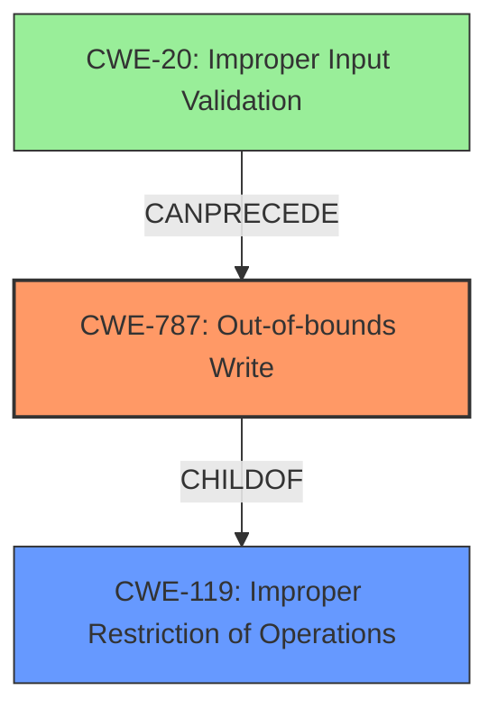

# Enhanced Analysis for CVE-2021-27638

# Summary
| CWE ID | CWE Name | Confidence | CWE Abstraction Level | CWE Vulnerability Mapping Label | CWE-Vulnerability Mapping Notes |
|---|---|---|---|---|---|
| CWE-787 | Out-of-bounds Write | 0.75 | Base | Allowed | Primary CWE |
| CWE-20 | Improper Input Validation | 0.5 | Class | Discouraged | Secondary Candidate |

## Evidence and Confidence

*   **Confidence Score:** 0.7
*   **Evidence Strength:** MEDIUM

## Relationship Analysis
The primary CWE is CWE-787 **Out-of-bounds Write**, which is a child of CWE-119 **Improper Restriction of Operations within the Bounds of a Memory Buffer**. CWE-20 **Improper Input Validation** can lead to other weaknesses.



## Vulnerability Chain
The vulnerability chain starts with **Improper Input Validation** (CWE-20), which leads to an **Out-of-bounds Write** (CWE-787), ultimately causing the application to crash.

## Summary of Analysis
The initial assessment points to **Improper Input Validation** (CWE-20) as a possible root cause, which aligns with the "Vulnerability Description Key Phrases". However, the crashing of the application due to a manipulated JT file suggests that an **Out-of-bounds Write** (CWE-787) is more likely to be the primary weakness. The description mentions the application crashing, and the root cause being **Improper Input Validation**, it is plausible that the **improper validation** leads to a buffer overflow or similar memory corruption issue, which would cause the crash.

The primary CWE match for similar CVE descriptions is CWE-787 **Out-of-bounds Write**, and it is also present in the retriever results. The description states that the application crashes due to a manipulated file, indicating memory corruption.

The evidence supporting CWE-787 is:
*   The vulnerability description indicates that the application crashes due to a manipulated file.
*   The **rootcause** phrase **Improper Input Validation** can lead to an out-of-bounds write if a size or length field is not validated correctly.

CWE-20 **Improper Input Validation** is also listed as the top combined result from the retriever. While the description mentions **Improper Input Validation**, it is a very broad class.
The evidence supporting CWE-20 is:
*   The vulnerability description explicitly states "**Improper Input Validation**" as the root cause.

CWE-119 **Improper Restriction of Operations within the Bounds of a Memory Buffer** is the parent Class of CWE-787 **Out-of-bounds Write**, but since the description provides enough information to use the child, CWE-787, it should be preferred.

CWE-789 **Memory Allocation with Excessive Size Value** could be a contributing factor if the size of the manipulated file is excessively large, but it isn't explicitly mentioned, so it is difficult to confirm.

CWE-1284 **Improper Validation of Specified Quantity in Input** is relevant if the size of the JT file, a specified quantity, is not validated, but there isn't enough information to determine if that is the case.

My assessment is based on the provided evidence, specifically the **rootcause** phrase **Improper Input Validation** and the resulting application crash. The graph relationships show that **Improper Input Validation** can lead to **Out-of-bounds Write**. The selected CWEs are at the optimal level of specificity, with CWE-787 being a Base level weakness and a child of the Class CWE-119.

Relevant CWE Information:

# Enhanced Context (25 CWEs)
The following CWEs were identified as potentially relevant to this vulnerability:

## CWE-1289: Improper Validation of Unsafe Equivalence in Input
**Abstraction Level**: Base
**Similarity Score**: 0.79
**Source**: dense

**Description**:
The product receives an input value that is used as a resource identifier or other type of reference, but it does not validate or incorrectly validates that the input is equivalent to a potentially-unsafe value.

**Mapping Guidance**:
- Usage: Allowed
- Rationale: This CWE entry is at the Base level of abstraction, which is a preferred level of abstraction for mapping to the root causes of vulnerabilities.

## CWE-1288: Improper Validation of Consistency within Input
**Abstraction Level**: Base
**Similarity Score**: 0.75
**Source**: dense

**Description**:
The product receives a complex input with multiple elements or fields that must be consistent with each other, but it does not validate or incorrectly validates that the input is actually consistent.

**Mapping Guidance**:
- Usage: Allowed
- Rationale: This CWE entry is at the Base level of abstraction, which is a preferred level of abstraction for mapping to the root causes of vulnerabilities.

## CWE-681: Incorrect Conversion between Numeric Types
**Abstraction Level**: Base
**Similarity Score**: 0.75
**Source**: dense

**Description**:
When converting from one data type to another, such as long to integer, data can be omitted or translated in a way that produces unexpected values. If the resulting values are used in a sensitive context, then dangerous behaviors may occur.

**Mapping Guidance**:
- Usage: Allowed
- Rationale: This CWE entry is at the Base level of abstraction, which is a preferred level of abstraction for mapping to the root causes of vulnerabilities.

## CWE-131: Incorrect Calculation of Buffer Size
**Abstraction Level**: Base
**Similarity Score**: 0.75
**Source**: dense

**Description**:
The product does not correctly calculate the size to be used when allocating a buffer, which could lead to a buffer overflow.

**Mapping Guidance**:
- Usage: Allowed
- Rationale: This CWE entry is at the Base level of abstraction, which is a preferred level of abstraction for mapping to the root causes of vulnerabilities.

## CWE-197: Numeric Truncation Error
**Abstraction Level**: Base
**Similarity Score**: 0.75
**Source**: dense

**Description**:
Truncation errors occur when a primitive is cast to a primitive of a smaller size and data is lost in the conversion.

**Mapping Guidance**:
- Usage: Allowed
- Rationale: This CWE entry is at the Base level of abstraction, which is a preferred level of abstraction for mapping to the root causes of vulnerabilities.

## CWE-191: Integer Underflow (Wrap or Wraparound)
**Abstraction Level**: Base
**Similarity Score**: 0.75
**Source**: dense

**Description**:
The product subtracts one value from another, such that the result is less than the minimum allowable integer value, which produces a value that is not equal to the correct result.

**Mapping Guidance**:
- Usage: Allowed
- Rationale: This CWE entry is at the Base level of abstraction, which is a preferred level of abstraction for mapping to the root causes of vulnerabilities.

## CWE-125: Out-of-bounds Read
**Abstraction Level**: Base
**Similarity Score**: 0.74
**Source**: dense

**Description**:
The product reads data past the end, or before the beginning, of the intended buffer.

**Mapping Guidance**:
- Usage: Allowed
- Rationale: This CWE entry is at the Base level of abstraction, which is a preferred level of abstraction for mapping to the root causes of vulnerabilities.

## CWE-129: Improper Validation of Array Index
**Abstraction Level**: Variant
**Similarity Score**: 0.74
**Source**: dense

**Description**:
The product uses untrusted input when calculating or using an array index, but the product does not validate or incorrectly validates the index to ensure the index references a valid position within the array.

**Mapping Guidance**:
- Usage: Allowed
- Rationale: This CWE entry is at the Variant level of abstraction, which is a preferred level of abstraction for mapping to the root causes of vulnerabilities.

## CWE-1286: Improper Validation of Syntactic Correctness of Input
**Abstraction Level**: Base
**Similarity Score**: 0.74
**Source**: dense

**Description**:
The product receives input that is expected to be well-formed - i.e., to comply with a certain syntax - but it does not validate or incorrectly validates that the input complies with the syntax.

**Mapping Guidance**:
- Usage: Allowed
- Rationale: This CWE entry is at the Base level of abstraction, which is a preferred level of abstraction for mapping to the root causes of vulnerabilities.

## CWE-70


## CWE Relationship Analysis

Current CWEs represent these abstraction levels: .


### Vulnerability Chain Analysis

**Chain starting from CWE-787:**
- 787 (Out-of-bounds Write) - ROOT


**Chain starting from CWE-1288:**
- 1288 (Improper Validation of Consistency within Input) - ROOT


### CWE Relationship Diagram

```mermaid
graph TD
    classDef primary fill:#f96,stroke:#333,stroke-width:2px
    classDef secondary fill:#69f,stroke:#333
    classDef tertiary fill:#9e9,stroke:#333
```