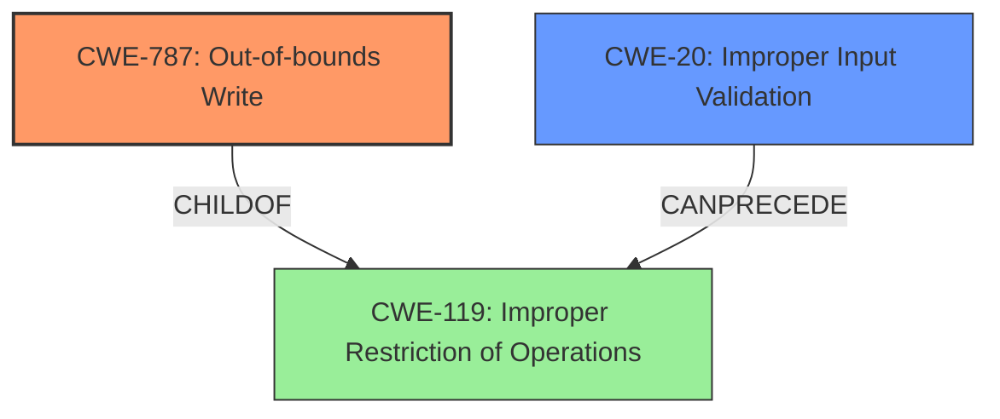

# Analysis for CVE-2021-27640

# Summary
| CWE ID | CWE Name | Confidence | CWE Abstraction Level | CWE Vulnerability Mapping Label | CWE-Vulnerability Mapping Notes |
|---|---|---|---|---|---|
| CWE-787 | Out-of-bounds Write | 0.9 | Base | Allowed | Primary CWE |
| CWE-20 | Improper Input Validation | 0.6 | Class | Discouraged | Secondary Candidate |

## Evidence and Confidence

*   **Confidence Score:** 0.8
*   **Evidence Strength:** HIGH

## Relationship Analysis
The primary CWE is CWE-787, a **Base** level weakness describing an out-of-bounds write. It is a child of CWE-119. CWE-20 is a **Class** level weakness describing improper input validation, and it can precede CWE-119. The evidence clearly points to **improper input validation** as the root cause, leading to an out-of-bounds write, so these relationships support the chosen CWEs.

## Vulnerability Chain
The vulnerability chain starts with the **improper input validation** (CWE-20) of a manipulated PSD file, which leads to an out-of-bounds write (CWE-787), ultimately resulting in the application crashing.

## Summary of Analysis
The initial analysis focused on the vulnerability description that highlights **improper input validation** as the root cause. The description states that a manipulated PSD file, received from untrusted sources, causes the application to crash due to **improper input validation**. This directly implies that the application is not correctly validating the structure or contents of the PSD file.

The provided evidence is sufficient to support the selection of CWE-787 as the primary CWE. The **Vulnerability Description Key Phrases** section explicitly mentions **"Improper Input Validation"** as the root cause. The phrase "**crashing of the application**" suggests a memory corruption issue. The **CWE for similar CVE Descriptions** section lists CWE-787 as the primary match. All this evidence strongly supports assigning CWE-787 as the primary CWE.

CWE-20 is considered as a secondary CWE because the description mentions **Improper Input Validation** as the root cause but it is too general, and the actual **Out-of-bounds Write** is the more specific issue. While CWE-20 is a parent of CWE-119, which in turn is a parent of CWE-787, assigning CWE-787 is more appropriate because it directly reflects the vulnerability.

The selected CWEs are at the optimal level of specificity. CWE-787 accurately describes the out-of-bounds write, while CWE-20 acknowledges the role of **improper input validation** as a contributing factor, though it is more general.

**CWE-119:** Considered but not used because while related, CWE-787 is a more specific child of CWE-119 and more accurately describes the vulnerability.
**CWE-121:** Considered but not used because the description does not specify if it's stack-based.
**CWE-126:** Considered but not used because the description highlights an out-of-bounds *write*, not a read.
**CWE-1284:** Considered but not used because the specific quantity that is not validated isn't clear from the description.
**CWE-190:** Considered but not used because there is no mention or indication of integer overflow or wraparound.
**CWE-200:** Considered but not used because there is no indication of sensitive information being exposed.

Relevant CWE Information:

# Enhanced Context (25 CWEs)

## CWE-1289: Improper Validation of Unsafe Equivalence in Input
**Abstraction Level**: Base
**Similarity Score**: 0.78
**Source**: dense

**Description**:
The product receives an input value that is used as a resource identifier or other type of reference, but it does not validate or incorrectly validates that the input is equivalent to a potentially-unsafe value.

**Mapping Guidance**:
- Usage: Allowed
- Rationale: This CWE entry is at the Base level of abstraction, which is a preferred level of abstraction for mapping to the root causes of vulnerabilities.

## CWE-191: Integer Underflow (Wrap or Wraparound)
**Abstraction Level**: Base
**Similarity Score**: 0.75
**Source**: dense

**Description**:
The product subtracts one value from another, such that the result is less than the minimum allowable integer value, which produces a value that is not equal to the correct result.

**Mapping Guidance**:
- Usage: Allowed
- Rationale: This CWE entry is at the Base level of abstraction, which is a preferred level of abstraction for mapping to the root causes of vulnerabilities.

## CWE-681: Incorrect Conversion between Numeric Types
**Abstraction Level**: Base
**Similarity Score**: 0.75
**Source**: dense

**Description**:
When converting from one data type to another, such as long to integer, data can be omitted or translated in a way that produces unexpected values. If the resulting values are used in a sensitive context, then dangerous behaviors may occur.

**Mapping Guidance**:
- Usage: Allowed
- Rationale: This CWE entry is at the Base level of abstraction, which is a preferred level of abstraction for mapping to the root causes of vulnerabilities.

## CWE-131: Incorrect Calculation of Buffer Size
**Abstraction Level**: Base
**Similarity Score**: 0.75
**Source**: dense

**Description**:
The product does not correctly calculate the size to be used when allocating a buffer, which could lead to a buffer overflow.

**Mapping Guidance**:
- Usage: Allowed
- Rationale: This CWE entry is at the Base level of abstraction, which is a preferred level of abstraction for mapping to the root causes of vulnerabilities.

## CWE-197: Numeric Truncation Error
**Abstraction Level**: Base
**Similarity Score**: 0.75
**Source**: dense

**Description**:
Truncation errors occur when a primitive is cast to a primitive of a smaller size and data is lost in the conversion.

**Mapping Guidance**:
- Usage: Allowed
- Rationale: This CWE entry is at the Base level of abstraction, which is a preferred level of abstraction for mapping to the root causes of vulnerabilities.

## CWE-1288: Improper Validation of Consistency within Input
**Abstraction Level**: Base
**Similarity Score**: 0.74
**Source**: dense

**Description**:
The product receives a complex input with multiple elements or fields that must be consistent with each other, but it does not validate or incorrectly validates that the input is actually consistent.

**Mapping Guidance**:
- Usage: Allowed
- Rationale: This CWE entry is at the Base level of abstraction, which is a preferred level of abstraction for mapping to the root causes of vulnerabilities.

## CWE-125: Out-of-bounds Read
**Abstraction Level**: Base
**Similarity Score**: 0.74
**Source**: dense

**Description**:
The product reads data past the end, or before the beginning, of the intended buffer.

**Mapping Guidance**:
- Usage: Allowed
- Rationale: This CWE entry is at the Base level of abstraction, which is a preferred level of abstraction for mapping to the root causes of vulnerabilities.

## CWE-129: Improper Validation of Array Index
**Abstraction Level**: Variant
**Similarity Score**: 0.74
**Source**: dense

**Description**:
The product uses untrusted input when calculating or using an array index, but the product does not validate or incorrectly validates the index to ensure the index references a valid position within the array.

**Mapping Guidance**:
- Usage: Allowed
- Rationale: This CWE entry is at the Variant level of abstraction, which is a preferred level of abstraction for mapping to the root causes of vulnerabilities.

## CWE-226: Sensitive Information in Resource Not Removed Before Reuse
**Abstraction Level**: Base
**Similarity Score**: 0.74
**Source**: dense

**Description**:
The product releases a resource such as memory or a file so that it can be made available for reuse, but it does not clear or "zeroize" the information contained in the resource before the product performs a critical state transition or makes the resource available for reuse by other entities.

**Mapping Guidance**:
- Usage: Allowed
- Rationale: This CWE entry is at the Base level of abstraction, which is a preferred level of abstraction for mapping to the root causes of vulnerabilities.

## CWE-703: Improper Check or Handling of Exceptional Conditions
**Abstraction Level**: