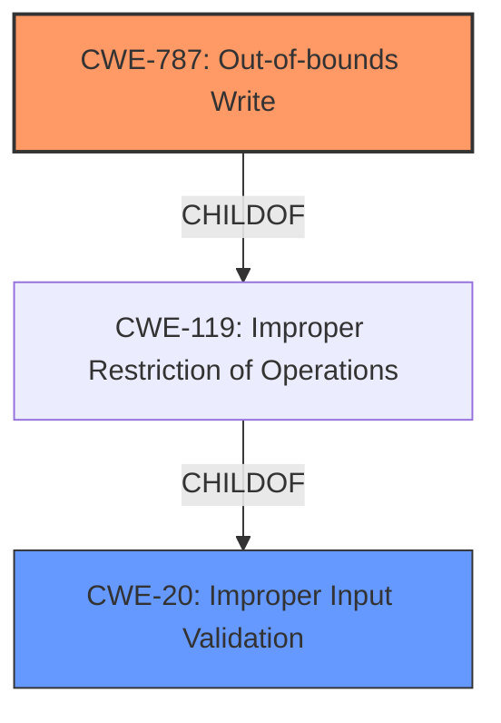

# Enhanced Analysis for CVE-2021-27641

# Summary
| CWE ID | CWE Name | Confidence | CWE Abstraction Level | CWE Vulnerability Mapping Label | CWE-Vulnerability Mapping Notes |
|---|---|---|---|---|---|
| CWE-787 | Out-of-bounds Write | 0.9 | Base | Primary | Allowed |
| CWE-20 | Improper Input Validation | 0.7 | Class | Secondary | Discouraged |

## Evidence and Confidence

*   **Confidence Score:** 0.8
*   **Evidence Strength:** HIGH

## Relationship Analysis
The primary CWE selected is CWE-787 (**Out-of-bounds Write**), which is a child of CWE-119 (**Improper Restriction of Operations within the Bounds of a Memory Buffer**). CWE-20 (**Improper Input Validation**) is considered as a contributing factor because the **improper input validation** is the root cause. The vulnerability description clearly points to a write operation occurring outside the intended buffer due to the failure to properly validate the input. This hierarchical relationship and the root cause information strengthens the selection of CWE-787 as the primary weakness.



## Vulnerability Chain
The vulnerability chain starts with **Improper Input Validation** (CWE-20), which leads to a manipulated TIF file being processed. This, in turn, results in an **Out-of-bounds Write** (CWE-787) condition, causing the application to crash.

## Summary of Analysis
The analysis is primarily based on the provided vulnerability description, which explicitly states that the application crashes due to **Improper Input Validation** when processing a manipulated TIF file.

The key phrase from the vulnerability description is: "SAP 3D Visual Enterprise Viewer, version - 9, allows a user to open manipulated TIF file received from untrusted sources which results in crashing of the application and becoming temporarily unavailable until the user restarts the application, this is caused due to **Improper Input Validation**."

The retriever results also suggest CWE-787 (**Out-of-bounds Write**) and CWE-20 (**Improper Input Validation**) as potential candidates.

CWE-787 (**Out-of-bounds Write**) is at the Base level of abstraction, which is the preferred level. The description of CWE-787 perfectly matches the vulnerability where the application crashes due to writing data past the end of the intended buffer.

CWE-20 (**Improper Input Validation**) is included as a secondary weakness because it represents the root cause that allows the manipulated TIF file to be processed in the first place. However, CWE-20 is a Class-level CWE and is discouraged for direct mapping when more specific CWEs are available. Since the impact is an out-of-bounds write, CWE-787 is more appropriate as the primary CWE.

Other CWEs considered but not used:

*   CWE-119 (**Improper Restriction of Operations within the Bounds of a Memory Buffer**): While related to CWE-787, it is a more general Class-level CWE. CWE-787 provides a more specific description of the vulnerability.
*   CWE-121 (**Stack-based Buffer Overflow**): This is too specific, as the overflow may not necessarily be stack-based.
*   CWE-126 (**Buffer Over-read**): The vulnerability description specifies a crash, indicating a write issue rather than a read issue.
*   CWE-1284 (**Improper Validation of Specified Quantity in Input**): This is relevant to input validation issues, but does not capture the specific out-of-bounds write condition.
*   CWE-789 (**Memory Allocation with Excessive Size Value**): While the manipulated TIF file may lead to excessive memory allocation, the primary impact is the out-of-bounds write.
*   CWE-1286 (**Improper Validation of Syntactic Correctness of Input**): Similar to CWE-1284, this focuses on syntactic correctness and does not directly describe the out-of-bounds write.


## CWE Relationship Analysis

Current CWEs represent these abstraction levels: .


### Vulnerability Chain Analysis

**Chain starting from CWE-787:**
- 787 (Out-of-bounds Write) - ROOT


**Chain starting from CWE-121:**
- 121 (Stack-based Buffer Overflow) - ROOT


### CWE Relationship Diagram

```mermaid
graph TD
    classDef primary fill:#f96,stroke:#333,stroke-width:2px
    classDef secondary fill:#69f,stroke:#333
    classDef tertiary fill:#9e9,stroke:#333
```