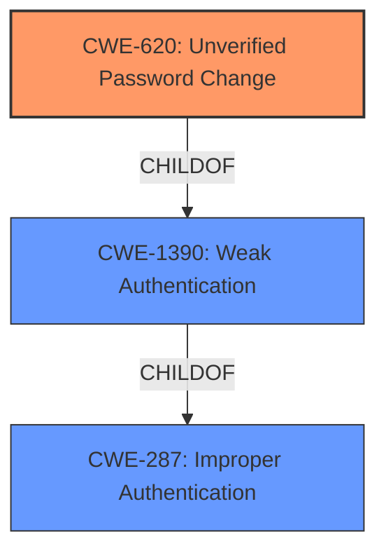

# Enhanced Analysis for CVE-2021-27651

# Summary
| CWE ID | CWE Name | Confidence | CWE Abstraction Level | CWE Vulnerability Mapping Label | CWE-Vulnerability Mapping Notes |
|---|---|---|---|---|---|
| CWE-620 | Unverified Password Change | 0.9 | Base | Allowed | Primary CWE |
| CWE-1390 | Weak Authentication | 0.7 | Class | Allowed-with-Review | Secondary Candidate |
| CWE-287 | Improper Authentication | 0.6 | Class | Discouraged | Secondary Candidate |

## Evidence and Confidence

*   **Confidence Score:** 0.9
*   **Evidence Strength:** HIGH

## Relationship Analysis
The primary CWE, CWE-620 **Unverified Password Change**, is a child of CWE-1390 **Weak Authentication**, indicating a hierarchical relationship where CWE-620 is a more specific case of CWE-1390. CWE-1390 itself is a child of CWE-287 **Improper Authentication**, forming a chain of increasing abstraction. This influenced the selection of CWE-620 as the most specific and relevant CWE, while CWE-1390 and CWE-287 are considered as potential higher-level classifications if the evidence was not sufficient to support the base level.



## Vulnerability Chain
The vulnerability chain starts with the **improper implementation** of the password reset functionality. Specifically, the **lack of proper authentication checks** during the password reset process (CWE-620). This leads to the **bypass of local authentication checks**, allowing an attacker to potentially gain unauthorized access to local accounts.
  - Root Cause: **Improper authentication checks in the password reset functionality.**
  - Weakness: **Unverified Password Change (CWE-620)**
  - Impact: **Bypass of local authentication checks, potential unauthorized access.**

## Summary of Analysis
The initial analysis identified several potential CWEs, including CWE-620 **Unverified Password Change**, CWE-1390 **Weak Authentication**, and CWE-287 **Improper Authentication**. The final decision to prioritize CWE-620 was based on the detailed vulnerability description and supporting evidence from the CVE Reference Links Content Summary.

The CVE description states that "Password reset functionality for local accounts can be used to bypass local authentication checks." The CVE Reference Links Content Summary further specifies that "The password reset functionality for local accounts **does not properly enforce authentication checks**." This aligns directly with the description of CWE-620 **Unverified Password Change**, which states: "When setting a new password for a user, the product **does not require knowledge of the original password, or using another form of authentication**."

The graph relationships influenced the decision by highlighting the hierarchical structure, where CWE-620 is a specific instance of the broader CWE-1390 and CWE-287. This confirmed that while the higher-level CWEs are relevant, CWE-620 provides the most accurate and specific classification.

The selected CWEs are at the optimal level of specificity because they directly address the **root cause** of the vulnerability, which is the **lack of verification** during the password reset process. This is more precise than simply stating that there is **weak or improper authentication** in general.

Relevant CWE Information:

# Enhanced Context (25 CWEs)
The following CWEs were identified as potentially relevant to this vulnerability:

## CWE-1391: Use of Weak Credentials
**Abstraction Level**: Class
**Similarity Score**: 0.78
**Source**: dense

**Description**:
The product uses weak credentials (such as a default key or hard-coded password) that can be calculated, derived, reused, or guessed by an attacker.

**Mapping Guidance**:
- Usage: Allowed-with-Review
- Rationale: This CWE entry is a Class and might have Base-level children that would be more appropriate

*This CWE was considered but not selected because the vulnerability is not related to the use of weak credentials but rather to the improper implementation of the password reset mechanism.*

## CWE-288: Authentication Bypass Using an Alternate Path or Channel
**Abstraction Level**: Base
**Similarity Score**: 0.78
**Source**: dense

**Description**:
The product requires authentication, but the product has an alternate path or channel that does not require authentication.

**Mapping Guidance**:
- Usage: Allowed
- Rationale: This CWE entry is at the Base level of abstraction, which is a preferred level of abstraction for mapping to the root causes of vulnerabilities.

*This CWE was considered but not selected because the vulnerability is not about an alternate path or channel but about the **improper authentication** within the intended password reset path.*

## CWE-798: Use of Hard-coded Credentials
**Abstraction Level**: Base
**Similarity Score**: 0.77
**Source**: dense

**Description**:
The product contains hard-coded credentials, such as a password or cryptographic key.

**Mapping Guidance**:
- Usage: Allowed
- Rationale: This CWE entry is at the Base level of abstraction, which is a preferred level of abstraction for mapping to the root causes of vulnerabilities.

*This CWE was considered but not selected because the vulnerability is not about the use of hard-coded credentials.*

## CWE-303: Incorrect Implementation of Authentication Algorithm
**Abstraction Level**: Base
**Similarity Score**: 0.77
**Source**: dense

**Description**:
The requirements for the product dictate the use of an established authentication algorithm, but the implementation of the algorithm is incorrect.

**Mapping Guidance**:
- Usage: Allowed
- Rationale: This CWE entry is at the Base level of abstraction, which is a preferred level of abstraction for mapping to the root causes of vulnerabilities.

*This CWE was considered but not selected because the vulnerability is not about the incorrect implementation of an authentication algorithm but rather about the **lack of proper authentication checks**.*

## CWE-916: Use of Password Hash With Insufficient Computational Effort
**Abstraction Level**: Base
**Similarity Score**: 0.77
**Source**: dense

**Description**:
The product generates a hash for a password, but it uses a scheme that does not provide a sufficient level of computational effort that would make password cracking attacks infeasible or expensive.

**Mapping Guidance**:
- Usage: Allowed
- Rationale: This CWE entry is at the Base level of abstraction, which is a preferred level of abstraction for mapping to the root causes of vulnerabilities.

*This CWE was considered but not selected because the vulnerability is not related to the strength of password hashing.*

## CWE-257: Storing Passwords in a Recoverable Format
**Abstraction Level**: Base
**Similarity Score**: 0.77
**Source**: dense

**Description**:
The storage of passwords in a recoverable format makes them subject to password reuse attacks by malicious users. In fact, it should be noted that recoverable encrypted passwords provide no significant benefit over plaintext passwords since they are subject not only to reuse by malicious attackers but also by malicious insiders. If a system administrator can recover a password directly, or use a brute force search on the available information, the administrator can use the password on other accounts.

**Mapping Guidance**:
- Usage: Allowed
- Rationale: This CWE entry is at the Base level of abstraction, which is a preferred level of abstraction for mapping to the root causes of vulnerabilities.

*This CWE was considered but not selected because the vulnerability is not about storing passwords in a recoverable format.*

## CWE-620: Unverified Password Change
**Abstraction Level**: Base
**Similarity Score**: 0.76
**Source**: dense

**Description**:
When setting a new password for a user, the product does not require knowledge of the original password, or using another form of authentication.

**Mapping Guidance**:
- Usage: Allowed
- Rationale: This CWE entry is at the Base level of abstraction, which is a preferred level of abstraction for mapping to the root causes of vulnerabilities.

*This CWE was selected as the primary CWE because it directly matches the vulnerability description, which involves the password reset functionality not requiring knowledge of the original password or another form of authentication.*

## CWE-807: Reliance on Untrusted Inputs in a Security Decision
**Abstraction Level**: Base
**Similarity Score**: 0.76
**Source**: dense

**Description**:
The product uses a protection mechanism that relies on the existence or values of an input, but the input can be modified by an untrusted actor in a way that bypasses the protection mechanism.

**Mapping Guidance**:
- Usage: Allowed
- Rationale: This CWE entry is at the Base level of abstraction, which is a preferred level of abstraction for mapping to the


## CWE Relationship Analysis

Current CWEs represent these abstraction levels: .


### Vulnerability Chain Analysis

**Chain starting from CWE-288:**
- 288 (Authentication Bypass Using an Alternate Path or Channel) - ROOT


**Chain starting from CWE-303:**
- 303 (Incorrect Implementation of Authentication Algorithm) - ROOT


### CWE Relationship Diagram

```mermaid
graph TD
    classDef primary fill:#f96,stroke:#333,stroke-width:2px
    classDef secondary fill:#69f,stroke:#333
    classDef tertiary fill:#9e9,stroke:#333
```