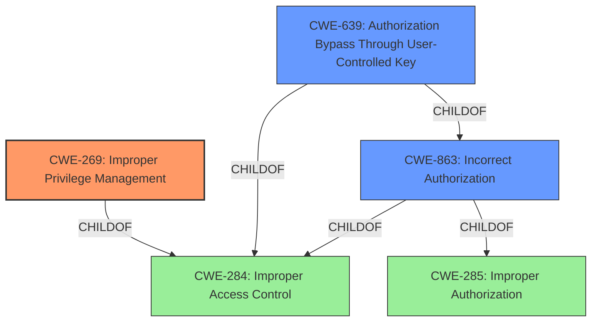

# Raw Analyzer Response for CVE-2021-27657

# Summary
| CWE ID | CWE Name | Confidence | CWE Abstraction Level | CWE Vulnerability Mapping Label | CWE-Vulnerability Mapping Notes |
|---|---|---|---|---|---|
| CWE-269 | Improper Privilege Management | 0.8 | Class | Primary | Discouraged |
| CWE-863 | Incorrect Authorization | 0.7 | Class | Secondary | Allowed-with-Review |
| CWE-639 | Authorization Bypass Through User-Controlled Key | 0.6 | Base | Secondary | Allowed |

## Evidence and Confidence

*   **Confidence Score:** 0.7
*   **Evidence Strength:** HIGH

## Relationship Analysis
The primary CWE selected is CWE-269, which is a Class-level weakness. It is related to CWE-284 (Improper Access Control) through a ChildOf relationship. CWE-863 (Incorrect Authorization) is a child of CWE-285 (Improper Authorization) and is also related to CWE-284. CWE-639 (Authorization Bypass Through User-Controlled Key) is a child of CWE-863 and CWE-284. The selection of CWE-269 is based on the evidence of **improper privilege management**, but since the description also mentions the possibility to **modify system files**, I have also included CWE-863 and CWE-639. While CWE-269 is discouraged, the mapping guidance notes that "If the root cause seems to be directly related to privileges, then examine the children of CWE-269 for additional hints."

## Vulnerability Chain
The vulnerability chain starts with **improper privilege management** (CWE-269), leading to **incorrect authorization** (CWE-863) and ultimately resulting in an authenticated user gaining unintended access to the server file system, allowing them to access or modify system files. This may also represent an **authorization bypass through user-controlled key** (CWE-639)

## Summary of Analysis
The initial assessment identified the **improper privilege management** as a primary weakness, with **incorrect authorization** and potential **authorization bypass** as contributing factors.

The vulnerability description states that an authenticated Metasys user can gain an unintended level of access to the server file system, allowing them to access or modify system files by sending specifically crafted web messages. The "CVE Reference Links Content Summary" section provides supporting evidence, stating that the root cause is **"Improper privilege management in Metasys servers, engines, and tools"**. It also mentions that **"The software does not properly assign, modify, track, or check privileges, leading to an unintended sphere of control for authenticated users."** This confirms that the primary weakness is indeed related to privilege management.

CWE-269 (Improper Privilege Management) is a Class-level weakness that describes a scenario where a product does not properly assign, modify, track, or check privileges for an actor, creating an unintended sphere of control for that actor. Given the evidence of **improper privilege management**, CWE-269 is a suitable primary mapping, despite the "Discouraged" usage.

However, the ability to access or modify system files also suggests an authorization issue. CWE-863 (Incorrect Authorization) describes a situation where the product performs an authorization check, but it does not correctly perform the check. CWE-639 (Authorization Bypass Through User-Controlled Key) describes a situation where a user can bypass authorization by modifying a key value. The fact that the attack is carried out by sending crafted web messages could suggest that a user-controlled key is involved, but this is not explicitly stated. So, I have included both CWE-863 and CWE-639 as secondary candidates.

The selection of CWEs is based on the provided evidence and relationship analysis. CWE-269 is the primary weakness, with CWE-863 and CWE-639 as contributing factors. The selected CWEs are at the appropriate level of specificity, given the available information.

Relevant CWE Information:

# Enhanced Context (25 CWEs)
The following CWEs were identified as potentially relevant to this vulnerability:

## CWE-639: Authorization Bypass Through User-Controlled Key
**Abstraction Level**: Base
**Similarity Score**: 0.74
**Source**: dense

**Description**:
The system's authorization functionality does not prevent one user from gaining access to another user's data or record by modifying the key value identifying the data.

**Mapping Guidance**:
- Usage: Allowed
- Rationale: This CWE entry is at the Base level of abstraction, which is a preferred level of abstraction for mapping to the root causes of vulnerabilities.

## CWE-274: Improper Handling of Insufficient Privileges
**Abstraction Level**: Base
**Similarity Score**: 0.74
**Source**: dense

**Description**:
The product does not handle or incorrectly handles when it has insufficient privileges to perform an operation, leading to resultant weaknesses.

**Mapping Guidance**:
- Usage: Discouraged
- Rationale: This CWE entry could be deprecated in a future version of CWE.

## CWE-807: Reliance on Untrusted Inputs in a Security Decision
**Abstraction Level**: Base
**Similarity Score**: 0.74
**Source**: dense

**Description**:
The product uses a protection mechanism that relies on the existence or values of an input, but the input can be modified by an untrusted actor in a way that bypasses the protection mechanism.

**Mapping Guidance**:
- Usage: Allowed
- Rationale: This CWE entry is at the Base level of abstraction, which is a preferred level of abstraction for mapping to the root causes of vulnerabilities.

## CWE-280: Improper Handling of Insufficient Permissions or Privileges 
**Abstraction Level**: Base
**Similarity Score**: 0.74
**Source**: dense

**Description**:
The product does not handle or incorrectly handles when it has insufficient privileges to access resources or functionality as specified by their permissions. This may cause it to follow unexpected code paths that may leave the product in an invalid state.

**Mapping Guidance**:
- Usage: Allowed
- Rationale: This CWE entry is at the Base level of abstraction, which is a preferred level of abstraction for mapping to the root causes of vulnerabilities.

## CWE-653: Improper Isolation or Compartmentalization
**Abstraction Level**: Class
**Similarity Score**: 0.73
**Source**: dense

**Description**:
The product does not properly compartmentalize or isolate functionality, processes, or resources that require different privilege levels, rights, or permissions.

**Mapping Guidance**:
- Usage: Allowed
- Rationale: This CWE entry is at the Base level of abstraction, which is a preferred level of abstraction for mapping to the root causes of vulnerabilities.

## CWE-1220: Insufficient Granularity of Access Control
**Abstraction Level**: Base
**Similarity Score**: 0.73
**Source**: dense

**Description**:
The product implements access controls via a policy or other feature with the intention to disable or restrict accesses (reads and/or writes) to assets in a system from untrusted agents. However, implemented access controls lack required granularity, which renders the control policy too broad because it allows accesses from unauthorized agents to the security-sensitive assets.

**Mapping Guidance**:
- Usage: Allowed
- Rationale: This CWE entry is at the Base level of abstraction, which is a preferred level of abstraction for mapping to the root causes of vulnerabilities.

## CWE-668: Exposure of Resource to Wrong Sphere
**Abstraction Level**: Class
**Similarity Score**: 0.73
**Source**: dense

**Description**:
The product exposes a resource to the wrong control sphere, providing unintended actors with inappropriate access to the resource.

**Mapping Guidance**:
- Usage: Discouraged
- Rationale: CWE-668 is high-level and is often misused as a catch-all when lower-level CWE IDs might be applicable. It is sometimes used for low-information vulnerability reports [REF-1287]. It is a level-1 Class (i.e., a child of a Pillar). It is not useful for trend analysis.

## CWE-303: