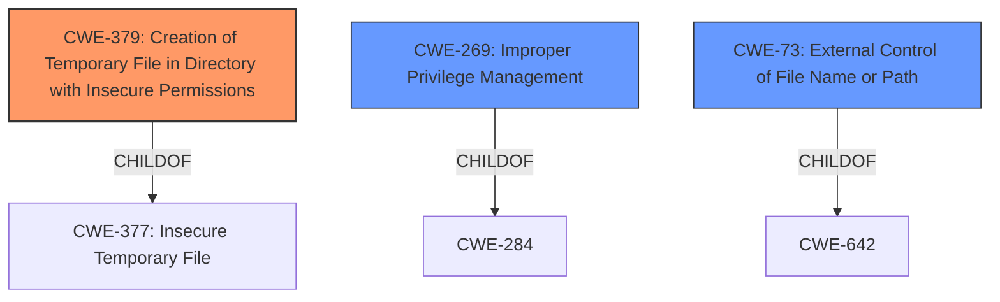

# Raw Analyzer Response for CVE-2021-27765

# Summary
| CWE ID | CWE Name | Confidence | CWE Abstraction Level | CWE Vulnerability Mapping Label | CWE-Vulnerability Mapping Notes |
|---|---|---|---|---|---|
| CWE-379 | Creation of Temporary File in Directory with Insecure Permissions | 0.9 | Base | Allowed | Primary CWE |
| CWE-269 | Improper Privilege Management | 0.6 | Class | Discouraged | Secondary CWE |
| CWE-73 | External Control of File Name or Path | 0.5 | Base | Allowed | Secondary CWE |

## Evidence and Confidence

*   **Confidence Score:** 0.8
*   **Evidence Strength:** HIGH

## Relationship Analysis
The primary CWE, CWE-379, is a Base-level CWE that directly describes the **insecure temporary file creation** aspect of the vulnerability. CWE-269 is a Class-level CWE that is too general. CWE-73 is a Base-level CWE that describes the external control of file names or paths, which is related to the fact that the temporary files are created in the user's %TEMP% directory.

## Vulnerability Chain
The vulnerability chain starts with the **creation of temporary files with insecure permissions** (CWE-379) in a user-controlled directory. Because the Windows Installer service operates with SYSTEM privileges, an unprivileged user can initiate a repair process which will execute temporary files with SYSTEM privileges leading to local privilege escalation.

## Summary of Analysis
The initial analysis and criticism focused on identifying the most specific and accurate CWE(s) that capture the root cause of the vulnerability. The evidence strongly supports CWE-379 as the primary CWE because the vulnerability stems from the **insecure creation of temporary files** in a directory with insufficient permissions. This aligns with the CVE Reference Links Content Summary, which highlights the "Insecure Temporary File Creation" as a key weakness.

CWE-269 was considered due to the "privilege escalation" impact, but it is a high-level Class that is discouraged by MITRE when more specific CWEs are available. The retriever results also gave it a high score, however, MITRE guidance says to avoid using CWE-269 when only phrases such as "privilege escalation" or "gain privileges" are available, as these indicate technical impact of the vulnerability - not the root cause weakness.

CWE-73 was also considered, because temporary files are created in the user's %TEMP% directory.

The final decision emphasizes CWE-379 for its direct relevance to the vulnerability's root cause. This decision is supported by the evidence from the CVE description, the vulnerability summary, and the retriever results.

Relevant CWE Information:
# Enhanced Context (25 CWEs)
The following CWEs were identified as potentially relevant to this vulnerability:

## CWE-379: Creation of Temporary File in Directory with Insecure Permissions
**Abstraction Level**: Base
**Similarity Score**: 0.086
**Source**: sparse

**Description**:
The product creates a temporary file in a directory whose permissions allow unintended actors to determine the file's existence or otherwise access that file.

**Mapping Guidance**:
- Usage: Allowed
- Rationale: This CWE entry is at the Base level of abstraction, which is a preferred level of abstraction for mapping to the root causes of vulnerabilities.

**Explanation**: The core issue is that temporary files are being created in a location that's writable by a user and executed with SYSTEM privileges, which directly matches the description of CWE-379. This is the most specific and accurate representation of the vulnerability.

## CWE-269: Improper Privilege Management
**Abstraction Level**: Class
**Similarity Score**: 0.524
**Source**: dense

**Description**:
The product does not properly assign, modify, track, or check privileges for an actor, creating an unintended sphere of control for that actor.

**Mapping Guidance**:
- Usage: Discouraged
- Rationale: CWE-269 is commonly misused. It can be conflated with "privilege escalation," which is a technical impact that is listed in many low-information vulnerability reports [REF-1287]. It is not useful for trend analysis.

**Explanation**: While privilege escalation is the impact, CWE-269 is too general and doesn't capture the specific root cause. It's more accurate to focus on the **insecure temporary file creation** as the primary weakness.

## CWE-73: External Control of File Name or Path
**Abstraction Level**: Base
**Similarity Score**: 0.002
**Source**: graph

**Description**:
The product allows user input to control or influence paths or file names that are used in filesystem operations.

**Mapping Guidance**:
- Usage: Allowed
- Rationale: This CWE entry is at the Base level of abstraction, which is a preferred level of abstraction for mapping to the root causes of vulnerabilities.

**Explanation**: The user's %TEMP% directory is where files are created.

## Other CWEs Considered and Rejected:

*   CWE-250: Execution with Unnecessary Privileges: While the SYSTEM context is involved, this isn't the core flaw. The primary issue is the **insecure creation of the temporary file**, not necessarily the execution with elevated privileges.
*   CWE-277: Insecure Inherited Permissions: Permissions on the %TEMP% directory are a factor, but the creation of the temporary file with insecure settings is the main concern.
*   CWE-427: Uncontrolled Search Path Element: This is not about an uncontrolled search path, but rather the **insecure creation of a temporary file** in a user-controlled directory.
*   CWE-59: Improper Link Resolution Before File Access ('Link Following'): Symlinks are not mentioned.
*   CWE-863: Incorrect Authorization: Authorization isn't the primary issue here. It's about the **insecure creation of the temporary file** and its subsequent execution.
*   CWE-732: Incorrect Permission Assignment for Critical Resource: The core issue is not about incorrect permission assignment for critical resources, but the **insecure creation of the temporary file** itself.
*   CWE-367: Time-of-check Time-of-use (TOCTOU) Race Condition: No race condition is mentioned.