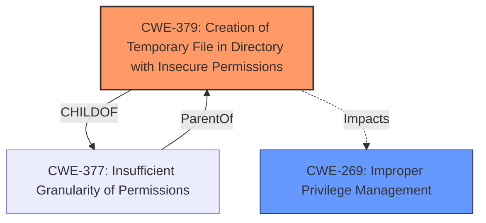

# Analysis for CVE-2021-27767

# Summary
| CWE ID | CWE Name | Confidence | CWE Abstraction Level | CWE Vulnerability Mapping Label | CWE-Vulnerability Mapping Notes |
|---|---|---|---|---|---|
| CWE-379 | Creation of Temporary File in Directory with Insecure Permissions | 0.9 | Base | Allowed | Primary CWE: The core issue is the creation of temporary files with insecure permissions in a user-controlled directory. |
| CWE-269 | Improper Privilege Management | 0.7 | Class | Discouraged | Secondary Candidate: The **impact** is privilege escalation, suggesting improper management, but the root cause is the insecure temporary file creation. |

## Evidence and Confidence

*   **Confidence Score:** 0.8
*   **Evidence Strength:** HIGH

## Relationship Analysis
The primary relationship influencing the decision is the parent-child relationship between CWE-377 (Insufficient Granularity of Permissions) and CWE-379. CWE-379 is a more specific case of creating temporary files with insecure permissions, making it a better fit than its parent. CWE-269 is considered but found to be a high-level class; the root cause is more precisely described by CWE-379.

## Vulnerability Chain
The chain of events leading to the vulnerability is as follows:
1.  **Root Cause:** **InstallShield vulnerability** leading to the creation of temporary files in a user's %TEMP% folder with insecure permissions (CWE-379).
2.  Repair operation run with SYSTEM privileges.
3.  Attacker injects malicious files into the temporary files.
4.  Malicious files are executed with SYSTEM privileges, leading to local privilege escalation.

## Summary of Analysis
The initial assessment identified CWE-269 as a potential candidate due to the privilege escalation aspect. However, upon closer inspection of the "CVE Reference Links Content Summary," the root cause lies in the creation of temporary files with insecure permissions. The vulnerability description explicitly mentions "CWE-379: Creation of Temporary File in Directory with Insecure Permissions" as a core issue, which strongly supports mapping to CWE-379. CWE-269 describes the general problem of "Improper Privilege Management", but CWE-379 more accurately describes the root cause, which is the creation of temporary files with insecure permissions.

The following evidence from the vulnerability description supports this:

*   "**Root cause of vulnerability:** The vulnerability stems from the way HCL BigFix Console for Windows handles repair operations using the Windows Installer framework. Specifically, it involves the creation and execution of temporary files in a user's %TEMP% folder with insecure permissions during the repair process. These operations are executed with SYSTEM privileges."
*   "**Weaknesses/vulnerabilities present:** CWE-379: Creation of Temporary File in Directory with Insecure Permissions: The core issue is that temporary files are created in a user-controlled directory (%TEMP%) with insecure permissions. Since the repair operation runs with SYSTEM privileges, the temporary files are also executed with those elevated privileges, enabling an attacker to inject malicious files for execution."

CWE-379 is chosen because it precisely identifies the **WEAKNESS** of creating temporary files with insecure permissions, which directly enables the privilege escalation.

Other CWEs considered but not used:

*   CWE-250 (Execution with Unnecessary Privileges): While the repair operation runs with SYSTEM privileges, this is the intended behavior. The issue is not the unnecessary privileges but rather the insecure temporary file creation.
*   CWE-427 (Uncontrolled Search Path Element): This CWE is not applicable because the vulnerability does not involve an uncontrolled search path.
*   CWE-277 (Insecure Inherited Permissions): This is not applicable since the issue is not with inherited permissions.
*   CWE-59 (Improper Link Resolution Before File Access ('Link Following')): This CWE is not applicable as there is no link following involved in this vulnerability.
*   CWE-732 (Incorrect Permission Assignment for Critical Resource): The issue is the creation of the temporary files, rather than incorrect permissions being assigned to existing critical resources.
*   CWE-863 (Incorrect Authorization): This CWE is not applicable as the vulnerability does not involve any authorization checks.
*   CWE-1188 (Initialization of a Resource with an Insecure Default): This CWE is not applicable as the vulnerability is not about initialization of a resource with an insecure default.