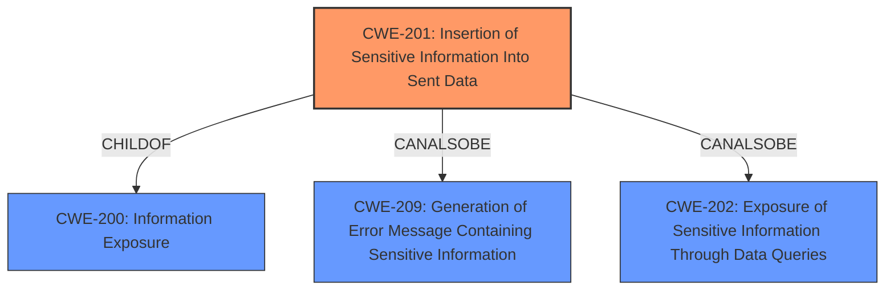

# Raw Analyzer Response for CVE-2021-27769

# Summary
| CWE ID | CWE Name | Confidence | CWE Abstraction Level | CWE Vulnerability Mapping Label | CWE-Vulnerability Mapping Notes |
|---|---|---|---|---|---|
| CWE-201 | Insertion of Sensitive Information Into Sent Data | 0.8 | Base | Allowed | Primary CWE |

## Evidence and Confidence

*   **Confidence Score:** 0.8
*   **Evidence Strength:** MEDIUM

## Relationship Analysis
The primary relationship that influenced the decision was the ChildOf relationship between CWE-201 and CWE-200 (Information Exposure). While CWE-200 is a broader category, the vulnerability description specifically mentions the act of "revealing information," which falls under information exposure. However, the key aspect is that this information is being "sent" to another actor, making CWE-201 a more precise fit. CWE-201 also has peer relationships to CWE-209 (Generation of Error Message Containing Sensitive Information) and CWE-202 (Exposure of Sensitive Information Through Data Queries). The graph influenced the decision to choose CWE-201 due to its more specific nature than its parent, CWE-200.

## Vulnerability Chain
The vulnerability chain is relatively simple:
1.  **WEAKNESS:** The website does not adequately prevent the inclusion of sensitive information in data that is sent to another actor.
2.  **Impact:** Information leakage, which can aid an attacker in further exploitation.

## Summary of Analysis
The analysis is based primarily on the vulnerability description, which states that the vulnerability involves information leakage when a website reveals information. The key phrases "Information leakage" and "attacker" also support this. The retriever results listed CWE-201 (Insertion of Sensitive Information Into Sent Data) as a candidate, and the description of CWE-201 closely matches the vulnerability: "The code transmits data to another actor, but a portion of the data includes sensitive information that should not be accessible to that actor."

I considered other CWEs, such as CWE-209 (Generation of Error Message Containing Sensitive Information), CWE-203 (Observable Discrepancy), and CWE-213 (Exposure of Sensitive Information Due to Incompatible Policies), but these were not as directly relevant. CWE-209 is specific to error messages, while CWE-203 relates to observable discrepancies, neither of which are explicitly mentioned in the vulnerability description. CWE-213 relates to incompatible policies which isn't in the description.

The selected CWE, CWE-201, is at the Base level of abstraction, which is preferred according to the MITRE mapping guidance. The evidence directly supports this classification, and the relationship analysis further strengthens the decision. The confidence level is 0.8 because the description is somewhat general, but the match with CWE-201 is the most appropriate based on the available information.