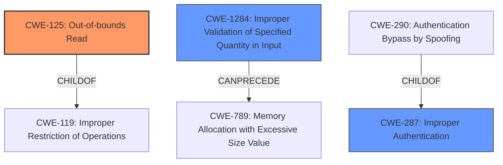

# Analysis for CVE-2021-27791

# Summary
| CWE ID    | CWE Name                                                                                    | Confidence | CWE Abstraction Level | CWE Vulnerability Mapping Label | CWE-Vulnerability Mapping Notes |
| :--------- | :------------------------------------------------------------------------------------------ | :--------- | :---------------------- | :------------------------------ | :------------------------------ |
| **CWE-125** | **Out-of-bounds Read**                                                                      | 1.0        | Base                    | Primary                         | Allowed                       |
| CWE-287   | Improper Authentication                                                                     | 0.6        | Class                   | Secondary                       | Discouraged                    |
| CWE-1284  | Improper Validation of Specified Quantity in Input                                        | 0.6        | Base                    | Secondary                       | Allowed                       |

## Evidence and Confidence

*   **Confidence Score:** 0.8
*   **Evidence Strength:** HIGH

## Relationship Analysis
The primary CWE is CWE-125, which is a Base-level CWE and a child of CWE-119 (Improper Restriction of Operations within the Bounds of a Memory Buffer). CWE-125 directly addresses the "reading memory addresses outside the intended range" aspect of the vulnerability. CWE-1284 (Improper Validation of Specified Quantity in Input) can precede CWE-789 (Memory Allocation with Excessive Size Value), indicating a potential chain where improper input validation leads to memory allocation issues. The relationships between CWE-287 and its children, such as CWE-290 (Authentication Bypass by Spoofing), suggest that the authentication bypass could be a result of a more specific weakness in the authentication process.

## Vulnerability Chain
The vulnerability chain starts with the **improper processing of a malformed authentication header** which leads to an **out-of-bounds read** and potentially an **authentication bypass**.

## Summary of Analysis
The initial assessment strongly points to CWE-125 (Out-of-bounds Read) as the primary weakness, given the explicit mention of "reading memory addresses outside the intended range." The evidence from the vulnerability description key phrases and CVE reference links content summary directly supports this.

The inclusion of CWE-287 (Improper Authentication) and CWE-1284 (Improper Validation of Specified Quantity in Input) is based on the potential for authentication bypass due to the **improper processing of the authentication header**. While CWE-287 is a Class-level CWE and typically discouraged, the specifics of the vulnerability description don't point definitively to a more specific child CWE. The **failure to properly process the malformed authentication header** also suggests **improper input validation**, making CWE-1284 a relevant, though secondary, consideration.

The selection of CWE-125 is at the optimal level of specificity because it directly describes the core issue of reading memory outside the intended bounds, aligning perfectly with the described impact of the vulnerability.

Relevant CWE Information:
# Enhanced Context (25 CWEs)
The following CWEs were identified as potentially relevant to this vulnerability:

## CWE-405: Asymmetric Resource Consumption (Amplification)
**Abstraction Level**: Class
**Similarity Score**: 0.79
**Source**: dense

**Description**:
The product does not properly control situations in which an adversary can cause the product to consume or produce excessive resources without requiring the adversary to invest equivalent work or otherwise prove authorization, i.e., the adversary's influence is "asymmetric."

**Mapping Guidance**:
- Usage: Allowed-with-Review
- Rationale: This CWE entry is a Class and might have Base-level children that would be more appropriate

*Not Selected*: While there is a malformed header being sent, the attack vector does not result in asymmetric resource consumption, therefore it is not a good fit.

## CWE-404: Improper Resource Shutdown or Release
**Abstraction Level**: Class
**Similarity Score**: 0.79
**Source**: dense

**Description**:
The product does not release or incorrectly releases a resource before it is made available for re-use.

**Mapping Guidance**:
- Usage: Allowed-with-Review
- Rationale: This CWE entry is a Class and might have Base-level children that would be more appropriate

*Not Selected*: There is no evidence that the product does not release or incorrectly releases a resource.

## CWE-226: Sensitive Information in Resource Not Removed Before Reuse
**Abstraction Level**: Base
**Similarity Score**: 0.78
**Source**: dense

**Description**:
The product releases a resource such as memory or a file so that it can be made available for reuse, but it does not clear or "zeroize" the information contained in the resource before the product performs a critical state transition or makes the resource available for reuse by other entities.

**Mapping Guidance**:
- Usage: Allowed
- Rationale: This CWE entry is at the Base level of abstraction, which is a preferred level of abstraction for mapping to the root causes of vulnerabilities.

*Not Selected*: There is no evidence that sensitive information is not cleared from resources before reuse.

## CWE-799: Improper Control of Interaction Frequency
**Abstraction Level**: Class
**Similarity Score**: 0.78
**Source**: dense

**Description**:
The product does not properly limit the number or frequency of interactions that it has with an actor, such as the number of incoming requests.

**Mapping Guidance**:
- Usage: Allowed-with-Review
- Rationale: This CWE entry is a Class and might have Base-level children that would be more appropriate

*Not Selected*: The vulnerability is not related to interaction frequency.

## CWE-668: Exposure of Resource to Wrong Sphere
**Abstraction Level**: Class
**Similarity Score**: 0.78
**Source**: dense

**Description**:
The product exposes a resource to the wrong control sphere, providing unintended actors with inappropriate access to the resource.

**Mapping Guidance**:
- Usage: Discouraged
- Rationale: CWE-668 is high-level and is often misused as a catch-all when lower-level CWE IDs might be applicable. It is sometimes used for low-information vulnerability reports [REF-1287]. It is a level-1 Class (i.e., a child of a Pillar). It is not useful for trend analysis.

*Not Selected*: There is not enough information to indicate that a resource is being exposed to the wrong control sphere.

## CWE-664: Improper Control of a Resource Through its Lifetime
**Abstraction Level**: Pillar
**Similarity Score**: 0.77
**Source**: dense

**Description**:
The product does not maintain or incorrectly maintains control over a resource throughout its lifetime of creation, use, and release.

**Mapping Guidance**:
- Usage: Discouraged
- Rationale: This CWE entry is high-level when lower-level children are available.

*Not Selected*: This is a high-level CWE, and more specific CWEs like CWE-125 are a better fit.

## CWE-400: Uncontrolled Resource Consumption
**Abstraction Level**: Class
**Similarity Score**: 0.77
**Source**: dense

**Description**:
The product does not properly control the allocation and maintenance of a limited resource, thereby enabling an actor to influence the amount of resources consumed, eventually leading to the exhaustion of available resources.

**Mapping Guidance**:
- Usage: Discouraged
- Rationale: CWE-400 is intended for incorrect behaviors in which the product is expected to track and restrict how many resources it consumes, but CWE-400 is often misused because it is conflated with the "technical impact" of vulnerabilities in which resource consumption occurs. It is sometimes used for low-information vulnerability reports. It is a level-1 Class (i.e., a child of a Pillar).

*Not Selected*: There is no evidence that there is uncontrolled resource consumption.

## CWE-789: Memory Allocation with Excessive Size Value
**Abstraction Level**: Variant
**Similarity Score**: 0.77
**Source**: dense

**Description**:
The product allocates memory based on an untrusted, large size value, but it does not ensure that the size is within expected limits, allowing arbitrary amounts of memory to be allocated.

**Mapping Guidance**:
- Usage: Allowed