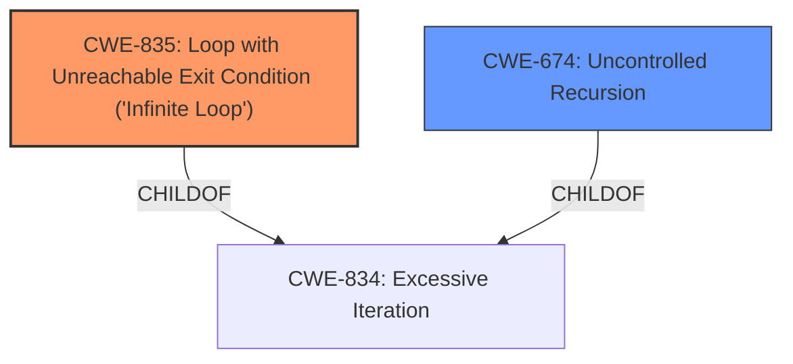

# Analysis Report for CVE-2021-27807

# Vulnerability Analysis Report: CVE-2021-27807

## Description


## Analysis (with Relationship Data)

# Summary
| CWE ID  | CWE Name                                                    | Confidence | CWE Abstraction Level | CWE Vulnerability Mapping Label | CWE-Vulnerability Mapping Notes |
| :------- | :---------------------------------------------------------- | :--------- | :---------------------- | :------------------------------ | :------------------------------ |
| CWE-835 | Loop with Unreachable Exit Condition ('Infinite Loop')     | 1          | Base                    | Primary                         | Allowed                       |
| CWE-674 | Uncontrolled Recursion                                      | 0.6        | Class                   | Secondary                       | Allowed-with-Review           |

## Evidence and Confidence

*   **Confidence Score:** 0.8
*   **Evidence Strength:** HIGH

## Relationship Analysis
The primary CWE is CWE-835, which is a Base level CWE and a child of CWE-834 (Excessive Iteration). CWE-674 (Uncontrolled Recursion) is a Class level CWE and is also a child of CWE-834. The vulnerability description clearly indicates an infinite loop, so CWE-835 is the more specific and appropriate choice.



## Vulnerability Chain
The vulnerability chain starts with a **carefully crafted PDF file**, leading to an **infinite loop**, resulting in a denial-of-service.
  - **Root Cause:** **Carefully crafted PDF file**
  - **Weakness:** **Infinite loop**
  - **Impact:** Denial of Service

## Summary of Analysis
The vulnerability description clearly states that a "carefully crafted PDF file can trigger an infinite loop while loading the file." The CVE Reference Links Content Summary confirms this, stating the **root_cause** is "A carefully crafted PDF file can trigger an infinite loop while loading the file," and the **weakness** is "Infinite loop vulnerability."

The Retriever Results list CWE-835 (Loop with Unreachable Exit Condition ('Infinite Loop')) as the top candidate, with a Base abstraction level and Allowed usage. CWE-674 (Uncontrolled Recursion) is also listed, but CWE-835 is more specific to the described vulnerability. CWE-20 (Improper Input Validation) is a Class level CWE and is too general.

Based on the evidence and the MITRE mapping guidance, CWE-835 is the most appropriate primary CWE.

Other CWEs Considered:

*   CWE-674: Uncontrolled Recursion - While recursion *could* be involved in creating the loop, the description focuses on the loop itself. Thus, CWE-835 is a better fit.
*   CWE-20: Improper Input Validation - This is a very general CWE, and while the crafted PDF file *is* a form of invalid input, the core weakness is the resulting infinite loop.
*   CWE-190: Integer Overflow or Wraparound - There is no evidence provided that an Integer Overflow is the rootcause of the infinite loop.
*   CWE-834: Excessive Iteration - While related, CWE-835 is a child of CWE-834 and is a more specific description of the vulnerability.
*   CWE-1339: Insufficient Precision or Accuracy of a Real Number - There is no evidence of floating point numbers or real numbers being involved in this case.
*   CWE-918: Server-Side Request Forgery (SSRF) - This is completely unrelated to the described vulnerability.


## CWE Relationship Analysis

Current CWEs represent these abstraction levels: .


### Vulnerability Chain Analysis

**Chain starting from CWE-674:**
- 674 (Uncontrolled Recursion) - ROOT


**Chain starting from CWE-834:**
- 834 (Excessive Iteration) - ROOT


### CWE Relationship Diagram

```mermaid
graph TD
    classDef primary fill:#f96,stroke:#333,stroke-width:2px
    classDef secondary fill:#69f,stroke:#333
    classDef tertiary fill:#9e9,stroke:#333
```


*Report generated on 2025-04-02 12:34:29*
