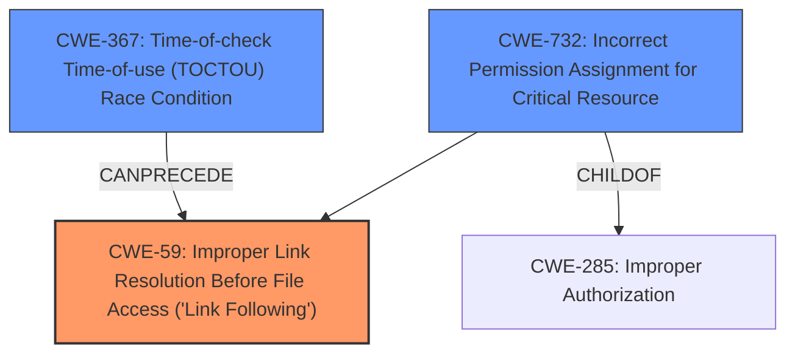

# Raw Analyzer Response for CVE-2021-27851

# Summary
| CWE ID | CWE Name | Confidence | CWE Abstraction Level | CWE Vulnerability Mapping Label | CWE-Vulnerability Mapping Notes |
|---|---|---|---|---|---|
| CWE-59 | Improper Link Resolution Before File Access ('Link Following') | 0.9 | Base | Allowed | Primary CWE |
| CWE-367 | Time-of-check Time-of-use (TOCTOU) Race Condition | 0.7 | Base | Allowed | Secondary CWE |
| CWE-732 | Incorrect Permission Assignment for Critical Resource | 0.6 | Class | Allowed-with-Review | Secondary CWE |

## Evidence and Confidence

*   **Confidence Score:** 0.8
*   **Evidence Strength:** HIGH

## Relationship Analysis
The primary CWE is CWE-59, representing the **improper link resolution**. CWE-367 (TOCTOU) and CWE-732 (Incorrect Permission Assignment) are related as contributing factors or conditions that enable the exploitation of the link following vulnerability. CWE-367 can lead to CWE-59 if the file is swapped between check and use. CWE-732 is a more general class of permission issues which this case instantiates by allowing for **improper permissions** on the build directory.

## Vulnerability Chain
The vulnerability chain begins with **improper permissions** allowing an unprivileged user to create a world-writable build directory. Then, a hard link is created pointing to a root-owned file. When the build fails and `--keep-failed` is specified, the `guix-daemon` recursively changes the ownership of the build directory, including the malicious hard link, to the user. This gives the user write access to the target file, resulting in local privilege escalation. The chain also involves a TOCTOU race condition:

1.  **Insecure Build Directory Handling:** Allows world-writable build directories.
2.  **Hard Link Manipulation:** Allows creation of hard links to sensitive files.
3.  **TOCTOU Race Condition:** Allows swapping a directory for a symlink during `chown`, bypassing protected hardlink.
4.  **Recursive `chown` Vulnerability**: Changes ownership of the build tree, including the hardlink, to the user.
5.  **Local Privilege Escalation:** User gains write access to arbitrary files, escalating privileges.

## Summary of Analysis
The analysis indicates that the primary vulnerability is **CWE-59 Improper Link Resolution Before File Access ('Link Following')**. This is supported by the vulnerability description and the CVE Reference Links Content Summary, which detail the creation of a hard link to a root-owned file. The recursive `chown` operation grants the user write access to this file.

The presence of a TOCTOU race condition makes **CWE-367 Time-of-check Time-of-use (TOCTOU) Race Condition** a secondary consideration. The attacker exploits a race condition by swapping a directory with a symlink, allowing `lchown()` to modify sensitive files.

**CWE-732 Incorrect Permission Assignment for Critical Resource** is another secondary consideration because the build directory is created with **improper permissions**, allowing the initial hard link creation.

The retriever results also support this analysis, with CWE-59 having a high score.

The decision to map CWE-59 as the primary weakness is based on the core issue of manipulating file access via links. The TOCTOU and **improper permissions** are contributing factors that enable the exploitation of this weakness. The selected CWEs are at the base level of specificity, accurately representing the root causes of the vulnerability.

Relevant CWE Information:

# Enhanced Context (25 CWEs)
The following CWEs were identified as potentially relevant to this vulnerability:

## CWE-367: Time-of-check Time-of-use (TOCTOU) Race Condition
**Abstraction Level**: Base
**Similarity Score**: 0.78
**Source**: dense

**Description**:
The product checks the state of a resource before using that resource, but the resource's state can change between the check and the use in a way that invalidates the results of the check. This can cause the product to perform invalid actions when the resource is in an unexpected state.

**Mapping Guidance**:
- Usage: Allowed
- Rationale: This CWE entry is at the Base level of abstraction, which is a preferred level of abstraction for mapping to the root causes of vulnerabilities.

## CWE-366: Race Condition within a Thread
**Abstraction Level**: Base
**Similarity Score**: 0.78
**Source**: dense

**Description**:
If two threads of execution use a resource simultaneously, there exists the possibility that resources may be used while invalid, in turn making the state of execution undefined.

**Mapping Guidance**:
- Usage: Allowed
- Rationale: This CWE entry is at the Base level of abstraction, which is a preferred level of abstraction for mapping to the root causes of vulnerabilities.

## CWE-362: Concurrent Execution using Shared Resource with Improper Synchronization ('Race Condition')
**Abstraction Level**: Class
**Similarity Score**: 0.77
**Source**: dense

**Description**:
The product contains a concurrent code sequence that requires temporary, exclusive access to a shared resource, but a timing window exists in which the shared resource can be modified by another code sequence operating concurrently.

**Mapping Guidance**:
- Usage: Allowed-with-Review
- Rationale: This CWE entry is a Class and might have Base-level children that would be more appropriate

## CWE-667: Improper Locking
**Abstraction Level**: Class
**Similarity Score**: 0.76
**Source**: dense

**Description**:
The product does not properly acquire or release a lock on a resource, leading to unexpected resource state changes and behaviors.

**Mapping Guidance**:
- Usage: Allowed-with-Review
- Rationale: This CWE entry is a Class and might have Base-level children that would be more appropriate

## CWE-662: Improper Synchronization
**Abstraction Level**: Class
**Similarity Score**: 0.76
**Source**: dense

**Description**:
The product utilizes multiple threads or processes to allow temporary access to a shared resource that can only be exclusive to one process at a time, but it does not properly synchronize these actions, which might cause simultaneous accesses of this resource by multiple threads or processes.

**Mapping Guidance**:
- Usage: Discouraged
- Rationale: This CWE entry is a level-1 Class (i.e., a child of a Pillar). It might have lower-level children that would be more appropriate

## CWE-59: Improper Link Resolution Before File Access ('Link Following')
**Abstraction Level**: Base
**Similarity Score**: 0.76
**Source**: dense

**Description**:
The product attempts to access a file based on the filename, but it does not properly prevent that filename from identifying a link or shortcut that resolves to an unintended resource.

**Mapping Guidance**:
- Usage: Allowed
- Rationale: This CWE entry is at the Base level of abstraction, which is a preferred level of abstraction for mapping to the root causes of vulnerabilities.

## CWE-363: Race Condition Enabling Link Following
**Abstraction Level**: Base
**Similarity Score**: 0.74
**Source**: dense

**Description**:
The product checks the status of a file or directory before accessing it, which produces a race condition in which the file can be replaced with a link before the access is performed, causing the product to access the wrong file.

**Mapping Guidance**:
- Usage: Allowed
- Rationale: This CWE entry is at the Base level of abstraction, which is a preferred level of abstraction for mapping to the root causes of vulnerabilities.

## CWE-404: Improper Resource Shutdown or Release
**Abstraction Level**: Class
**Similarity Score**: 0.74
**Source**: dense

**Description**:
The product does not release or incorrectly releases a resource before it is made available for re-use.

**Mapping Guidance**:
- Usage: Allowed-with-Review
- Rationale: This CWE entry is a Class and might have Base-level children that would be more appropriate

## CWE-368: Context Switching Race Condition
**Abstraction Level**: Base
**Similarity Score**: 0.73
**Source**: dense

**Description**:
A product performs a series of non-atomic actions to switch between contexts that cross privilege or other security boundaries, but