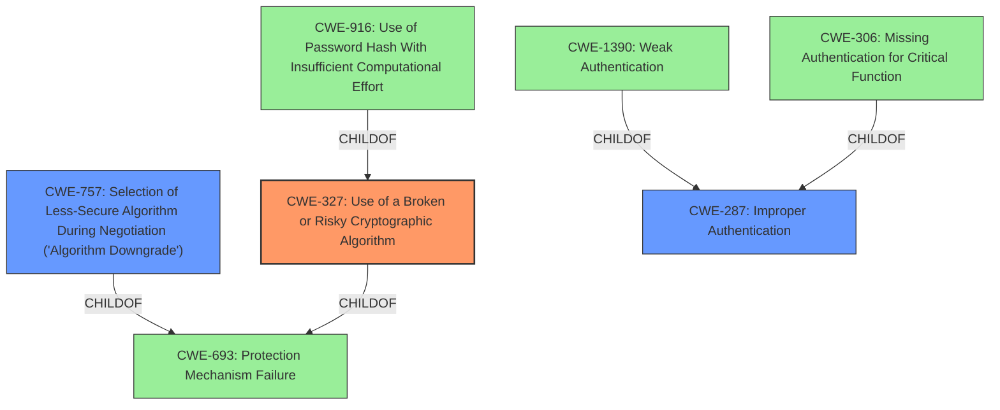

# Raw Analyzer Response for CVE-2021-27877

# Summary
| CWE ID | CWE Name | Confidence | CWE Abstraction Level | CWE Vulnerability Mapping Label | CWE-Vulnerability Mapping Notes |
|---|---|---|---|---|---|
| CWE-327 | Use of a Broken or Risky Cryptographic Algorithm | 0.9 | Class | Allowed-with-Review | Primary CWE |
| CWE-757 | Selection of Less-Secure Algorithm During Negotiation ('Algorithm Downgrade') | 0.7 | Base | Allowed | Secondary Candidate |
| CWE-287 | Improper Authentication | 0.6 | Class | Discouraged | Secondary Candidate |

## Evidence and Confidence

*   **Confidence Score:** 0.8
*   **Evidence Strength:** HIGH

## Relationship Analysis
The primary CWE selected is CWE-327, "Use of a Broken or Risky Cryptographic Algorithm," which is a Class-level CWE. This is related to the vulnerability because the SHA authentication scheme is outdated and exploitable. CWE-757, "Selection of Less-Secure Algorithm During Negotiation ('Algorithm Downgrade')," is a Base-level CWE and a child of CWE-693. It could be relevant if the system allows downgrading to the weaker SHA algorithm. However, based on the provided information, it is unclear whether an explicit negotiation is happening to use the insecure scheme or it's just supported and exploitable. CWE-287 "Improper Authentication" is a parent Class of CWE-1390 "Weak Authentication," and CWE-306 "Missing Authentication for Critical Function". It is a high-level class that is discouraged.

## Vulnerability Chain
The vulnerability chain starts with the **support of multiple authentication schemes** including the outdated and **insecure SHA authentication scheme**. This leads to **unauthorized access** to the Agent and the ability to **execute privileged commands**.

## Summary of Analysis
The initial assessment identified several potential CWEs, including CWE-287, CWE-916, CWE-306, CWE-757, and CWE-327. The final decision leans towards CWE-327, "Use of a Broken or Risky Cryptographic Algorithm," because the core issue is the use of an outdated and exploitable SHA authentication scheme. This aligns directly with the description of CWE-327.

The evidence from the "CVE Reference Links Content Summary" supports this: "The primary weakness is the presence of the outdated and exploitable SHA authentication scheme." The vulnerability description also mentions that "This authentication scheme is no longer used in current versions of the product, but hadn't yet been disabled. An attacker could remotely exploit this scheme to gain unauthorized access to an Agent and execute privileged commands."

CWE-757 was considered because the product **supports multiple authentication schemes** and it may be possible to force the product to use the weaker SHA. But the information provided does not explicitly state that it is possible to force the downgrade, so it is noted as a secondary candidate.

CWE-287 is a higher-level class that might be misused when lower-level CWE entries are likely to be applicable. Therefore it is not the best fit.

The selected CWE is at the optimal level of specificity, as it directly addresses the root cause of the vulnerability: the use of a broken cryptographic algorithm (SHA).