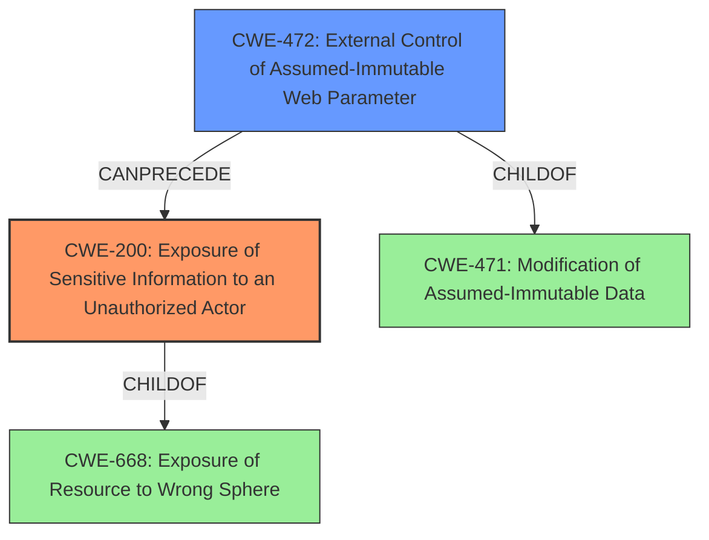

# Raw Analyzer Response for CVE-2021-27908

# Summary
| CWE ID | CWE Name | Confidence | CWE Abstraction Level | CWE Vulnerability Mapping Label | CWE-Vulnerability Mapping Notes |
|---|---|---|---|---|---|
| CWE-200 | Exposure of Sensitive Information to an Unauthorized Actor | 0.9 | Class | Primary | Discouraged, but selected due to the direct **impact** of the vulnerability. |
| CWE-472 | External Control of Assumed-Immutable Web Parameter | 0.8 | Base | Secondary | Allowed, as the **root cause** involves an externally controlled parameter that is assumed to be immutable. |

## Evidence and Confidence

*   **Confidence Score:** 0.85
*   **Evidence Strength:** HIGH

## Relationship Analysis
The primary CWE is CWE-200, representing the **impact** of the vulnerability, while CWE-472 represents the **root cause** involving external control of parameters. CWE-200 is a Class-level CWE, and its description aligns with the vulnerability's final outcome: exposure of sensitive information. CWE-472, a Base-level CWE, explains how an attacker leverages externally controlled parameters to achieve this exposure.

## Vulnerability Chain
The vulnerability chain begins with an authorized admin user leveraging Symfony parameter syntax in free text fields within Mautic's configuration. This leads to the exposure of secret parameters publicly.
  - **Root Cause:** Improper handling and **external control** of configuration parameters.
  - **Weakness:** **Exposure of sensitive information** due to the ability to inject and expand Symfony parameters in public-facing parts of the application.
  - **Impact:** **Confidentiality breach**, where attackers with admin privileges can access and disclose sensitive information like database passwords.

## Summary of Analysis
The analysis indicates a two-fold classification. The primary classification is CWE-200, which highlights the main security **impact**: the **Exposure of Sensitive Information to an Unauthorized Actor**. The secondary classification, CWE-472, pinpoints the **root cause**: **External Control of Assumed-Immutable Web Parameter**.

The vulnerability description states, "secret parameters such as database credentials could be **exposed** publicly by an authorized admin user through leveraging Symfony parameter syntax in any of the free text fields in Mautics configuration that are used in publicly facing parts of the application." This aligns directly with CWE-200.

The "CVE Reference Links Content Summary" confirms the root cause: "The vulnerability stems from the way Mautic handles Symfony parameters... This feature is exploited in Mautic by an admin using free text fields... which are then rendered in public-facing parts of the application." This evidence supports CWE-472, as it demonstrates the **external control** over parameters that are assumed to be immutable, such as configuration settings.

CWE-200 is a Class-level CWE, while CWE-472 is a Base-level CWE, which is more specific and preferred for root cause analysis. The choice of CWE-472 reflects the detailed understanding of how the vulnerability occurs.

While CWE-74 (Improper Neutralization of Special Elements in Output Used by a Downstream Component) was considered due to the use of Symfony parameters, it was deemed less appropriate. The core issue is not about neutralization, but rather the acceptance and processing of externally controlled parameters in the first place. Also, CWE-74 is discouraged.

Relevant CWE Information:

# Enhanced Context (25 CWEs)
The following CWEs were identified as potentially relevant to this vulnerability:

## CWE-807: Reliance on Untrusted Inputs in a Security Decision
**Abstraction Level**: Base
**Similarity Score**: 0.78
**Source**: dense

**Description**:
The product uses a protection mechanism that relies on the existence or values of an input, but the input can be modified by an untrusted actor in a way that bypasses the protection mechanism.

**Mapping Guidance**:
- Usage: Allowed
- Rationale: This CWE entry is at the Base level of abstraction, which is a preferred level of abstraction for mapping to the root causes of vulnerabilities.

## CWE-472: External Control of Assumed-Immutable Web Parameter
**Abstraction Level**: Base
**Similarity Score**: 0.77
**Source**: dense

**Description**:
The web application does not sufficiently verify inputs that are assumed to be immutable but are actually externally controllable, such as hidden form fields.

**Mapping Guidance**:
- Usage: Allowed
- Rationale: This CWE entry is at the Base level of abstraction, which is a preferred level of abstraction for mapping to the root causes of vulnerabilities.

## CWE-74: Improper Neutralization of Special Elements in Output Used by a Downstream Component ('Injection')
**Abstraction Level**: Class
**Similarity Score**: 0.77
**Source**: dense

**Description**:
The product constructs all or part of a command, data structure, or record using externally-influenced input from an upstream component, but it does not neutralize or incorrectly neutralizes special elements that could modify how it is parsed or interpreted when it is sent to a downstream component.

**Mapping Guidance**:
- Usage: Discouraged
- Rationale: CWE-74 is high-level and often misused when lower-level weaknesses are more appropriate.

## CWE-639: Authorization Bypass Through User-Controlled Key
**Abstraction Level**: Base
**Similarity Score**: 0.76
**Source**: dense

**Description**:
The system's authorization functionality does not prevent one user from gaining access to another user's data or record by modifying the key value identifying the data.

**Mapping Guidance**:
- Usage: Allowed
- Rationale: This CWE entry is at the Base level of abstraction, which is a preferred level of abstraction for mapping to the root causes of vulnerabilities.

## CWE-538: Insertion of Sensitive Information into Externally-Accessible File or Directory
**Abstraction Level**: Base
**Similarity Score**: 0.76
**Source**: dense

**Description**:
The product places sensitive information into files or directories that are accessible to actors who are allowed to have access to the files, but not to the sensitive information.

**Mapping Guidance**:
- Usage: Allowed
- Rationale: This CWE entry is at the Base level of abstraction, which is a preferred level of abstraction for mapping to the root causes of vulnerabilities.

## CWE-212: Improper Removal of Sensitive Information Before Storage or Transfer
**Abstraction Level**: Base
**Similarity Score**: 0.76
**Source**: dense

**Description**:
The product stores, transfers, or shares a resource that contains sensitive information, but it does not properly remove that information before the product makes the resource available to unauthorized actors.

**Mapping Guidance**:
- Usage: Allowed
- Rationale: This CWE entry is at the Base level of abstraction, which is a preferred level of abstraction for mapping to the root causes of vulnerabilities.

## CWE-319: Cleartext Transmission of Sensitive Information
**Abstraction Level**: Base
**Similarity Score**: 0.76
**Source**: dense

**Description**:
The product transmits sensitive or security-critical data in cleartext in a communication channel that can be sniffed by unauthorized actors.

**Mapping Guidance**:
- Usage: Allowed
- Rationale: This CWE entry is at the Base level of abstraction, which is a preferred level of abstraction for mapping to the root causes of vulnerabilities.

## CWE-1391: Use of Weak Credentials
**Abstraction Level**: Class
**Similarity Score**: 0.76
**Source**: dense

**Description**:
The product uses weak credentials (such as a default key or hard-coded password) that can be calculated, derived, reused, or guessed by an attacker.

**Mapping Guidance**:
- Usage: Allowed-with-Review
- Rationale: This CWE entry is a Class and might have Base-level children that would be more appropriate

## CWE-668: Exposure of Resource to Wrong Sphere
**Abstraction Level**: Class
**Similarity Score**: 0.75
**Source**: dense

**Description**:
The product exposes a resource to the wrong control sphere, providing unintended actors with inappropriate access to the resource.

**Mapping Guidance**:
- Usage: Discouraged
- Rationale: CWE-668 is high-level and is often misused as a catch-all when lower-level CWE IDs might be applicable. It is sometimes used for low-information vulnerability