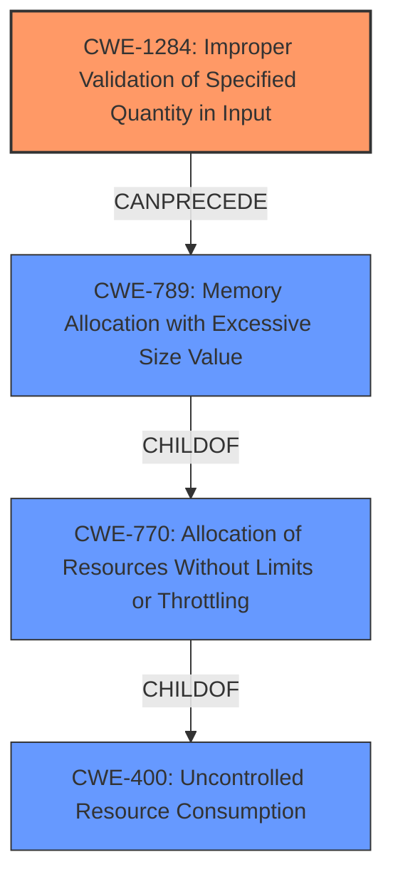

# Raw Analyzer Response for CVE-2021-27921

# Summary
| CWE ID    | CWE Name                                                        | Confidence | CWE Abstraction Level | CWE Vulnerability Mapping Label | CWE-Vulnerability Mapping Notes |
| :--------- | :-------------------------------------------------------------- | :--------- | :---------------------- | :------------------------------ | :------------------------------ |
| CWE-1284  | Improper Validation of Specified Quantity in Input            | 0.85       | Base                    | Primary                         | Allowed                       |
| CWE-789   | Memory Allocation with Excessive Size Value                    | 0.75       | Variant                 | Secondary                       | Allowed                       |
| CWE-400   | Uncontrolled Resource Consumption                               | 0.60       | Class                   | Secondary                       | Discouraged                    |

## Evidence and Confidence

*   **Confidence Score:** 0.80
*   **Evidence Strength:** HIGH

## Relationship Analysis
The primary weakness is CWE-1284 (**Improper Validation of Specified Quantity in Input**), a Base level CWE which describes the **lack of input validation** for a quantity, which in this case is the size of the contained image. This leads to CWE-789 (**Memory Allocation with Excessive Size Value**), a Variant level CWE, where the product allocates memory based on this **unvalidated size**, potentially causing a denial-of-service. CWE-789 is a ChildOf CWE-770 (**Allocation of Resources Without Limits or Throttling**), which in turn is a ChildOf CWE-400 (**Uncontrolled Resource Consumption**). The relationship shows a progression from the **lack of validation** to **excessive memory allocation** and finally to **resource exhaustion**, leading to a denial-of-service.

## Vulnerability Chain
The vulnerability chain starts with **Improper input validation** (CWE-1284) of the image size, leading to **excessive memory allocation** (CWE-789), which results in **uncontrolled resource consumption** (CWE-400) and ultimately a denial-of-service.

## Summary of Analysis
The initial assessment, supported by both Retriever results and the vulnerability description, points to a chain of weaknesses starting with **improper input validation** and culminating in **resource exhaustion**. The vulnerability description explicitly states that the reported size of a contained image is **not properly checked**, leading to an attempted memory allocation that can be very large. The CVE Reference Links Content Summary confirms that the root cause is that "The reported size of a contained image within a BLP container is not properly checked." This directly aligns with CWE-1284's description: "The product receives input that is expected to specify a quantity (such as size or length), but it does not validate or incorrectly validates that the quantity has the required properties." The subsequent **excessive memory allocation** and **denial of service** are consequences of this **missing validation**.

The graph relationships confirm this chain, with CWE-1284 leading to CWE-789, which in turn contributes to CWE-400. While CWE-400 is listed as a top CWE, it is a Class level CWE and is often misused, as mentioned in the Mapping Guidance. Therefore, focusing on the more specific Base and Variant CWEs provides a more accurate representation of the vulnerability.

CWE-1284 and CWE-789 are selected as the primary and secondary CWEs because they represent the root cause and the immediate consequence, respectively. These CWEs are at the optimal level of specificity, providing a detailed understanding of the vulnerability's nature.

Relevant CWE Information:

# Enhanced Context (25 CWEs)
The following CWEs were identified as potentially relevant to this vulnerability:

## CWE-226: Sensitive Information in Resource Not Removed Before Reuse
**Abstraction Level**: Base
**Similarity Score**: 0.78
**Source**: dense

**Description**:
The product releases a resource such as memory or a file so that it can be made available for reuse, but it does not clear or "zeroize" the information contained in the resource before the product performs a critical state transition or makes the resource available for reuse by other entities.

**Mapping Guidance**:
- Usage: Allowed
- Rationale: This CWE entry is at the Base level of abstraction, which is a preferred level of abstraction for mapping to the root causes of vulnerabilities.

*This CWE is not a good fit because the vulnerability is not about sensitive information, but about a missing size check.*

## CWE-404: Improper Resource Shutdown or Release
**Abstraction Level**: Class
**Similarity Score**: 0.78
**Source**: dense

**Description**:
The product does not release or incorrectly releases a resource before it is made available for re-use.

**Mapping Guidance**:
- Usage: Allowed-with-Review
- Rationale: This CWE entry is a Class and might have Base-level children that would be more appropriate

*This CWE is not a good fit because the vulnerability is not about releasing resources, but about a missing size check.*

## CWE-1325: Improperly Controlled Sequential Memory Allocation
**Abstraction Level**: Base
**Similarity Score**: 0.77
**Source**: dense

**Description**:
The product manages a group of objects or resources and performs a separate memory allocation for each object, but it does not properly limit the total amount of memory that is consumed by all of the combined objects.

**Mapping Guidance**:
- Usage: Allowed
- Rationale: This CWE entry is at the Base level of abstraction, which is a preferred level of abstraction for mapping to the root causes of vulnerabilities.

*This CWE is somewhat relevant but less precise than CWE-789. CWE-1325 talks about multiple objects, while the vulnerability focuses on a single, excessively large allocation.*

## CWE-772: Missing Release of Resource after Effective Lifetime
**Abstraction Level**: Base
**Similarity Score**: 0.77
**Source**: dense

**Description**:
The product does not release a resource after its effective lifetime has ended, i.e., after the resource is no longer needed.

**Mapping Guidance**:
- Usage: Allowed
- Rationale: This CWE entry is at the Base level of abstraction, which is a preferred level of abstraction for mapping to the root causes of vulnerabilities.

*This CWE is not a good fit because the vulnerability is not about releasing resources, but about a missing size check leading to an excessive allocation.*

## CWE-789: Memory Allocation with Excessive Size Value
**Abstraction Level**: Variant
**Similarity Score**: 0.76
**Source**: dense

**Description**:
The product allocates memory based on an untrusted, large size value, but it does not ensure that the size is within expected limits, allowing arbitrary amounts of memory to be allocated.

**Mapping Guidance**:
- Usage: Allowed
- Rationale: This CWE entry is at the Variant level of abstraction, which is a preferred level of abstraction for mapping to the root causes of vulnerabilities.

*This CWE is a good fit as a secondary CWE since it describes the allocation of memory with an excessive size value, a direct consequence of the missing input validation.*

## CWE-664: Improper Control of a Resource Through its Lifetime
**Abstraction Level**: Pillar
**Similarity Score**: 0.75
**Source**: dense

**Description**:
The product does not maintain or incorrectly maintains control over a resource throughout its lifetime of creation, use, and release.

**Mapping Guidance**:
- Usage: Discouraged
- Rationale: This CWE entry is high-level when lower-level children are available.

*This CWE is too high-level and does not provide sufficient detail.*

## CWE-775: Missing Release of File Descriptor or Handle after Effective Lifetime
**Abstraction Level**: Variant
**Similarity Score**: 0.74
**Source**: dense

**Description**:
The product does not release a file descriptor or handle after its effective lifetime has ended, i.e., after the file descriptor/handle is no longer needed.

**Mapping Guidance**:
- Usage: Allowed
- Rationale: This CWE entry is at the Variant level of abstraction, which is a preferred level of abstraction for mapping to the root causes of vulnerabilities.

*This CWE is not a good fit because the vulnerability is not about releasing file descriptors, but about a missing size check.*

## CWE-667: Improper Locking
**Abstraction Level**: Class
**Similarity Score**: