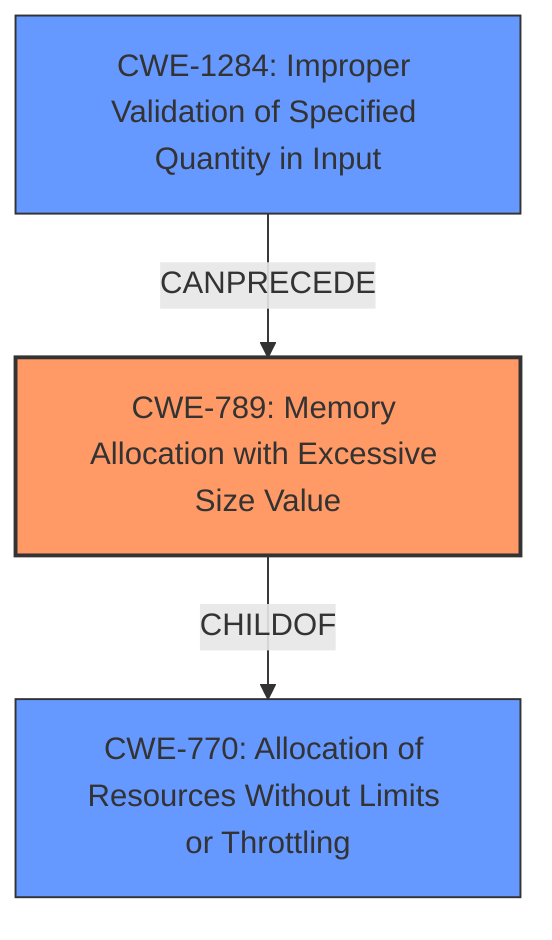

# Analysis Report for CVE-2021-27922

# Vulnerability Analysis Report: CVE-2021-27922

## Description


## Analysis (with Relationship Data)

# Summary

| CWE ID | CWE Name | Confidence | CWE Abstraction Level | CWE Vulnerability Mapping Label | CWE-Vulnerability Mapping Notes |
|---|---|---|---|---|---|
| CWE-789 | Memory Allocation with Excessive Size Value | 0.9 | Variant | Allowed | Primary CWE |
| CWE-1284 | Improper Validation of Specified Quantity in Input | 0.7 | Base | Allowed | Secondary Candidate |
| CWE-770 | Allocation of Resources Without Limits or Throttling | 0.6 | Base | Allowed | Secondary Candidate |

## Evidence and Confidence

*   **Confidence Score:** 0.8
*   **Evidence Strength:** HIGH

## Relationship Analysis

The primary CWE is CWE-789, which is a variant of CWE-770. CWE-1284 can precede CWE-789.



## Vulnerability Chain

The vulnerability chain starts with **improper** size checking (potentially CWE-1284), leading to the **allocation of excessive memory** (CWE-789) and ultimately resulting in a denial of service.

## Summary of Analysis

Initially, CWE-20 (Improper Input Validation) was considered due to its presence in the similar CVE descriptions, however, that is too high level and the analysis of the retriever results shows the root cause is not validating the size which then leads to memory allocation with an excessive size.

The evidence suggests that the vulnerability involves a **lack of proper size checking** for a contained image within an ICNS container, which can lead to a very large memory allocation.

The reference to the **"reported size of a contained image is not properly checked"** strongly indicates **improper input validation** related to the size. This aligns with CWE-1284. The consequence of this **improper validation** is that the system attempts a very large memory allocation, which matches CWE-789.

CWE-789 is selected as the primary CWE as it directly represents the core issue: **memory allocation with an excessive size value** due to the **improper size checking**.

CWE-1284 is considered as a secondary CWE because the root cause is the **improper validation of specified quantity in input**, which allows for a **memory allocation with excessive size value**.

CWE-770 (Allocation of Resources Without Limits or Throttling) is also a valid candidate, but CWE-789 is a more specific variant of CWE-770 and thus is preferred.

The selected CWEs are at the optimal level of specificity, representing the vulnerability's root cause (CWE-1284), the immediate consequence (CWE-789), and the broader context of resource management (CWE-770).

Relevant CWE Information:

# Enhanced Context (25 CWEs)

## CWE-226: Sensitive Information in Resource Not Removed Before Reuse
**Abstraction Level**: Base
**Similarity Score**: 0.79
**Source**: dense

**Description**:
The product releases a resource such as memory or a file so that it can be made available for reuse, but it does not clear or "zeroize" the information contained in the resource before the product performs a critical state transition or makes the resource available for reuse by other entities.
**Did Not Select**: This CWE focuses on sensitive information not being removed, which is not the primary issue in the vulnerability description.

## CWE-404: Improper Resource Shutdown or Release
**Abstraction Level**: Class
**Similarity Score**: 0.78
**Source**: dense

**Description**:
The product does not release or incorrectly releases a resource before it is made available for re-use.
**Did Not Select**: This CWE is too general and doesn't capture the specific issue of excessive memory allocation due to improper size validation.

## CWE-1325: Improperly Controlled Sequential Memory Allocation
**Abstraction Level**: Base
**Similarity Score**: 0.77
**Source**: dense

**Description**:
The product manages a group of objects or resources and performs a separate memory allocation for each object, but it does not properly limit the total amount of memory that is consumed by all of the combined objects.
**Did Not Select**: While this CWE is related to memory allocation issues, it's not as directly relevant as CWE-789, which specifically addresses excessive size values.

## CWE-772: Missing Release of Resource after Effective Lifetime
**Abstraction Level**: Base
**Similarity Score**: 0.77
**Source**: dense

**Description**:
The product does not release a resource after its effective lifetime has ended, i.e., after the resource is no longer needed.
**Did Not Select**: This CWE focuses on failing to release resources, whereas the described vulnerability is about allocating excessive memory in the first place.

## CWE-789: Memory Allocation with Excessive Size Value
**Abstraction Level**: Variant
**Similarity Score**: 0.76
**Source**: dense

**Description**:
The product allocates memory based on an untrusted, large size value, but it does not ensure that the size is within expected limits, allowing arbitrary amounts of memory to be allocated.
**SELECTED - Primary CWE**

## CWE-664: Improper Control of a Resource Through its Lifetime
**Abstraction Level**: Pillar
**Similarity Score**: 0.75
**Source**: dense

**Description**:
The product does not maintain or incorrectly maintains control over a resource throughout its lifetime of creation, use, and release.
**Did Not Select**: This CWE is too high-level and doesn't provide enough specific information about the vulnerability.

## CWE-775: Missing Release of File Descriptor or Handle after Effective Lifetime
**Abstraction Level**: Variant
**Similarity Score**: 0.74
**Source**: dense

**Description**:
The product does not release a file descriptor or handle after its effective lifetime has ended, i.e., after the file descriptor/handle is no longer needed.
**Did Not Select**: This CWE is specific to file descriptors/handles, which is not the primary issue in the vulnerability description.

## CWE-667: Improper Locking
**Abstraction Level**: Class
**Similarity Score**: 0.74
**Source**: dense

**Description**:
The product does not properly acquire or release a lock on a resource, leading to unexpected resource state changes and behaviors.
**Did Not Select**: This CWE relates to locking issues, which are not present in the vulnerability description.

## CWE-909: Missing Initialization of Resource
**Abstraction Level**: Class
**Similarity Score**: 0.73
**Source**: dense

**Description**:
The product does not initialize a critical resource.
**Did Not Select**: This CWE is about missing initialization, which is not related to the described vulnerability.

## CWE-131: Incorrect Calculation of Buffer Size
**Abstraction Level**: Base
**Similarity Score**: 0.73
**Source**: dense

**Description**:
The product does not correctly calculate the size to be used when allocating a buffer, which could lead to a buffer overflow.
**Did Not Select**: While related to buffer sizes, this CWE is more specific to incorrect calculations, whereas the described vulnerability is about a lack of validation.

## CWE-789: Memory Allocation with Excessive Size Value
**Abstraction Level**: Variant
**Similarity Score**: 7271.14
**Source**: sparse

**Description**:
The product allocates memory based on an untrusted, large size value, but it does not ensure that the size is within expected limits, allowing arbitrary amounts of memory to be allocated.
**SELECTED - Primary CWE**

## CWE-190: Integer Overflow or Wraparound
**Abstraction Level**: Base
**Similarity Score**: 7160.26
**Source**: sparse

**Description**:
The product performs a calculation that can
         produce an integer overflow or wraparound when the logic
         assumes that the resulting value will always be larger than
         the original value. This occurs when an integer value is
         incremented to a value that is too large to store in the
         associated representation. When this occurs, the value may
         become a very small or negative number.
**Did Not Select**: While integer overflows can be related to memory allocation issues, the vulnerability description doesn't explicitly mention an integer overflow.

## CWE-1325: Improperly Controlled Sequential Memory Allocation
**Abstraction Level**: Base
**Similarity Score**: 7098.44
**Source**: sparse

**Description**:
The product manages a group of objects or resources and performs


## CWE Relationship Analysis

Current CWEs represent these abstraction levels: .


### Vulnerability Chain Analysis

**Chain starting from CWE-667:**
- 667 (Improper Locking) - ROOT


**Chain starting from CWE-664:**
- 664 (Improper Control of a Resource Through its Lifetime) - ROOT


### CWE Relationship Diagram

```mermaid
graph TD
    classDef primary fill:#f96,stroke:#333,stroke-width:2px
    classDef secondary fill:#69f,stroke:#333
    classDef tertiary fill:#9e9,stroke:#333
```


*Report generated on 2025-04-02 10:18:41*
